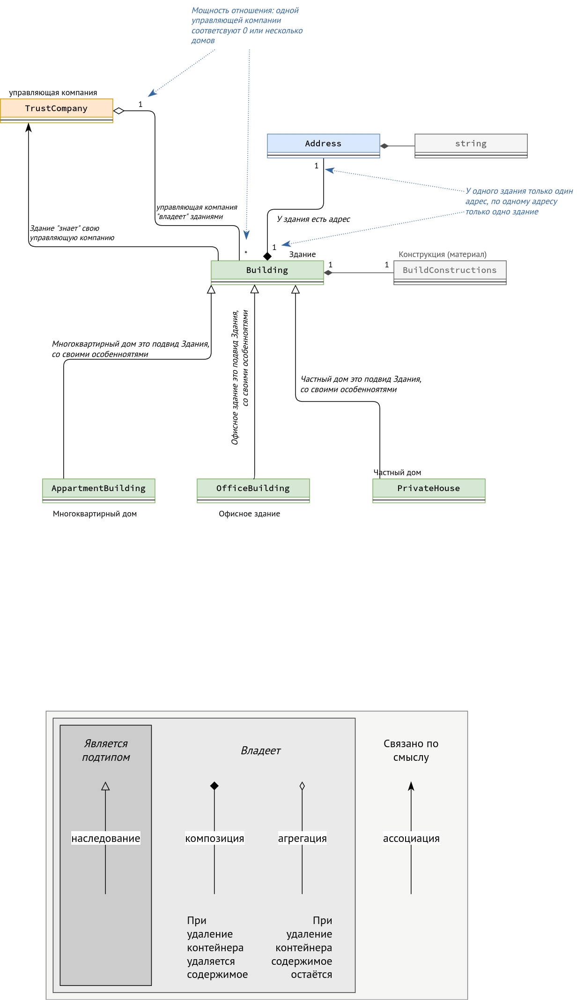

```C++
// Лекция 11. 15 ноября
#include <list>
#include <iostream>
using namespace std;

// адрес здания
class Address {
    string city;                    // здесь и далее Adress композирует string
    string street;
    string biulding_number;         // номер здания, может содержать букву

    // todo: add methods
};

// Типы материалов (конструкций) из которых строят здания
enum BuildConstructions {
    bricks,             // кирпич
    panel_block,        // панели железобетонные
    mixed,              // смешанные материалы
    wood,               // дерево
    unknown             // неизвестно
};

// Здание. Только объявление, чтобы использовать внутри TrustCompany.
// См. определение ниже
class Building;         

// Управляющая компания
class TrustCompany {
    // todo: add fields
    string company_name;
    list<Building*> buildings;      // агрегация со зданиями, которые компания обслуживает; по смыслу близко к ассоциации
public:
    Address addr;                   // Композиция с адресом
    void add_building(Building* h) // добавляет новое здание, которое компания будет обслуживать
    {     
        // todo: ...
    }
    // todo: add methods
};

// Здание
class Building {
private:
    unsigned floors_count;              // число этажей
    unsigned year_builded;              // Год постройки
    BuildConstructions build_constr;    // тип конструкции (материала)
    TrustCompany* company;              // управляющая компания
    // todo: add methods
public:
    Address addr;

};

// Частный дом
class PrivateHouse : public Building {
    bool has_garage;        // есть ли гараж
    // todo: поля
    // todo: методы
};

// Многоквартирный дом
class AppartmentBuilding : public Building {
    unsigned entrance_count;    // число подъездов
    unsigned apartmemts_count;  // число квартир

    // todo: поля
    // todo: методы
};


class OfficeBuilding : public Building {
    unsigned entrance_count;                    // число входов
    unsigned cabinets_count;                    // число кабинетов

    // todo: поля
    // todo: методы
};

int main() {
    PrivateHouse h;
    h.addr = Address("Chita", "Barguzinskaya", "39b");
    // композиция Address в PrivateHouse: когда удалится h, тогда и удалится Адресс

    TrustCompany company1;
    company1.add_building(&h);   // можно передать любой производный от Building класс
    // Агрегация PrivateHouse в TrustCompany: после удаления company1 h не удалится
}
```


