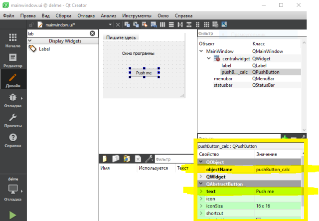

# Занятие 14
- Разбор теста
- Программы с GUI на Qt

# Занятие 13
26 ноября

Скопируйте фреимворк Qt и IDE Qt Creator. На компьютерах уадиторий 400, 401, 404 см. папку: `C:\Qt`

Или используйте онлайн-инталлятор OpenSource версии через с VPN с IP вне РФ. 
https://www.qt.io: кнопка: `Download. Try` >> Downloads for open source users | `Go Open Source` >> `Download the Qt online installer` >> `Download`


**Программа с графическим пользовательским интерфейсом на Qt**
1. Создание проекта в Qt Creator (Application Qt > Qt Widgets Application) \
  *Выберете путь для сохранения содержащий только латиницу* \
  Предпочтительный компилятор (в составе комплекта Qt) - MinGW (GCC)
1. Файлы проекта:
    - `main.cpp` -- главный файл программы; здесь создаётся окно программы и запускается *цикл обработки сообщений* программы
    - `mainwindow.cpp`, `mainwindow.h` -- содержит класс представляющий логику работы окна программы; содержат обработчики событий (методы), переменные (поля) для хранения данных программы
    - `mainwindow.ui` -- описывает внешний вид окна программы;

1. Откройте файл `mainwindow.ui`. \
 Добавьте в окно вашей программы поля ввода (QLineEdit), кнопку (QPushButton) и надписи (QLabel), которые понадобятся для решения вашей первой задачи из задачника. \
 Задайте свои мена для элементов интерфейса (свойство ObjectName). Например для кнопки: pushbutton_calc -- кнопка для запуска вычислений. \
 Отредактируйте текст элементов интерфейса (свойство Text) \


Если нужно, добавьте картинку на форму. Файл картинки скопируйте файл в папку сборки. Далее, добавить Label, свойство pixmap, нажать треугольник рядом, Выбрать файл.
Поставьте галочку в свойстве scaledContents чтобы масштабировать картинку.

1. Выясните в какой папке создаётся исполняемый файл программы: вкладка Проекты (Project) - Каталог сборки

1. Скомпилируйте и запустите проект, проверьте исполняемый файл \
  *см. как запустить скомпилированный файл программы вне Qt Creator: http://blog.harrix.org/article/1015*

1. `mainwindow.ui`. Создайте обработчик события: ПКМ на вашей кнопке > Перейти к слоту > Clicked - ОК. Будет создано объявление функции (метода) в файле `mainwindow.h` и определение в файле `mainwindow.cpp`

1. Подключите файлы с кодом, который решает вашу задачу: ПКМ на имени проекта (в дереве проекта) > Добавить существующие файлы ...
  Скопируйте эти файлы в папку проекта перед добавлением в проект.\
  Подключите заголовочный файл с вашим кодом в файл с обработчиком события `mainwindow.cpp`.\
  Напишите обработчик события.\
  Обращение к содержимому поля ввода:
  `ui->lineEdit_a->text()` \
  Оператор `->` - это одновременное разыменование и оператор доступа к члену класса\структуры (`.`) \
  Преобразование строкового типа (QString) в числовой:
  `ui->lineEdit_a->text().toFloat()`
  Изменение текста на элементе интерфейса: `ui->label_result->setText( "some text" )`\
  Преобразование числа в строку (QString): `QString::number( 3.14159 )`

1. Храните все входные и выходные данные программы не в элементах интерфейса, а в классе отвечающим за обработку событий главного окна, в разделе private (см. пример).

1. Задайте заголовок главного окна (свойство windowTitle). \
Добавьте надпись и изображение, при необходимости, с условием задачи.
Добавьте пункт меню Справка, подпункт Об авторе. Показывайте сообщение с информацией о себе: ``` QMessageBox::about(this, "Заголовок диалогового окна", "Текст в окне"); ```

1. Задайте ограничения для размеров элементов интерфейса (ПКМ > задать максимальный размер)
Используйте компоновку элементов интерфейса для аккуратного их расположения и  создания интерфейса, отзывчивого на изменение размеров окна.

Пример: https://github.com/VetrovSV/OOP/tree/master/examples/2020/lec_5_qt-project

Во всех файлах исходного кода укажите автора программы.

### Дополнительно
**Проблемы компиляции**\
Если компиляция не удалась, но во вкладке ошибок (внизу окна IDE) нет точной информации об ошибках, то смотрите "Вывод сборки" (Compile output). \
Проверьте пути. Они не должны содержать символов, которые не входят в первую половину ASCII  таблицы (латинский алфавит, специальные символы, цифры).

**Форматирование надписей в HTML**\
Текст на элементах интерфейса можно форматировать в HTML: ПКМ на элементе > Изменить форматированный текст

**Настройка стиля элемента интерфейса**\
Настроить внешний вид элемента интерфейса с помощью таблицы стилей (как в CSS): ПКМ на элементе > StyleSheet;
Разные элементы интерфейса имеют разный набор свойств https://doc.qt.io/qt-5/stylesheet-reference.html.
Для большинства можно настроить:
- поля (margin), ширину границы (border) и отступы (padding) [https://doc.qt.io/qt-5/stylesheet-customizing.html#box-model].
- цвет текста ``` color: rgb(92, 53, 102); ```
- цвет фона: ```background-color: rgb(255, 255, 128); ```
- фоновое изображение, например для фона окна:
```CSS
/* укажем имя конкретного элемента интерфейса - centralwidget,
ибо этот стиль не должен дальше распространится на все дочерние элементы интерфейса*/
#centralwidget{         
  background-image:url("my_image.jpg");
  background-position: center;
}
 ```

Само изображение должно находится в папке с исполняемым файлом программы. Во время настройки стиля оно не отобразится на фоне, но появится после компиляции и запуска.

Список свойств: https://doc.qt.io/qt-5/stylesheet-reference.html#list-of-property-types

**Как добавить изображение в исполняемый файл** и включить отображение изображения в дизайнере форм.
1. Добавьте файл с описанием включаемых в исполняемый файл зависимостей -- файл ресурсов: ПКМ на корне проекта > Шаблон QT | QT Resource File > задайте имя файла, например images
2. Укажите имя файла с изображением в файле ресурсов: ПКМ на файле ресурсов > Добавить существующий > Выберете файл
3. Чтобы использовать изображение на форме, например в label: выберете label > свойство pixmap > ... > Resource root | выберете изображение из списка

**Как настроить выравнивание элементов интерфейса внутри компоновщиков (layout)?** \
ПКМ на любом элементе внутри компоновщика > Выравнивание компоновщика

**Как настроить растягивание элементов интерфейса внутри компоновщиков (layout)** \
Свойство `SizePolicy`

**Как запустить скомпилированную программу?**
1. Скомпилируйте программу в режиме выпуска (release). Исполняемый файл будет меньше и потребуются библиотеки меньшего размера
2. Скопируйте нужные, динамически подключаемые библиотеки (dll в Windows) в папку с исполняемым файлом. Узнать какие нужны библиотеки можно либо запуская exe файл либо, с помощью программы dependecywalker. Для автоматического копирования нужных библиотек используйте программу windeployqt [https://raw.githubusercontent.com/VetrovSV/OOP/master/OOP_2_7_lib_and_deploy.pdf]

Нужные библиотеки можно найти в папке Qt/6.0.1/gcc_64/lib.


### Домашнее задание
1. Изучите интерфейс Qt Creator:
  - Как создать консольный проект?
  - Из каких файлов состоит проект?
  - Режимы компиляции и запуска
  - Каталог проекта и каталог сборки. Как быстро открыть каталог проекта из IDE?
  - Отладка, точки останова, просмотр переменных и выражений, способы трассировки
  - Средства переименования (рефакторинг)
- Создайте программу на QT с графическим интерфейсом пользователя решающую задачи с массивами (создание и поиск суммы массива). Используйте ранее написанный код. Выводите данные в QPlainTextEdit
1. Сделайте программу с графическим интерфейсом, на основе программы из [занятия 1](https://github.com/VetrovSV/OOP/blob/master/2022/plan_cpp.md#%D0%B7%D0%B0%D0%B4%D0%B0%D0%BD%D0%B8%D1%8F).
 - сделайте пользовательский интерфейс понятным и эстетичным
 - для вывода ответа используйте многострочное поле ввода
 - используйте готовые файлы из существующей программы
 - напишите коментарии, поясняющие код

### Ссылки на слайды:
- https://raw.githubusercontent.com/VetrovSV/OOP/master/Qt_lec1.pdf
- https://raw.githubusercontent.com/VetrovSV/OOP/master/Qt_lec2.pdf
- https://raw.githubusercontent.com/VetrovSV/OOP/master/Qt_lec3.pdf

### Дополнительно. Создание приложений с графическим интерфейсом на С++ с помщью библиотек Microsoft Visual Studio
- Создание приложений на основе фреимворка WPF: 
https://github.com/VetrovSV/OOP/blob/master/examples/Cpp_WinRT_UWP/readme.md
- [WPF, UWP, WinUI, MAUI, Windows App SDK](https://habr.com/ru/post/566352/) -- обзор фреимворков от Майкрософт для создания приложений с графическим интерфейсом
- [Как создать Windows Forms проект на C++](https://programforyou.ru/poleznoe/how-to-create-windows-forms-cpp-project)
- [stack overflow: Visual Studio 2017 and 2019 C++/CLI Missing](https://stackoverflow.com/questions/43298794/visual-studio-2017-and-2019-c-cli-missing)
- https://www.youtube.com/watch?v=DLX5bCEd6-4


# Лекция 12
12 ноября
Повторение: шаблонные функции и классы. Агрегация. Композиция. Ассоциация. Наследование. Экземпляры базового класса и производного.
- Динамический полиморфизм. Виртуальные и абстрактные методы и классы. [OOP 1_2]


### Домашнее задание
- Конспект: совместный цикл
- Сделайте один из классов в задании про наследование виртуальным или абстрактным

# Лекция 11
02 ноября
- Шаблонные классы
- Отношения между классами: агрегация и композиция [studbook]
- Наследование [OOP 1_2]


### Домашнее задание
- Наследование.
  - Задание 4 из файла: https://raw.githubusercontent.com/VetrovSV/OOP/master/%D0%9E%D0%9E%D0%9F.%20%D0%97%D0%B0%D0%B4%D0%B0%D0%BD%D0%B8%D1%8F%20I.pdf
- Изучите правило пяти, конструктор копирования, перемещения, оператор присваивания копированием, оператор присваивания перемещением. Приведите примеры, когда эти методы необходимы.

# Лекция 10. Классы в С++
29 октября
- Разбор теста: include, указатели, массивы, return, throw без try. Вопросы?
- Классы, повторение: избыточность, выравнивание памяти, инкупсуляция, вызов конструкторов. Тест через несколько недель. 
  - Представление данных: строка vs класс
  - Запись состояния класса в файл
- Git. Повторение. Вопросы?
- Возврат объектов из функций и методов. [StudBook](https://raw.githubusercontent.com/VetrovSV/OOP/master/OOP_StudBook.pdf#subsection.4.3.2)
- Шаблонные [функции](https://raw.githubusercontent.com/VetrovSV/OOP/master/OOP_StudBook.pdf#section.2.3) и [классы](https://raw.githubusercontent.com/VetrovSV/OOP/master/OOP_StudBook.pdf#section.4.4). 

### Домашнее задание
- Изучите разные приёмы работы с экземплярами класса: [studbook](https://raw.githubusercontent.com/VetrovSV/OOP/master/OOP_StudBook.pdf#subsection.4.3.2)
- Конспект: умные указатели: unique_ptr, функция make_unique
- *Бонус: реализуйте Метод Куайна—Мак-Класки для минимизации булевых функций. Используйте фугкциональную или объектно-ориентированныую декоменпозицию.*
- *Бонус: создайте шаблонную функцию в задании с классическими массивами*


# Практика 10.
TDD: сначала тест, потом код.
- слайды: https://raw.githubusercontent.com/VetrovSV/OOP/master/OOP_unit_test.pdf
- пример: https://github.com/VetrovSV/OOP/tree/master/examples/simple_class/tests
- интеграция Google Test и Visual Studio https://github.com/VetrovSV/OOP/blob/master/unit_test/unit_test.md

1. Добавьте в *решение* для класса новый проект для тестов на основе GoogleTest. 
При настройке укажите для какого проекта добавляется проект тестов. Сохраняйте проект с классом и тестом в одном каталоге.
Добавьте в проект тестов все необходимые файлы класса (проект - добавить - существующий элемент). 
Подключите в основной файл сходных кодов тестового проекта заголовочный файл класса. Например: `#include "../MyClassProject/MyClass.h"`

Отключите использование предварительно компилируемых заголовочных файлов (pch.h): свойства проекта - С++ - Предварительно компилируемые заголовочные файлы.


2. Создайте тесты для методов класса. \
Запустите тесты: меню Тест - Обозреватель тестов - Выполнить все тесты.

3. Исправьте или дополните класс.


### Домашнее задание
  - Создайте модульный тест для класса: https://raw.githubusercontent.com/VetrovSV/OOP/master/%D0%9E%D0%9E%D0%9F.%20%D0%97%D0%B0%D0%B4%D0%B0%D0%BD%D0%B8%D1%8F%20I.pdf
  - Загружайте работы на ГитХаб, по специальной ссылке из Дискорда

**Сохраняйте исходные коды в универсальной кодировке Unicode**:
Visual Studio: Tools > Options > Environment > Documents > Save documents as Unicode when data cannot be saved in codepage

# Лекция 9. Классы в С++
15 октября.
- this. 
- Статические члены класса. [studbook](https://raw.githubusercontent.com/VetrovSV/OOP/master/OOP_StudBook.pdf#subsection.4.3.3)
- Тест

### Домашнее задание
- Напишите АТД, класс, примеры использования объектов, создайте UML диаграмму.
  - Задание полностью: https://raw.githubusercontent.com/VetrovSV/OOP/master/%D0%9E%D0%9E%D0%9F.%20%D0%97%D0%B0%D0%B4%D0%B0%D0%BD%D0%B8%D1%8F%20I.pdf

# Лекция 8. Классы в С++
10 октября
- Вопросы по Git?
- Повторение. АДТ. Класс. Объект. Инкапсуляция. Ссылки и указатели. Массивы.
- Конструкторы. Деструкторы. Правило пяти. 
- UML диаграмма класса. Draw.io. PlantUML.
- Массивы из объектов. Массивы из указателей на объекты. Запись состояния объекта в файл.
- Тест по C++ на следующей лекции.

### Домашнее задание
- Конспект. Указатели на методы класса
- Статические члены класса.


### Ссылки
- PlantUML

# Лекция 7. Классы в С++
8 октября
- Повторение. Git. Github. Markdown. Заголовки, курсив (наклонный), полужирный, код, вставка изображений и ссылки.
Используйте редактор Atom для редактирования и просмотра Markdown.
- Классы в С++. Объекты. Идентичность и равенство. Области видимости внутри класса. Поля и методы. Инкапсуляция. Предусловия. Операторы `.` и `->`
  - Слайды: https://raw.githubusercontent.com/VetrovSV/OOP/master/OOP_1.0.pdf
  - Пример: https://github.com/VetrovSV/OOP/tree/master/examples/simple_class
    - https://raw.githubusercontent.com/VetrovSV/OOP/master/OOP_StudBook.pdf#section.4.3


### Домашнее задание
- АТД, UML, класс (поля, геттеры, сеттеры); 
  - Задание 1: https://raw.githubusercontent.com/VetrovSV/OOP/master/%D0%9E%D0%9E%D0%9F.%20%D0%97%D0%B0%D0%B4%D0%B0%D0%BD%D0%B8%D1%8F%20I.pdf
- Бонус: реализуйте алгоритм минимизации булевых функций
