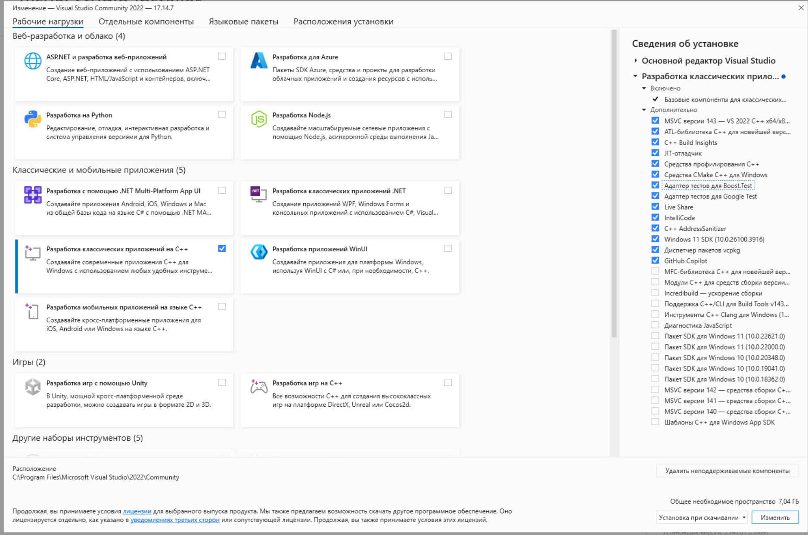

# Язык программирования С, как базовый язык программирования встраиваемых систем

## 1. Введение в язык С
1. Язык С. Характеристика языка. [c_language.excalidraw](../c_language.excalidraw)
2. Понятие среды разработки и её основные компоненты. Панели. Запуск и сборка. Режимы запуска и сборки.
    1. VS Code. Расширение: C\C++ Extension pack. Терминал.\
    Скачать: https://code.visualstudio.com/
    1. *Makrdown для текста и т.п. Панель быстрых команд (Command palette). Горячие клавиши, полезные для разработчика возможности.*
    1. *git и github (для самостоятельного изучения)*
    1. Visual Studio Community https://visualstudio.microsoft.com/
    Об установке: https://learn.microsoft.com/en-us/cpp/build/vscpp-step-0-installation?view=msvc-170
    

    
    

    3. [Настройка компилятора вручную](../examples.md#настройка-компилятора-и-компиляция-для-vs-code-или-для-компиляции-из-командной-строки)
3. [Пример минимальной программы](../examples.md#hello-world)
3. Ручная компиляция и запуск.
4. *Порядок сборки программы из различных модулей. (самостоятельное изучение)*
5. *Использование сборщика Cmake (самостоятельное изучение)*

## 2. Типы данных
[c_language.excalidraw](../c_language.excalidraw)
[c_language.excalidraw.png](../c_language.excalidraw.png)
1. Понятие и свойства данных. Типизация. Базовые типы.
2. Литералы, переменные, константы. Преобразование данных.  Приведение типов данных. Преобразование типов в bool. Специфика округления. Переполнение.
1. *Синонимы типов (typedef). Использование typedef для быстрой смени типов в исходном коде*
3. Ввод и вывод данных. *perror*
    - Настройка локали: https://github.com/VetrovSV/OOP/blob/master/C/locale_encoding.md
4. *Форматирование строк.*

## 3. Операции над данными, выражения
1. Выражения и правила их записи. Операции и их виды. Правила выполнения и приоритет операций. Арифметические операции (целые и вещественные). Преобразования типов. *Битовая обработка данных.*  
2. Обзор стандартной библиотеки языка С.
3. *Пример программы с арифметическими вычислениями.*
4. *Обработка аргументов командной строки*

## 4. Основные алгоритмические конструкции.
1. Условный оператор. Оператор выбора. *Тернарный оператор*. Примеры.
1. Цикл с предусловие и постусловием; примеры. Цикл со счётчиком. Инкремент и декремент. Break. Continue.
1. Использование отладчика. *Логирование.*
1. *Примеры: проверка ввода с условием, проверка ввода с циклом, численное интегрирование*

## 5. Массивы
1. Массивы данных. Размерность и измерения. Свойства массива. Индексация и доступ к элементам. 
1. Приёмы работы с одномерными и многомерными статическими массивами. 
1. Матрицы.
1. *Примеры: заполнение массива случайными числами в заданном диапазоне, вывод массива, поиск максимального элемента в массиве*

## 6. Адреса, указатели, ссылки, динамические данные и массивы
1. Структура памяти: статическая, стек, динамическая память (куча)
1. Адреса. Указатели. Свойства указателей. Операции над ними. 
1. Понятие динамических данных. 
    - Операции выделения и освобождения памяти. malloc, calloc, realloc, free; sizeof.
    - Утечка памяти. Висячие указатели.
    - undefined behavior (на примере двойного освобождения )
    - *Variable Length Array (VLA) и их ограничения.*
    - *Приведение типов указателей.*
    - *адресная арифметика*
1. Организация и приёмы работы с одномерными и многомерными динамическими массивами данных. 
1. memcpy, memset
1. void*
1. *Примеры*

## 7. Составные типы данных. Файлы
1. Понятие структурированных данных. 
    - *Перечисления, объединения*, структуры. Доступ и приёмы работы с их элементами. Приёмы работы со структурами. 
    - Инициализация полей через {}. Инициализация через {} с указанием названий полей.
    - Объявление структуры через typedef. 
    - Функции-инициализаторы. Массивы из структур. 
    - Указатели на структуры.
1. Файлы и приёмы работы с ними. Бинарные и текстовые файлы. Преимущества работы с внешней памятью. 
1. *ferror, errno*
1. *Примеры: среднее арифметическое чисел из файла*

## 8. Процедурное программирование
1. Процедурное программирование. 
    - Область видимости, время жизни, пространство имен элементов программы. Глобальные и локальные переменные.
    - Формальные и фактические параметры. Побочные эффекты. Передача аргументов по ссылке (указателю) и по значению. Const указатели. [] для массивов.  
    - Принцип единственной ответственности. 
    - Объявление и определение функций.
1. Автоматическое тестирование функций. Assert.
1. *Библиотеки Unity и Check для модульного тестирования.*
1. *Указатели на функции* 

## 9. Модульное программирование
1. Декомпозиция и модульность проекта. Включение файлов. Файлы .h и .c
1. защита от повторного включения. include. include-guards (#ifndef … #define … #endif, #pragma once).
1. *Компиляция .c файлов в статическую библиотеку. Использование статической библиотеки в программе.*

## 10. Язык препроцессора. 
- Препроцессинг. Понятие макроса. Макрос для подстановки значений.
- Определение и отмена макросов (#define #undef)
- Функциональные макросы. Многострочные макросы. *Оператор конкатенации (##). *
- *Проверки: #ifdef, #ifndef, #if, #elif, #else, #endif*
- *Предопределённые макросы: `__FILE__, __LINE__, __DATE__, __TIME__, __STDC__, __STDC_VERSION__`*
- *#error и #warning*
- *#pragma и расширения компилятора*
https://github.com/VetrovSV/OOP/blob/master/C/preprocessing.md

##  Темы, понятия и инструменты для самостоятельного изучения после прохождения курса
Помимо тем, выделенных курсивом предлагается в будущем познакомиться со следующими темами:

* **Возможности, плагины и горячие клавиши вышей любимой среды разработки (VS Code, Visual Studio, ...)**

* **Встраиваемые системы и реального времени**
  bare‑metal на ARM/AVR, RTOS (FreeRTOS), работа с периферией
* **Системное программирование и ОС‑интеграция**
  fork/exec, pipe, сигнализация, mmap, IO‑multiplexing (select/epoll)
&nbsp;

* **Вставки кода на языке семейства ассемблера (inline‑asm)**
* &nbsp;

* **Современные версии языка**
  C17, C23 – новые ключевые слова, атомарные типы, улучшенные макросы, атрибуты функций и др. [[C11 and C23 feature highlights](https://twdev.blog/2024/09/cauto/)]
* **Продвинутый препроцессор**:
  вариативные макросы, X‑Macros, условная компиляция для разных платформ
&nbsp;

* **Инструменты отладки и профилирования**
  GDB (core dumps, remote debugging), Valgrind, AddressSanitizer, профайлеры (perf, gprof)
* **Статический и динамический анализ**
  clang-tidy, Cppcheck, Coverity, Sanitizers (UBSan, LeakSanitizer)
* **Сборка и автоматизация**
  CMake, Autotools, Meson, Ninja, CMake в продвинутом режиме, CI/CD (GitHub Actions, GitLab CI)
* **Документация**
  Doxygen, Sphinx (с Breathe для C), генерация HTML/PDF-доков
&nbsp;

* **Многопоточность и параллелизм**:
  pthreads, атомарные операции C11, OpenMP
* **Сетевое программирование**
  BSD sockets, SSL/TLS (OpenSSL), REST‑клиенты на C

* **Интерфейсы с другими языками**
  C↔Python (ctypes, CFFI), C↔Java (JNI)
  Создание библиотек .so/.dll, экспорт функций

* **Дополнительные полезные библиотеки**
  - UI: В том числе для GUI и текстового UI (ncursors)
  - Математические вычисления: линейная алгебра, численное интегрирование и дифференцирование, и т.п.
  - Модульное тестирование 
  - ...
 

## Ссылки
- [Примеры](../examples.md)
- Шпаргалка по языку С. [excalidraw](../c_language.excalidraw), [png](../c_language.excalidraw.png) 
- [Рекомендации и требования по написанию кода](../../criteria.md)
