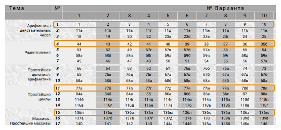

Задачник: https://ivtipm.github.io/Programming/Files/spisocall.htm

Пример таблицы с заданиями. Оранжевым выделены первые 4 задачи (4 строки).

Номер варианта - последняя цифра номера зачётной книжки.

Требования к выполнению заданий:
* Приводите текст условия задачи, ФИО и название группы в начале файла с кодом.
* Запрашивайте у пользователя входные значения. Всегда поясняйте, что именно должен ввести пользователь.
* Выводите ответ с округлением до 2 знаков (или более) после запятой
* Пишите поясняющие комментарии: для функций, их параметров, переменных и т.п.
* Называйте переменные так, чтобы по их имени можно было догадаться об их назначении. Пишите пояснения к переменным.

# 1. Hello, World!
Отчёт о создании и компиляции программ в IDE (VS Code, Visual Studio и др.) и *консоли (бонус)*.

Скомпилируйте и запустите программу, которая выводит "Hello, World!".
Пишите поясняющие комментарии.

Предоставьте отчёт в виде скриншота или pdf, где хорошо видно исходный код программы и то, что она вывела на экран.

Для скриншота (снимка части экрана) используйте сочетание клавиш `Win + Shift + S`.

# 2. Арифметические вычисления

Выполните задание из первой строки задачника.
https://ivtipm.github.io/Programming/Files/spisocall.htm

# 3. Условный оператор 
Выполните задание из строки 4 (раздел Разветвления) [задачника](https://ivtipm.github.io/Programming/Files/spisocall.htm) согласно номеру вашего варианта.

# 4. Простейшие циклы
Выполните задание из строки 11 (раздел Циклы) [задачника](https://ivtipm.github.io/Programming/Files/spisocall.htm) согласно номеру вашего варианта.

* Ваша программа должна содержать один цикл для вычислений (одну циклическую конструкцию: while, for, do..while). 
  Не для всех условий задач это оптимальное решение, но в учебных целях используйте циклы.
* Проверьте вычисления. Если есть ошибки в цикле, то используйте пошаговое выполнение программы (например в Visual Studio) или выводите значения переменных в теле цикла чтобы найти источник ошибки.

# 5. Массивы

Выполните задание из 15 строки задачника (раздел Массивы. Простейшие массивы).
Понимайте фразу "Даны натуральное число n, действительные числа a1,..., an" так:
- n задаётся пользователем
- элементы массива a1,..., an можно заполнять автоматические, с помощью генератора случайных чисел или запращивать у пользователя.

Если не указано иного, считайте, что исходнеы данные - вещественные числа.

Обязательно выводите элементы массива перед ответом. 

Не выполняйте заполнение массива, вывод массива и вычисления в одном и том же цикле. В дальнейшем, такие циклы будет проще вынести в отдельные функции. 

Можно заранее определить статический массив фиксированного размера, например из 128 элементов. Далее использовать в этом массиве столько элементов, сколько укажет пользователь. Но заранее предупредите пользователя об ограничении. 

# 6. Функции и модули

# Ссылки
- [План](readme.md)
- [Примеры](../examples.md)
- Шпаргалка по языку С. [excalidraw](../c_language.excalidraw), [png](../c_language.excalidraw.png) 
- [Рекомендации и требования по написанию кода](../../criteria.md)
- [Задания](tasks.md)