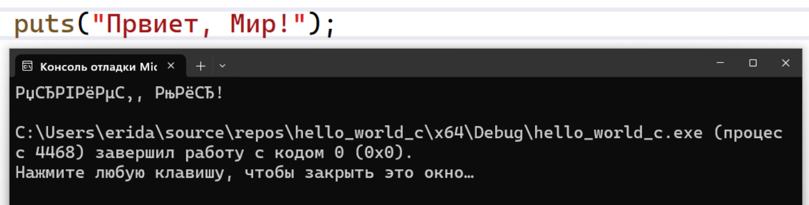

# Настройки  локализации

Настройки локализации (Локаль, locale) — это набор параметров, определяющих язык, региональные и культурные правила для программы или системы. 


Функция setlocale (из <locale.h> / <clocale>) устанавливает или запрашивает текущую локаль программы для одной или нескольких категорий (например, LC_CTYPE, LC_NUMERIC, LC_TIME, LC_ALL и т.д.). 

Документация по функции: https://en.cppreference.com/w/c/locale/setlocale
```c
char* setlocale( int category, const char* locale );
```


В программах локаль определяет, как должны работать функции стандартной библиотеки (в С/C++ или других языках) в следующих категориях (category):

- LC_NUMERIC – десятичные разделители, формат чисел (например в русской локали числа име.т формат `3,14`, а в американской `3.14`);
- LC_TIME – форматирование даты и времени;
- LC_CTYPE – классификация символов и преобразование регистра;
- LC_COLLATE – порядок сортировки строк;
- LC_MONETARY – формат денежных величин;
- и др. 
- LC_ALL - все параметры.

Кроме того имя локали может включать название кодировки символов. 

Это всё влияет на то, как именно будут работать функции вроде printf и как будут интерпретироваться строки (массивы символов), какая будет использована кодовая таблица.

Пример задания локали:
```c
setlocale(LC_ALL, "ru_RU.UTF-8");
```

Формат имени локали имеет вид:
```
язык[_страна][.кодовая_страница]
```
Например `de_DE.UTF-8`.

Кодировку можно задать и не меняя других настроек локализации:
```c
setlocale(LC_ALL, ".UTF-8");
```

При запуске программы автоматически задаётся специальная минимальная локаль с именем "С";

Чтобы получить текущую локаль нужно вызывать:
```c
char* locale = setlocale(LC_ALL, "");
```


Так как при задании локали можно задать кодовую таблицу для символов, это может помочь решить проблему неправильной кодировки в консоли:\


Дополнительно может потребоваться задать кодовую талицу для вводимых и выводимых в консоль символов. Тогда полный пример настроек для Windows может выглядеть так:
```c
#include <windows.h>

setlocale(LC_ALL, ".UTF-8");
SetConsoleCP(CP_UTF8);              // задать кодировку для ввода
SetConsoleOutputCP(CP_UTF8);        // задать кодировку для ввода
```

**получение локали**
```c
char * locale = setlocale(LC_ALL, NULL);
    puts(locale);
```

В Linux/Unix-системах самый простой способ получить все доступные локали:

```bash
locale -a
```

В Windows нет универсального командного инструмента, но локали можно увидеть: «Панель управления» → «Часы и регион» → «Регион» → вкладка «Дополнительно» → список «Язык для программ…».