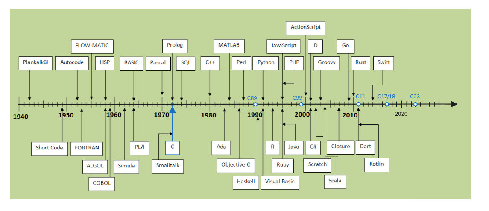
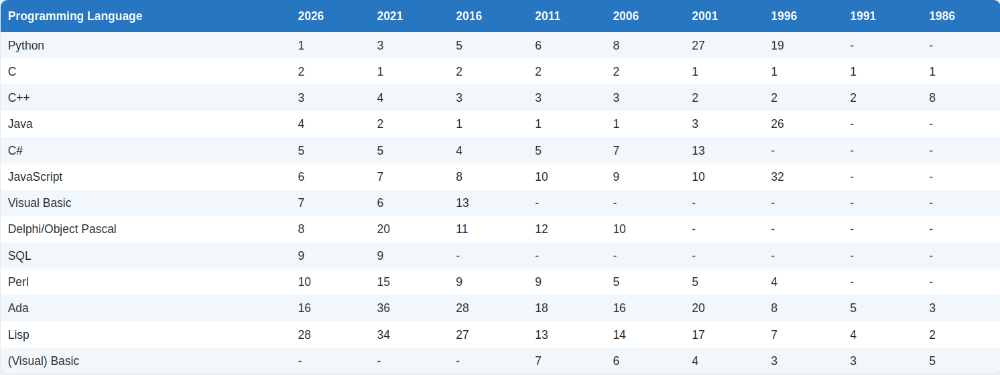
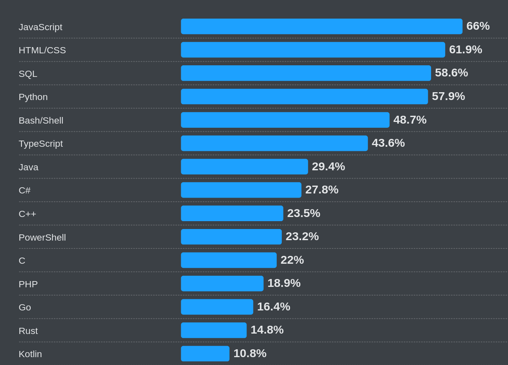

# Краткое введение в Java

## Что такое Java?
Java — современный объектно‑ориентированный язык программирования, разработанный Sun Microsystems (ныне часть Oracle) в середине 1990‑х. Программы компилируются в байт‑код, который исполняется на виртуальной машине — JVM, что делает Java кроссплатформенной.

todo: ссылка на доску excalidraw

    
    

    
https://www.tiobe.com/tiobe-index/

https://survey.stackoverflow.co/2025/technology#most-popular-technologies

См. также https://devecosystem-2025.jetbrains.com/

## Сравнение с C и Python
| Аспект | C | Python | Java |
|--------|---|--------|------|
| **Поддерживаемые парадигмы** | Процедурная, ограниченная ООП | Процедурная, объектно‑ориентированная, функциональная, императивная, скриптовая | Объектно‑ориентированная, императивная, функциональная, реактивная |
| **Типизация** | Статическая, строгая | Динамическая, нестрогая | Статическая, строгая |
| **Управление памятью** | Ручное (`malloc`/`free`) | Автоматическое, сборщик мусора | Автоматический, сборщик мусора (JVM) |
| **Компиляция** | В машинный код (через компилятор) | Интерпретируется (байт‑код) | В байт‑код, затем JIT‑компиляция |
| **Стандартная библиотека** | Небольшая, базовые функции | Обширная ("batteries‑included") | Очень обширная, модульная (Java Platform Module System) |
| **Производительность** | Высокая (низкоуровневая) | Ниже из‑за интерпретации/GC | Высокая после JIT, оптимизации GC |
| **Инструменты и IDE** | gcc/clang, VS, gdb | PyCharm, VS Code, pip, virtualenv | IntelliJ IDEA, Eclipse, NetBeans, Maven, Gradle |
| **Пакетные менеджеры / системы сборки** | make, cmake, pkg‑config, autotools | pip, conda, poetry, setuptools | Maven, Gradle, Ant, Maven Wrapper |

## Где используется Java?
- **Корпоративные серверные приложения** (Spring, Jakarta EE)
- **Мобильные приложения** (Android, хотя сейчас Kotlin доминирует)
- **Большие данные** (Hadoop, Spark)
- **Встраиваемые системы** (IoT‑устройства с JVM‑Lite)
- **Настольные (desktop) приложения** – классические GUI‑приложения с использованием Swing, JavaFX, JIDE, Vaadin (для гибридных) и других фреймворков. Java‑десктоп остаётся популярным в корпоративных инструментах, научных визуализациях и кроссплатформенных утилитах.

## Ключевые концепции, важные для понимания
- **Главный класс** с функцией `public static void main(String[] args)` – точка входа.
- **Классы и объекты** – всё в Java является объектом, кроме примитивных типов (`int`, `boolean`, `float` …).
- **Пакеты (`package`)** – способ группировать классы и управлять пространством имён.
- **Исключения** – `try/catch/finally`, проверяемые и непроверяемые.
- **Сборщик мусора** – автоматическое освобождение памяти, не требуется `free`.
- **Обобщённые типы (generics)** – параметризованные типы, обеспечивающие типобезопасность.
- **Лямбда‑выражения и Stream API** (начиная с Java 8) – функциональный стиль.
- **JIT‑компиляция** – динамический перевод байт‑кода в машинный код во время выполнения, повышающий производительность.

## Краткая история развития
- **1995** – первая версия (Java 1.0).
- **1998** – Java 2 (J2SE 1.2) – введён пакетный механизм, коллекции.
- **2004** – Java 5 – генераики, аннотации, автобоксинг.
- **2006** – Java 6 – улучшения в API, скриптовый движок.
- **2011** – Java 7 – try‑with‑resources, diamond operator.
- **2014** – Java 8 – лямбда‑выражения, Stream API, дата‑время API.
- **2021‑2024** – быстрый выпуск (6‑мес. цикл), новые функции (records, sealed classes, pattern matching).

## Важные библиотеки и фреймворки
- **JUnit** – тестирование.
- **JavaFX** – GUI‑фреймворк.
- **Log4j / SLF4J** – логирование.
- **Apache Commons** – набор готовых утилит.
- **Maven / Gradle** – системы сборки и управления зависимостями.

## Литература и источники
- [Дорожная карта изучения Java](https://roadmap.sh/java)
- Слайды: 
  - https://docs.google.com/presentation/d/14Y8LWzVeChUyjaKhb6rgELdWJR58B2YGUIukeZ-e3PU/edit?slide=id.g205b655ab26_0_1091#slide=id.g205b655ab26_0_1091
  - https://docs.google.com/presentation/d/1pmOlWlulw2prFhPjn73f3SE6KCyYtW2jYux-aKugVcA/edit?slide=id.g1d57d625921_0_52#slide=id.g1d57d625921_0_52
