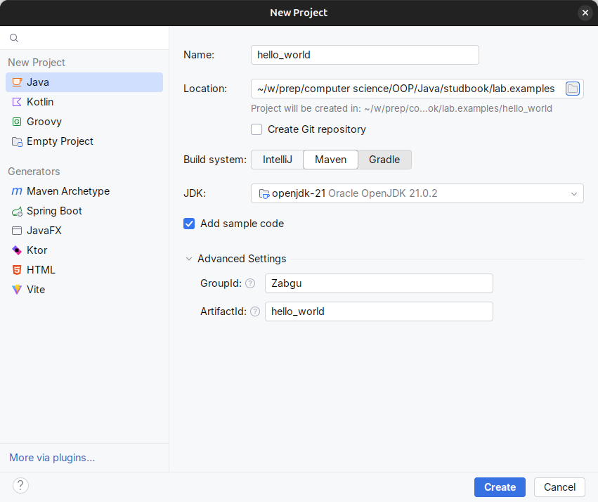
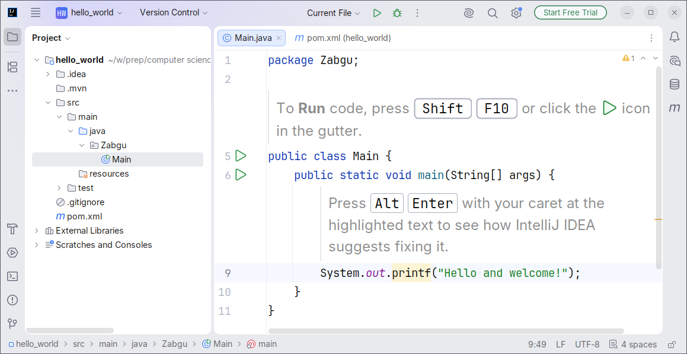
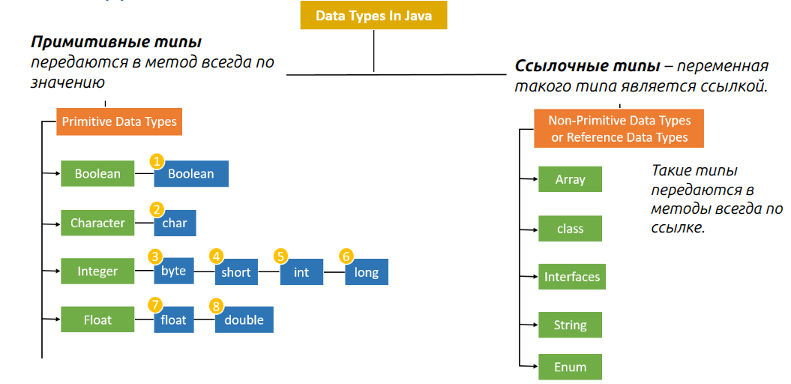

# Введение в язык Java

# Подготовка окружения разработчика на Java

1. Установите IDE
   Например Jet Brains ItelliJ IDEA. https://www.jetbrains.com/idea/download/\
   Если у Вас есть проблемы с установкой или скачиванием, то обратитесь за помощью к одногруппникам или преподавателю.

2. Установите комплект разработки -- **JDK** (компилятор, виртуальная машина, стандартная библиотека и т.д.) 
   - вручную сейчас (https://whichjdk.com/)
   - или скачайте и установите при создании первого проекта в IntelliJ IDEA позднее.

3. Если необходимо, отдельно установите или настройте систему сборки Maven или Gradle.\ 
   Система позволит с лёгкостью компилировать, тестировать, запускать и упаковывать ваши программы на Java с помощью простых консольных команд.\
   Если вам не нужна отдельная система сборки, то можете пользовать той версией, что уже встроена в IntelliJ IDEA.
   Подробности про maven см. в разделе [про компиляцию и запуск программ](11_compile_and_run.md)


## 1. Создание и запуск первой программы

Окно создания нового проекта в IDEA



&nbsp;

Обязательно укажите:
- Name -- осмысленное имя для проекта (будет создана одноимённая папка, будет использоваться как имя пакета для приложения)
- Location -- куда сохранить проект
- Система сборки -- Maven или Gradle; система IntelliJ  менее универсальна и распространена.
- ☑ Add Sample Code -- создать не пустой проект, а добавить пример кода.

&nbsp;

Окно IDE IntelliJ IDEA: панель проект и редактор кода



&nbsp;

```java
// Главный класс. Может иметь произвольное имя
// Должен быть public (доступен для внешних модулей)
// Любой класс должен находится в одноименном файле (класс Main - файл Main.java)
public class Main {
    
   // главный метод (функция). Должен быть статическим,
   // должен называться main
   public static void main(String[] args) {

       // Вывод сообщения в консоль
       System.out.println("Hello World!");
       
       }
   }
```

**Запуск**. нажать **Run** (зелёный треугольник) или клавиши **Shift + F10**. В консоли появится `Hello, World!`.

TODO: об устройстве IntelliJ IDEA и важных горячих клавишах.


## 2. Примитивные типы и переменные

### 1. Объявление переменных примитивных типов

Переменные в Java объявляются указанием ***типа***, ***имени*** и (необязательно) ***начального значения***.
Синтаксис: `<type> <identifier> [= <expression>];`

- `<expression>` -- выражение или литерал.
- Если указать `final`, переменную необходимо инициализировать сразу и изменить её значение невозможно.
- Имена переменных должны начинаться с буквы, `$` или `_`, далее могут использоваться буквы, цифры и те же символы.
- Рекомендуется использовать понятные имена в camelCase.

```java
// Объявление переменной без инициализации
int count; // тип int, имя count

// Объявление с инициализацией
double price = 19.99;

// Константа (неизменяемая переменная)
final char LETTER = 'A';

// Логическая переменная
boolean isReady = true;
``` 

**Литерал** -- это значение, записанное в коде. Например `1729` или  `1.618033` -- числовые литералы, `"Java"` -- строковый литерал, `true` -- литерал логического типа.

### Структура типов



### Таблица числовых примитивов Java
| Тип | Размер (байт) | Диапазон значений | Форматный спецификатор (printf) | Пример литерала | Примечания |
|-----|--------------|-------------------|--------------------------------|----------------|-----------|
| `byte` | 1 | -128 … 127 | `%d` | `100` (или `(byte)100`) | 8‑битный целочисленный тип, часто используется для массивов байтов |
| `short` | 2 | -32 768 … 32 767 | `%d` | `20000` (или `(short)20000`) | 16‑битный целочисленный тип |
| `int` | 4 | -2 147 483 648 … 2 147 483 647 | `%d` | `123456` | основной целочисленный тип, используется по умолчанию |
| `long` | 8 | -9 223 372 036 854 775 808 … 9 223 372 036 854 775 807 | `%d` | `123456L` | для больших целых, в `printf` достаточно `%d` |
| `float` | 4 | ±3.4028235E38 (≈7 значащих цифр) | `%f` | `3.14f` | одинарная точность, литерал требует суффикса `f` |
| `double` | 8 | ±1.7976931348623157E308 (≈15‑16 значащих цифр) | `%f` | `3.1415926535` | двойная точность, тип по умолчанию для дробных чисел |
| `char` | 2 | 0 … 65 535 (Unicode) | `%c` | `'A'` (или ` '\u0041'`) | хранит один символ Unicode, может использоваться как целое значение |
| `boolean` | 1 (логический) | `true` / `false` | `%b` | `true` / `false` | логический тип, используется в условных выражениях, размер не фиксирован в JVM (обычно 1 байт)

- Диапазоны и размеры взяты из официальной документации Oracle JDK и проверенных справочников (Wikipedia, Oracle).  
- В Java **нет** беззнаковых целочисленных примитивов (аналогов `size_t`, `unsigned int` в C/C++).  
- Примитив `boolean` включён в список примитивов, но не относится к числовым типам и поэтому в таблицу не попал.

- Примитивы Java: `byte`, `short`, `int`, `long`, `float`, `double`, `char`, `boolean`.
- Каждый тип имеет фиксированный диапазон (см. таблицу выше). При переполнении происходит «обёртывание».
- Приведение типов: безопасное (`int` → `long`) и явное (`long` → `int`).
- Примитивы Java: `byte`, `short`, `int`, `long`, `float`, `double`, `char`, `boolean`.
- Каждый тип имеет фиксированный диапазон (см. таблицу в учебнике). При переполнении происходит «обёртывание».
- Приведение типов: безопасное (`int` → `long`) и явное (`long` → `int`).
- Объект‑обёртки (`Byte`, `Short`, `Integer`, `Long`, `Float`, `Double`, `Character`, `Boolean`). Автоупаковка/автораспаковка происходит автоматически, но следует помнить о стоимости создания объектов.


## 3. Операторы и выражения

**Оператор** – символ (или комбинация символов), который задаёт действие над одним или несколькими операндами (значениями). Например, `+` складывает два числа, а `!` инвертирует логическое значение.

**Выражение** – комбинация операторов, операндов и, при необходимости, скобок, которая вычисляется в значение определённого типа. Выражения могут быть простыми (`a + b`) или сложными, включать вызовы методов, приведения типов и т.д.


#### Приоритет операторов (от высшего к низшему)


| Приоритет | Операторы (группы) |
|-----------|-------------------|
| 1 (самый высокий) | постфиксные инкремент и декремент: `expr++ expr--`; <br> &nbsp;  доступ к элементы массива `[]` ; вызов метода `()` ; доступ к члену класса `.` ; `new` ; преобразование типов `(type)` |
| 2 | Префиксные инкремент и декремент: `++expr --expr +expr -expr ~ !` |
| 3 | multiplicative: `* / %` |
| 4 | additive: `+ -` |
| 5 | shift: `<< >> >>>` |
| 6 | сравнение: `< <= > >= instanceof` |
| 7 | сравнение: `== !=` |
| 8 | побитовые AND: `&` |
| 9 | побитовые XOR: `^` |
| 10 | побитовые OR: `|` |
| 11 | логические AND: `&&` |
| 12 | логические OR: `||` |
| 13 | тернарный: `?:` |
| 14 | присваивание: `= += -= *= /= %= &= ^= |= <<= >>= >>>=` |
| 15 (самый низкий) | запятая `,` |

*Скобки `()` могут переопределять порядок вычисления, гарантируя нужный приоритет.*

---

## 4. Консольный ввод‑вывод
- Вывод:
  - `System.out.println("text");` – печатает с переводом строки.
  - `System.out.print("text");` – без перевода строки.
  - `System.out.printf("%d %f %s\n", i, d, s);` – форматированный вывод (подобно `printf` в C).
- Ввод через `java.util.Scanner`:


```java
import java.util.Scanner;

Scanner sc = new Scanner(System.in);
System.out.print("Введите целое число: ");
int a = sc.nextInt();

System.out.print("Введите число с плавающей точкой: ");
double b = sc.nextDouble();

sc.nextLine(); // очистка буфера (нужна для корректного считывания строки)

System.out.print("Введите строку: ");
String line = sc.nextLine();
```
- Проверка корректного ввода:
```Java
if (!sc.hasNextInt()) {
    System.out.println("Ожидалось целое число!");
    return;
}
```

## 5. Примеры


1. **Площадь прямоугольника**
   ```Java
   Scanner sc = new Scanner(System.in);
   System.out.print("Ширина: ");
   double w = sc.nextDouble();
   System.out.print("Высота: ");
   double h = sc.nextDouble();
   double area = w * h;
   System.out.printf("Площадь = %.2f\n", area);
   ```

Пример полной программы: [Java/2026_oop1_ivtz24/CalcExample](../2026_oop1_ivtz24/CalcExample/)

## 6. Подключение пакетов и стандартная библиотека Java

В Java пакеты используются для организации функций (статических методов), классов и интерфейсов. Они помогают избежать конфликтов имен и упрощают поиск и использование классов.

Для подключения пакета в Java используется ключевое слово `import`. Например, чтобы подключить класс `Scanner` из пакета `java.util`, нужно написать:

```java
import java.util.Scanner;
```

Также можно подключить все классы из пакета с помощью звездочки:

```java
import java.util.*;
```

Однако лучше подключать только те классы, которые действительно нужны, чтобы избежать излишней загрузки.

В Java есть стандартные пакеты, такие как `java.lang`, который подключается автоматически, и не нужно писать `import java.lang.*;`.


Статический импорт позволяет использовать статические методы или константы без указания имени класса.

```java
import java.lang.Math;
// Использование:
float y = sin(Math.Pi);


import static java.lang.Math.*;         // подключение всех идентификаторов модуля
import static java.lang.Math.PI;     // подключение конкретного идентификатора
// Использование:
float y = sin(PI);
```

### Стандартная библиотека Java (Java Class Library)

Стандартная библиотека Java (Java Class Library, JCL) — это набор пакетов с классами и интерфейсами, которые доступны в любой реализации Java. Имена пакетов составные (например, `java.util.regex`), потому что пакеты могут быть вложенными: пакет `java.util.regex` является подпакетом пакета `java.util`. 

Пакет — это пространство имён, которое соответствует иерархии каталогов на диске. В Java 9+ появилась система модулей (JPMS), где модуль — это группа связанных пакетов, описываемая в файле `module-info.java`. Отдельные файлы `.java` модулями не являются — они содержат классы, которые входят в состав пакетов, а пакеты, в свою очередь, могут быть объединены в модули.

Ниже перечислены основные пакеты стандартной библиотеки:

- **java.lang**. Содержит классы, которые подключаются автоматически (без `import`): `String`, `Math`, `System`, `Integer`, `Double`, `Thread`, `Throwable` и др.
- **java.util**. Содержит коллекции (`List`, `Set`, `Map`, `Queue`), и различные классы, необходимые почти в любом коде `Scanner`, `Random`, `Date`, `Optional` и др.
- **java.util.regex**. Регулярные выражения: `Pattern`, `Matcher`.
- **java.util.function**. Функциональные интерфейсы для лямбда-выражений и Stream API: `Function`, `Predicate`, `Consumer`, `Supplier`.
- **java.io**. Потоки ввода-вывода (байтовые и символьные): `InputStream`, `OutputStream`, `Reader`, `Writer`, `File`.
- **java.util.stream**. Stream API для функциональной обработки коллекций: `Stream`, `IntStream`, `Collectors`.
- **java.nio**. Неблокирующий ввод-вывод (New I/O): `Buffer`, `Channel`, `Path`, `Files`.
- **java.net**. Сетевые возможности: `URL`, `Socket`, `ServerSocket`, `HttpURLConnection`.
- **java.math**. Математические операции произвольной точности: `BigInteger`, `BigDecimal`.
- **java.time**. Дата и время (Java 8+): `LocalDate`, `LocalTime`, `LocalDateTime`, `Duration`, `Period`.
- **java.sql**. Работа с базами данных через JDBC: `Connection`, `Statement`, `ResultSet`.
- **java.awt**. Базовые элементы графического интерфейса (минимальный набор возможностей для создания GUI): `Component`, `Container`, `Graphics`, `Color`.
- **javax.swing**. Расширенный набор GUI-компонентов (Swing, менее предпочтителен чем JavaFX): `JFrame`, `JButton`, `JTextField`.
- **java.text**. Форматирование чисел, дат и текста: `NumberFormat`, `DateFormat`, `SimpleDateFormat`.
- **java.lang.reflect**. Рефлексия — возможность исследовать классы во время выполнения: `Class`, `Method`, `Field`, `Constructor`.
- **java.lang.annotation**. Работа с аннотациями: `Annotation`, `Retention`, `Target`.
- **java.security**. Криптография и управление доступом: `MessageDigest`, `KeyStore`, `Permission`.

#### 6. Математическая библиотека Java
- Официальная справка (англ.): <https://docs.oracle.com/en/java/javase/21/docs/api/java.base/java/lang/Math.html>
- Русскоязычное руководство: <https://javaer.ru/learn/java-docs/java-lang-math/>


## 7. Итоги и контрольные вопросы
- Перечислите все примитивные типы и их диапазоны.
- Как объявить константу и почему её используют?
- Какие методы `Scanner` нужны для чтения `int`, `double` и `String`?
- Как вывести значение с двумя знаками после запятой?
- Приведите формулу площади прямоугольника и пример её реализации в Java.


# Ссылки
- Шпаргалка по основам синтаксиса Java: https://introcs.cs.princeton.edu/java/11cheatsheet/
