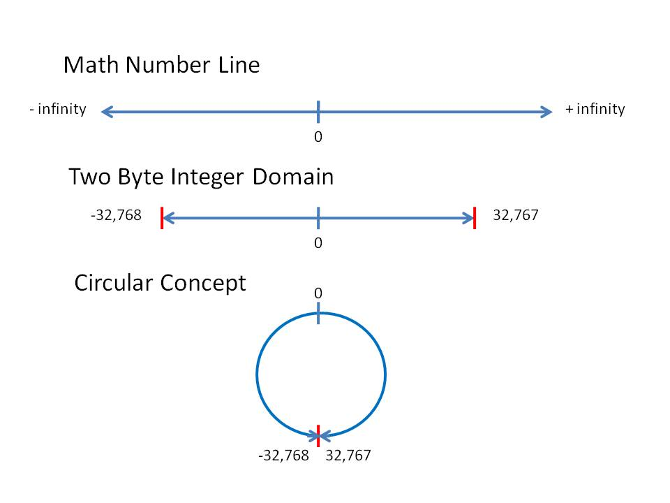

# Преобразование типов и арифметические выражения

## Введение: запись числовых литералов

В Java можно писать числовые литералы так, чтобы они были легко читаемы. Начиная с Java 7 допускается использовать символ подчёркивания (`_`) между цифрами: `1_000_000` → один миллион, `0b1010_1010` → бинарное представление и т.д. Подчёркивания игнорируются компилятором и могут ставиться почти в любом месте между цифрами, но **не** в начале или конце литерала и не рядом с точкой или суффиксом.

### Примеры
```java
int million = 1_000_000;           // читаемый целочисленный литерал
long hex = 0xFF_EC_DE_5;            // шестнадцатеричный с подчёркиваниями
int bin = 0b1101_0010;            // бинарный
float f = 3.14_15F;                // вещественный с суффиксом
```

### Экспоненциальная (научная) запись
Для **вещественных** чисел допускается экспоненциальная форма `mantissa` `E`/`e` `exponent`. Мантса может быть целой или дробной, а экспонента — целым числом со знаком. Пример: `1.23e4` → `12300.0`, `5e-3` → `0.005`.
```java
double d1 = 6.022e23;   // 6.022 × 10²³ (число Авогадро)
float f1 = 2.5e-2F;    // 0.025
```
Подчёркивания работают и в экспоненциальной форме: `1_000.0e-3` → `1.0`.

Эти возможности описаны в официальной документации Java (Java Language Specification, §3.10.2 "Floating‑Point Literals" и §3.10.1 "Integer Literals").

## 1. Автоматические (неявные) преобразования (widening conversion)

Java автоматически преобразует числовой тип, если результирующее значение **вмещается** в более ёмкий тип. Правила преобразования:
- `byte → short → int → long → float → double`
- `char → int → long → float → double`

### Примеры
```java
int i = 42;         
long l = i;          // теперь l == 42L
float f = i;         // int → float
double d = f;        // float → double
char c = 'A';        // char → int (автоподнятие)
int code = c;        // code == 65
```

## 2. Явные преобразования (narrowing)

Когда требуется записать значение большего типа в меньший, требуется явное преобразование: `(type) expression`. 
- `type` – тип, в который происходит преобразование;
- `expression` – выражение или литерал.

Приведение может привести к потере старших битов (соответственно число меняется) или к потере дробной части.

### Примеры
```java
long big = 1234567890123L;
int narrowed = (int) big;          // потеря старших битов
System.out.println(narrowed);     // выводит «-539222987»

double dVal = 3.99;
int iVal = (int) dVal;             // отбрасывает дробную часть → 3
float fVal = (float) dVal;         // возможна потеря точности
```

## 3. Переполнение (overflow) и потеря точности

**Переполнение (overflow)** числового типа происходит, когда результат арифметической операции *выходит за  диапазон* допустимых значений. В Java для целочисленных типов (`byte`, `short`, `int`, `long`) переполнение реализовано как **wrap‑around**




```java
int max = Integer.MAX_VALUE;   // 2 147 483 647
int overflow = max + 1;          // -2 147 483 648 (wrap‑around)
```

Переполнение может произойти незаметно, во время выполнения программы не будет брошено исключения, сигнализирующего о проблеме. Это отличается, например, от проверяющих методов `Math.addExact`, `Math.subtractExact`, `Math.multiplyExact` и `Math.toIntExact`, которые **явно бросают** `ArithmeticException`, если результат не помещается в целевой тип.

### Потеря точности при преобразовании floating‑point → integer
При явном приведении `float`/`double` к целому части отбрасывается, а не округляется:
```java
double d = 9.99;
int i = (int) d;   // i == 9
```

## 4. Особенности целочисленной арифметики

- Деление целых — **целочисленное**, остаток отбрасывается.
- Оператор `%` дает остаток знака делимого.
- При смешанных типах происходит **binary numeric promotion** (см. ниже).

### Примеры
```java
int a = 7;
int b = 2;
System.out.println(a / b);   // 3
System.out.println(a % b);   // 1
```

## 5. Особенности арифметики с плавающей точкой

## 6. Операции округления и константы из `java.lang.Math`

Java предоставляет набор методов в классе `Math` для разных видов округления и несколько часто используемых математических констант.

### Округление
| Метод | Описание |
|-------|----------|
| `Math.round(double a)` | Округляет до ближайшего `long` (½ → вверх). |
| `Math.round(float a)` | Округляет до ближайшего `int`. |
| `Math.floor(double a)` | Округление **вниз** к ближайшему целому (результат `double`). |
| `Math.ceil(double a)` | Округление **вверх** к ближайшему целому (результат `double`). |
| `Math.rint(double a)` | Округление к ближайшему целому, «банкеровское» (округление к чётному). |
| `Math.abs(int a)`, `Math.abs(double a)` | Возвращает абсолютное значение. |

#### Примеры
```java
double val = 2.7;
System.out.println(Math.round(val));   // 3
System.out.println(Math.floor(val));   // 2.0
System.out.println(Math.ceil(val));    // 3.0
System.out.println(Math.rint(2.5));   // 2.0 (округление к чётному)
```

### Математические константы
| Константа | Значение |
|-----------|----------|
| `Math.PI` | ≈ 3.141592653589793 |
| `Math.E`  | ≈ 2.718281828459045 |
| `Math.sqrt(2)` | Квадратный корень из 2 ≈ 1.4142135623730951 |
| `Math.sqrt(3)` | Квадратный корень из 3 ≈ 1.7320508075688772 |
| `Math.log(Math.E)` | Естественный логарифм e = 1 |

Эти константы и методы удобно использовать в вычислениях, требующих точных значений или различных форм округления.

## 7. Генерация случайных чисел

Java предлагает два основных способа получения случайных чисел:

- `Math.random()` — возвращает `double` в диапазоне `[0.0, 1.0)`.
- `java.util.Random` — более гибкий генератор, позволяющий получать целые, `float`, `long`, `boolean` и т.д.

### Примеры
```java
double d = Math.random();          // 0.0 ≤ d < 1.0
System.out.println(d);

Random rnd = new Random();         // создаёт генератор с текущим временем как seed
int i = rnd.nextInt(10);          // случайное int от 0 (включительно) до 10 (исключительно)
long l = rnd.nextLong();           // случайное 64‑битное значение
float f = rnd.nextFloat();         // 0.0 ≤ f < 1.0
boolean b = rnd.nextBoolean();     // true или false
```

### Управление seed

Установка фиксированного `seed` делает последовательность предсказуемой, что удобно для тестов:
```java
Random rnd = new Random(12345L);
System.out.println(rnd.nextInt()); // каждый запуск выдаст одно и то же число
```


## 7. Случайные числа в диапазоне `[a, b]`

#### С помощью `Math.random()`
```java
int a = 5;
int b = 12; // включительно
int random = a + (int)(Math.random() * (b - a + 1));
System.out.println(random); // от 5 до 12
```

#### С помощью `java.util.Random`
```java
Random rnd = new Random();
int a = 5;
int b = 12;
int random = rnd.nextInt(b - a + 1) + a; // диапазон [a, b]
System.out.println(random);
```

#### С помощью `ThreadLocalRandom`
```java
int a = 5;
int b = 12;
int random = ThreadLocalRandom.current().nextInt(a, b + 1); // верхняя граница исключается, поэтому +1
System.out.println(random);
```

## 8. Неявные преобразования в выражениях (binary numeric promotion)

- Операции над `float` и `double` следуют IEEE‑754.
- Возможны специальные значения: `NaN`, `Infinity`, `-Infinity`.
- При выполнении арифметики с целыми `int` автоматически продвигаются к `double`, если один из операндов `double`.

Не все десятичные дроби возможно записать точно, например 1/3 ≈ 0.33. Но 1/3 в десятичной записи -- это бесконечная дробь. Аналогично не все дробные числа можно записать в виде конечного набора цифр и в двоичной системе счисления. Причем в двоичной системе счисления есть свои дроби, которые не получается записать в виде конечного набора цифр. Например число `0.3` в десятичной записывается точно, но в двоичной системе счисления -- нет: `0.3` = `0.010011001100110011001101...`. Из-за типы float и double могут сохранять не все знания точно. 

**Пример**
```java
double x = 0.1 + 0.2;
System.out.println(x);          // 0.30000000000000004
System.out.println(x == 0.3);    // false
```

## 6. Неявные преобразования в выражениях (binary numeric promotion)

JLS §5.6 описывает правила повышения типов для бинарных операторов (`+ - * / %`). Итоговый тип определяется по следующему порядку:
1. Если один из операндов `double` → `double`
2. Иначе, если один `float` → `float`
3. Иначе, если один `long` → `long`
4. Иначе → `int`

### Таблица сочетаний (частичный)
| Операнд 1 | Операнд 2 | Результат |
|-----------|-----------|-----------|
| `int` | `float` | `float` |
| `short` | `byte` | `int` |
| `long` | `int` | `long` |
| `char` | `int` | `int` |

### Пример
```java
char ch = 'A';          // 65
int i = 5;
var result = ch + i;   // int, value 70
float f = 2.5f;
var mixed = i + f;      // float, value 7.5
```

## 9. Явные приведения в выражениях

Иногда требуется предотвратить автоматическое повышение, например, при делении, где важен целочисленный результат.
```java
int x = 5;
int y = 2;
int intDiv = x / y;               // 2 (целочисленное деление)
double doubleDiv = (double) x / y; // 2.5 (приведение первого операнда)
System.out.println(intDiv);
System.out.println(doubleDiv);
```

## 10. Сравнение с C и Python

| Аспект | Java | C | Python |
|--------|------|---|--------|
| Размеры типов | фиксированы | зависит от платформы | произвольная точность (int), `float` → C‑double |
| Неявное `int → float` | **нет** (только при арифметическом продвижении) | есть | есть (auto‑cast) |
| Переполнение целых | wrap‑around, без исключения | UB (неопределённое) | автоматический переход к `bigint` |
| Деление целых | целочисленное, усечение | целочисленное (в C99) | всегда плавающая (`/`) |

## 11. Практические рекомендации

- **Явный каст** используйте, когда нужен контроль над типом результата или когда переводите `long` → `int`.
- Для **проверки переполнения** применяйте методы `Math.addExact`, `Math.subtractExact`, `Math.multiplyExact`, `Math.toIntExact` – они бросают `ArithmeticException` при переполнении.
- При работе с **денежными** или другими точными значениями используйте `java.math.BigDecimal` вместо `float`/`double`.
- При выводе результатов с плавающей точкой используйте `System.out.printf("%.2f", value)` для ограничения количества знаков.
