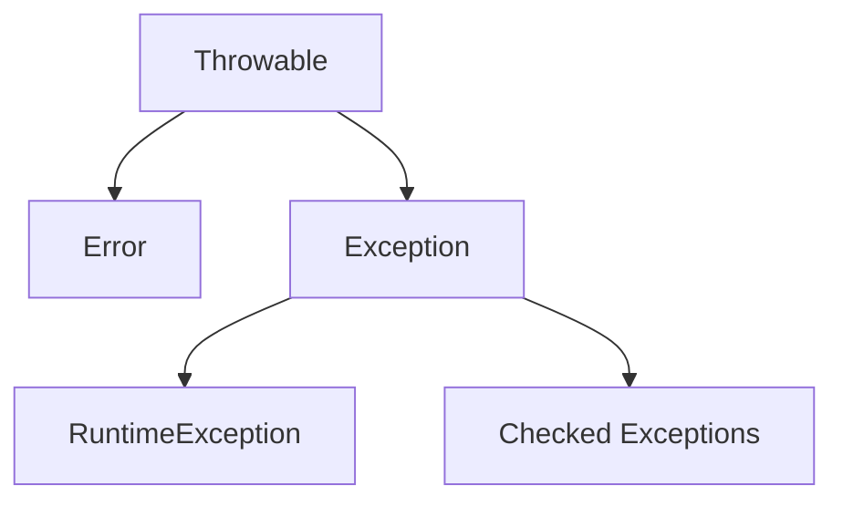

# Исключительные ситуации (Exceptions)

## Что такое исключительная ситуация?

**Исключительная ситуация** – это ситуация, когда обычный алгоритм выполнения программы не имеет смысла и требует особого реагирования. Обычно это связано с ошибками во входных данных и когда нет смысла продолжать выполнения программы.


### Примеры
- Входные данные некорректны, например ожидался размер массива, но получен 0 или отрицательное число.
- Невозможно прочитать файл (файл не существует) или невозможно сделать запись в файл (файл недоступен для изменения)
- Недоступно сетевое соединение
- Закончилась доступная память

| Язык | Событие | Как выглядит в коде |
|------|---------|---------------------|
| **Java** | Деление на ноль | `int r = 10 / 0;` → `ArithmeticException` |
| **Python** | Открыть несуществующий файл | `open('nofile.txt')` → `FileNotFoundError` |
| **C** | Ошибка выделения памяти | `malloc(…);` возвращает `NULL` |
| **C** | Неверный аргумент функции | `int foo(int x){ if(x<0) return -1; … }` |


## Как сигнализировать об ошибке в C

- Вернуть код ошибки или специальное значение из функции
- Записать в параметр-указатель специальное значение
- Использовать специальную служебную переменную для сохранения кода ошибки


### 1. Возврат кода ошибки

```c
#include <stdio.h>
#include <stdlib.h>

/// Открывает файл и возвращает файловую переменную
/// Если файл не удалось открыть, то возвращает NULL
FILE *open_file(const char *path) {
    FILE *f = fopen(path, "r");
    if (!f) {
        perror("fopen");
        return NULL;         
    }
    return f;
}


int main(void) {
    FILE *f = open_file("data.txt");
    // Проверка исключительной ситуации 
    if (!f) {
        // Обработка исключительной ситуации
        fprintf(stderr, "Не удалось открыть файл\n");
        // ...
    }
    /* работа с файлом ... */
    fclose(f);
}
```

 

### 2. Параметр‑указатель для результата/ошибки

```c
#include <stdio.h>
#include <stdlib.h>

/// Читает первую строку из файла и записывает её в `out`
/// Возвращает 0 в случае успеха, -1 в случае ошибки
int read_first_line(const char *path, char *out, size_t out_len) {
    FILE *f = fopen(path, "r");
    if (!f) return -1;               // ошибка открытия
    if (!fgets(out, (int)out_len, f)) {
        fclose(f);
        return -1;                   // ошибка чтения
    }
    fclose(f);
    return 0;                        // успех
}


int main(void) {
    char line[256];
    if (read_first_line("data.txt", line, sizeof(line)) != 0) {
        fprintf(stderr, "Ошибка чтения файла\n");
    }
    printf("Первая строка: %s\n", line);
}
```

### 3. Специальный параметр-указатель на код ошибки (errno)

Некоторые функции C не возвращают код ошибки напрямую, а сигнализируют об ошибке через глобальную переменную `errno`, которая объявлена в `<errno.h>`.

```c
#include <stdio.h>
#include <math.h>
#include <errno.h>

int main(void) {
    errno = 0;               // сбрасываем перед вызовом
    double r = sqrt(-1.0);   // математически некорректно

    if (errno == EDOM) {     // Domain Error — аргумент вне области определения
        printf("Ошибка: sqrt от отрицательного числа (%f)\n", r);
        // r будет NaN, дальнейшие вычисления с ним бессмысленны
    }
}
```

`errno` — это «специальная переменная»: функция не возвращает значение ошибки, а *побочно* записывает его в глобальную область, а вызывающий код проверяет её после вызова.

- В C ошибки обычно сигнализируются через коды возврата или специальные параметры.
- В обоих случаях важно проверять результат сразу после вызова функции.


### Стандартные функции C, использующие разные способы сигнализации об ошибке

| Функция | Библиотека | Как сигнализирует об ошибке | Пример проверки |
| :--- | :--- | :--- | :--- |
| `fopen()` | `<stdio.h>` | Возвращает `NULL` | `if (!f) { /* ошибка */ }` |
| `malloc()` | `<stdlib.h>` | Возвращает `NULL` | `if (!ptr) { /* нехватка памяти */ }` |
| `read()` | `<unistd.h>` | Возвращает `-1`, код в `errno` | `if (n == -1) { perror("read"); }` |
| `sqrt()` | `<math.h>` | Устанавливает `errno` в `EDOM` | `if (errno == EDOM) { /* ... */ }` |
| `strtol()` | `<stdlib.h>` | Возвращает `0` или `LONG_MIN/MAX`, устанавливает `errno` в `ERANGE` | `if (errno == ERANGE) { /* переполнение */ }` |
| `printf()/scanf()` | `<stdio.h>` | Возвращают отрицательное число при ошибке | `if (printf(...) < 0) { /* ошибка вывода */ }` |

Обратите внимание: одна функция может сочетать оба подхода. Например, `read()` возвращает `-1` **и** дополнительно записывает конкретный код ошибки в `errno`. Универсального способа нет — каждую функцию нужно проверять по-своему.


## Как работать с исключениями в Java


Java использует механизм **исключений**, который позволяет:
- отделить основной код от кода обработки ошибок;
- передать информацию об ошибке «вверх» по стеку вызовов до того уровня, где её можно эффективно обработать;
- гарантировать выполнение очистки ресурсов через `finally` или try-with-resources.


- **try‑catch** – перехватываем и обрабатываем.
- **finally** – код, который всегда выполняется (чистка ресурсов).
- **try‑with‑resources** – автоматическое закрытие объектов, реализующих `AutoCloseable`.

```java
try (BufferedReader br = new BufferedReader(new FileReader("file.txt"))) {
    System.out.println(br.readLine());
} catch (IOException e) {
    e.printStackTrace();
}
```

## 2. Иерархия `java.lang.Throwable`

Все исключения в Java являются объектами, наследуемыми от класса `Throwable`.



### Основные ветви

1. **`Error`** — серьёзные проблемы JVM, например `OutOfMemoryError` или `StackOverflowError`. Программа обычно не должна пытаться их перехватывать, так как они сигнализируют о фатальном сбое среды.
2. **`Exception`** — ошибки, которые приложение может и должно обрабатывать. Они делятся на две категории:
   - **непроверяемые (unchecked)** — наследуются от `RuntimeException`. Это обычно ошибки программиста, например `NullPointerException` или `ArrayIndexOutOfBoundsException`. Компилятор не заставляет их обрабатывать;
   - **проверяемые (checked)** — все остальные наследники `Exception`, например `IOException` или `SQLException`. Компилятор **требует**, чтобы такие исключения были либо обработаны в блоке `try-catch`, либо объявлены в сигнатуре метода через `throws`.

| Тип | Базовый класс | Кто отвечает | Пример | Обязательность обработки |
| :--- | :--- | :--- | :--- | :--- |
| **Error** | `Error` | JVM / среда | `OutOfMemoryError` | Нет |
| **Unchecked** | `RuntimeException` | Программист | `NullPointerException` | Нет |
| **Checked** | `Exception` | Внешняя среда | `IOException` | **Да** |

## 3. Обработка исключений: `try-catch-finally`

Для перехвата исключений используется конструкция `try-catch`.

### Базовый синтаксис

```java
try {
    int result = 10 / 0; // Здесь возникает ArithmeticException
} catch (ArithmeticException e) {
    System.out.println("Ошибка: деление на ноль! " + e.getMessage());
}
```

### Множественные блоки `catch`

Если код в `try` может выбросить разные типы исключений, можно использовать несколько блоков `catch`.

**Важно:** блоки должны идти от более специфичных к более общим.

```java
try {
    // Код, который может выбросить разные исключения
} catch (FileNotFoundException e) {
    // Обработка конкретно отсутствия файла
} catch (IOException e) {
    // Обработка любой другой ошибки ввода-вывода
} catch (Exception e) {
    // «Последний рубеж» для всех остальных исключений
}
```

### Блок `finally`

Код в блоке `finally` выполняется **всегда**, независимо от того, возникло исключение или нет. Это идеальное место для закрытия ресурсов.

```java
try {
    System.out.println("Работа с ресурсом...");
} catch (Exception e) {
    System.out.println("Ошибка!");
} finally {
    System.out.println("Очистка ресурсов (выполнится в любом случае)");
}
```

## 4. Генерация и делегирование исключений

### Оператор `throw`

Используется для явного создания и «выброса» исключения.

```java
public void setAge(int age) {
    if (age < 0) {
        throw new IllegalArgumentException("Возраст не может быть отрицательным");
    }
}
```

### Ключевое слово `throws`

Если метод не обрабатывает проверяемое исключение внутри себя, он должен «делегировать» ответственность вызывающему коду, указав это в сигнатуре.

```java
public void readFile() throws IOException {
    // Метод не обрабатывает IOException, а пробрасывает его выше
    throw new IOException("Файл не найден");
}

// Вызывающий код обязан либо обработать его, либо пробросить дальше
public void start() {
    try {
        readFile();
    } catch (IOException e) {
        e.printStackTrace();
    }
}
```

## 5. Современное управление ресурсами: try-with-resources

Начиная с Java 7, для работы с ресурсами, которые нужно закрывать, например файлами или сетевыми соединениями, используется конструкция `try-with-resources`. Ресурс должен реализовывать интерфейс `AutoCloseable`.

### До Java 7

```java
BufferedReader br = null;
try {
    br = new BufferedReader(new FileReader("test.txt"));
} catch (IOException e) {
    e.printStackTrace();
} finally {
    if (br != null) {
        br.close(); // Нужно вручную проверять на null и обрабатывать ошибку закрытия
    }
}
```

### С try-with-resources

```java
try (BufferedReader br = new BufferedReader(new FileReader("test.txt"))) {
    System.out.println(br.readLine());
} catch (IOException e) {
    e.printStackTrace();
} // br.close() вызовется автоматически при выходе из блока
```

## 6. Создание собственных исключений

Свои исключения создаются путём наследования от `Exception` для проверяемых исключений или от `RuntimeException` для непроверяемых.

```java
// Своё проверяемое исключение
class InsufficientFundsException extends Exception {
    public InsufficientFundsException(String message) {
        super(message);
    }
}

public class BankAccount {
    private double balance = 100;

    public void withdraw(double amount) throws InsufficientFundsException {
        if (amount > balance) {
            throw new InsufficientFundsException("Недостаточно средств. Баланс: " + balance);
        }
        balance -= amount;
    }
}
```

## 7. Практические рекомендации и антипаттерны

### ❌ Антипаттерны

1. **«Поглощение» исключений**

    ```java
    try {
        // какой-то код
    } catch (Exception e) {
        // Пустой блок — ошибка «исчезает», найти причину сбоя будет невозможно
    }
    ```

2. **Перехват слишком общих типов**

    ```java
    try {
        // какой-то код
    } catch (Exception e) {
        // Часто скрывает настоящие причины проблемы
    }
    ```

    Конструкции `catch (Throwable t)` или слишком общий `catch (Exception e)` затрудняют отладку, потому что вместе с ожидаемыми ошибками перехватываются и ошибки, которые программа не должна обрабатывать.

### ✅ Рекомендации

- **Будьте специфичны.** Перехватывайте максимально конкретные исключения.
- **Не используйте исключения для управления обычной логикой.** Исключения предназначены для *исключительных* ситуаций, а не для обычных условий. Например, вместо `try-catch` для проверки наличия файла используйте `Files.exists()`.
- **Выбирайте тип правильно:**
  - `Checked` — если вызывающий код **может и должен** что-то предпринять для восстановления;
  - `Unchecked` — если это ошибка программиста, которую нужно исправить в коде.

## 8. Итоги и контрольные вопросы

Исключения в Java — это единый механизм описания и обработки ошибок. Они позволяют не смешивать нормальный ход выполнения программы с проверками ошибок, а также корректно освобождать ресурсы даже при сбоях.

Контрольные вопросы:
1. В чём разница между `Error` и `Exception`?
2. Почему `RuntimeException` называют непроверяемым исключением?
3. Почему блоки `catch` нужно располагать от более специфичных к более общим?
4. Что произойдёт, если в блоке `try` возникнет исключение, а в блоке `finally` тоже будет выброшено исключение?
5. Какой интерфейс должен реализовать класс, чтобы его можно было использовать в `try-with-resources`?
