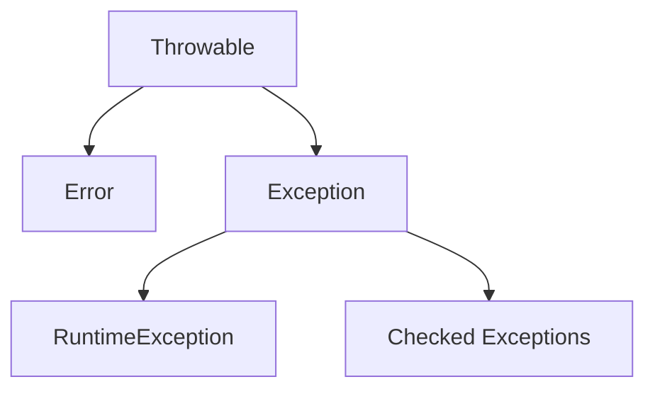

# Исключительные ситуации (Exceptions)

Исключение — это объект, который создаётся в момент возникновения ошибки во время выполнения программы и содержит информацию о типе ошибки, состоянии программы и стеке вызовов (stack trace).

## 1. Концепция исключений

В языках вроде C ошибки часто обрабатываются через возвращаемые значения: например, функция возвращает `-1` или `NULL` при неудаче. Это заставляет программиста проверять результат после каждого вызова, что загромождает бизнес-логику.

Java использует механизм **исключений**, который позволяет:
- отделить основной код от кода обработки ошибок;
- передать информацию об ошибке «вверх» по стеку вызовов до того уровня, где её можно эффективно обработать;
- гарантировать выполнение очистки ресурсов через `finally` или try-with-resources.

## 2. Иерархия `java.lang.Throwable`

Все исключения в Java являются объектами, наследуемыми от класса `Throwable`.



### Основные ветви

1. **`Error`** — серьёзные проблемы JVM, например `OutOfMemoryError` или `StackOverflowError`. Программа обычно не должна пытаться их перехватывать, так как они сигнализируют о фатальном сбое среды.
2. **`Exception`** — ошибки, которые приложение может и должно обрабатывать. Они делятся на две категории:
   - **непроверяемые (unchecked)** — наследуются от `RuntimeException`. Это обычно ошибки программиста, например `NullPointerException` или `ArrayIndexOutOfBoundsException`. Компилятор не заставляет их обрабатывать;
   - **проверяемые (checked)** — все остальные наследники `Exception`, например `IOException` или `SQLException`. Компилятор **требует**, чтобы такие исключения были либо обработаны в блоке `try-catch`, либо объявлены в сигнатуре метода через `throws`.

| Тип | Базовый класс | Кто отвечает | Пример | Обязательность обработки |
| :--- | :--- | :--- | :--- | :--- |
| **Error** | `Error` | JVM / среда | `OutOfMemoryError` | Нет |
| **Unchecked** | `RuntimeException` | Программист | `NullPointerException` | Нет |
| **Checked** | `Exception` | Внешняя среда | `IOException` | **Да** |

## 3. Обработка исключений: `try-catch-finally`

Для перехвата исключений используется конструкция `try-catch`.

### Базовый синтаксис

```java
try {
    int result = 10 / 0; // Здесь возникает ArithmeticException
} catch (ArithmeticException e) {
    System.out.println("Ошибка: деление на ноль! " + e.getMessage());
}
```

### Множественные блоки `catch`

Если код в `try` может выбросить разные типы исключений, можно использовать несколько блоков `catch`.

**Важно:** блоки должны идти от более специфичных к более общим.

```java
try {
    // Код, который может выбросить разные исключения
} catch (FileNotFoundException e) {
    // Обработка конкретно отсутствия файла
} catch (IOException e) {
    // Обработка любой другой ошибки ввода-вывода
} catch (Exception e) {
    // «Последний рубеж» для всех остальных исключений
}
```

### Блок `finally`

Код в блоке `finally` выполняется **всегда**, независимо от того, возникло исключение или нет. Это идеальное место для закрытия ресурсов.

```java
try {
    System.out.println("Работа с ресурсом...");
} catch (Exception e) {
    System.out.println("Ошибка!");
} finally {
    System.out.println("Очистка ресурсов (выполнится в любом случае)");
}
```

## 4. Генерация и делегирование исключений

### Оператор `throw`

Используется для явного создания и «выброса» исключения.

```java
public void setAge(int age) {
    if (age < 0) {
        throw new IllegalArgumentException("Возраст не может быть отрицательным");
    }
}
```

### Ключевое слово `throws`

Если метод не обрабатывает проверяемое исключение внутри себя, он должен «делегировать» ответственность вызывающему коду, указав это в сигнатуре.

```java
public void readFile() throws IOException {
    // Метод не обрабатывает IOException, а пробрасывает его выше
    throw new IOException("Файл не найден");
}

// Вызывающий код обязан либо обработать его, либо пробросить дальше
public void start() {
    try {
        readFile();
    } catch (IOException e) {
        e.printStackTrace();
    }
}
```

## 5. Современное управление ресурсами: try-with-resources

Начиная с Java 7, для работы с ресурсами, которые нужно закрывать, например файлами или сетевыми соединениями, используется конструкция `try-with-resources`. Ресурс должен реализовывать интерфейс `AutoCloseable`.

### До Java 7

```java
BufferedReader br = null;
try {
    br = new BufferedReader(new FileReader("test.txt"));
} catch (IOException e) {
    e.printStackTrace();
} finally {
    if (br != null) {
        br.close(); // Нужно вручную проверять на null и обрабатывать ошибку закрытия
    }
}
```

### С try-with-resources

```java
try (BufferedReader br = new BufferedReader(new FileReader("test.txt"))) {
    System.out.println(br.readLine());
} catch (IOException e) {
    e.printStackTrace();
} // br.close() вызовется автоматически при выходе из блока
```

## 6. Создание собственных исключений

Свои исключения создаются путём наследования от `Exception` для проверяемых исключений или от `RuntimeException` для непроверяемых.

```java
// Своё проверяемое исключение
class InsufficientFundsException extends Exception {
    public InsufficientFundsException(String message) {
        super(message);
    }
}

public class BankAccount {
    private double balance = 100;

    public void withdraw(double amount) throws InsufficientFundsException {
        if (amount > balance) {
            throw new InsufficientFundsException("Недостаточно средств. Баланс: " + balance);
        }
        balance -= amount;
    }
}
```

## 7. Практические рекомендации и антипаттерны

### ❌ Антипаттерны

1. **«Поглощение» исключений**

    ```java
    try {
        // какой-то код
    } catch (Exception e) {
        // Пустой блок — ошибка «исчезает», найти причину сбоя будет невозможно
    }
    ```

2. **Перехват слишком общих типов**

    ```java
    try {
        // какой-то код
    } catch (Exception e) {
        // Часто скрывает настоящие причины проблемы
    }
    ```

    Конструкции `catch (Throwable t)` или слишком общий `catch (Exception e)` затрудняют отладку, потому что вместе с ожидаемыми ошибками перехватываются и ошибки, которые программа не должна обрабатывать.

### ✅ Рекомендации

- **Будьте специфичны.** Перехватывайте максимально конкретные исключения.
- **Не используйте исключения для управления обычной логикой.** Исключения предназначены для *исключительных* ситуаций, а не для обычных условий. Например, вместо `try-catch` для проверки наличия файла используйте `Files.exists()`.
- **Выбирайте тип правильно:**
  - `Checked` — если вызывающий код **может и должен** что-то предпринять для восстановления;
  - `Unchecked` — если это ошибка программиста, которую нужно исправить в коде.

## 8. Итоги и контрольные вопросы

Исключения в Java — это единый механизм описания и обработки ошибок. Они позволяют не смешивать нормальный ход выполнения программы с проверками ошибок, а также корректно освобождать ресурсы даже при сбоях.

Контрольные вопросы:
1. В чём разница между `Error` и `Exception`?
2. Почему `RuntimeException` называют непроверяемым исключением?
3. Почему блоки `catch` нужно располагать от более специфичных к более общим?
4. Что произойдёт, если в блоке `try` возникнет исключение, а в блоке `finally` тоже будет выброшено исключение?
5. Какой интерфейс должен реализовать класс, чтобы его можно было использовать в `try-with-resources`?
