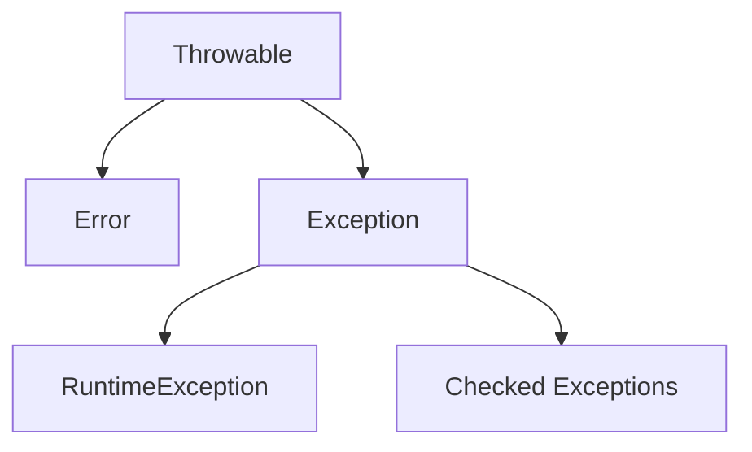
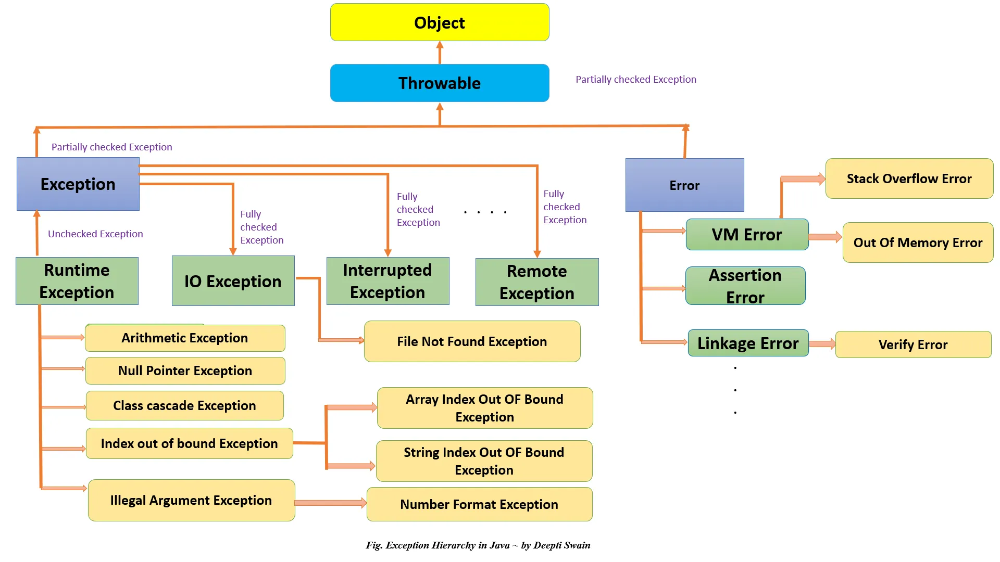

# Исключительные ситуации (Exceptions)

## Что такое исключительная ситуация?

**Исключительная ситуация** – это ситуация, когда обычный алгоритм выполнения программы не имеет смысла и требует особого реагирования. Обычно это связано с ошибками во входных данных и когда нет смысла продолжать выполнения программы.


#### Примеры
- Входные данные некорректны, например ожидался размер массива, но получен 0 или отрицательное число.
- Невозможно прочитать файл (файл не существует или к нему нет доступа) или невозможно сделать запись в файл (файл недоступен для изменения)
- Недоступно сетевое соединение
- Закончилась доступная память


### Как обозначать исключительные ситуации?
В работе с исключениями можно использовать разные подходы:
- Никак не обозначать исключения.
  Такой подход, например, использует принцип Garbage in - garbage out (мусор на входе, мусор не выходе). Если в функцию были переданы некорректные данные, то функция выдаёт некорректный ответ. Тогда приходится делать отдельную проверку корректности ответа, если она, конечно возможна.
- Обозначать через возвращаемое значение функции.
  *Например функция возвращает 0, если отработала успешно и возвращает положительное число, обозначающее ошибку, если во время её работы возникли ошибка (переданы некорректные данные).*
- Обозначать через параметр, праданный по ссылке.
  Аналогично предыдущему подходу, но вместо возврата используется запись кода ошибки, сообщения об исключении или иных данных обозначающих исключение в параметр-ссылку.
- Использовать специально реализованных во многих языках подход, позволяющий создавать в памяти, специальные временные значения обозначающие исключение, и позволяющий прерывать выполнение функции. Этот подход называется **механизм обработки исключений** 


| Язык | Событие | Как выглядит в коде |
|------|---------|---------------------|
| **Java** | Деление на ноль | `int r = 10 / 0;` → `ArithmeticException` |
| **Python** | Открыть несуществующий файл | `open('nofile.txt')` → `FileNotFoundError` |
| **C** | Ошибка выделения памяти | `malloc(…);` возвращает `NULL` |
| **C** | Неверный аргумент функции | `int foo(int x){ if(x<0) return -1; … }` |

> Подробнее о подходах к обработке ошибок в C и других языках (Rust, Go) см. [17_exceptions_other_langs.md](17_exceptions_other_langs.md).


# 1. Исключения, которые бросают библиотечные функции

Возможно, вы уже сталкивались с исключениями, даже не зная этого. Любой метод Java может бросить (throw) исключение, если не может выполнить свою работу.

Например `Scanner.nextInt()` — метод, который читает число с клавиатуры:

```java
import java.util.Scanner;

public class Main {
    public static void main(String[] args) {
        Scanner sc = new Scanner(System.in);
        System.out.print("Введите число: ");
        int x = sc.nextInt();   // что будет, если ввести "abc"?
        System.out.println("Вы ввели: " + x);
    }
}
```

Если пользователь введёт не число, а, например, `abc`, метод `nextInt()` не сможет выполнить свою работу — он не знает, как превратить строку `"abc"` в число. Вместо того чтобы вернуть какое-то некорректное значение, метод (функция) приостановит свою работу, не вернёт значение (до этого выполнение метода не дойдёт) и **бросит исключение** `InputMismatchException`.

Другие знакомые примеры:

| Код | Что происходит | Какое исключение |
| :--- | :--- | :--- |
| `Integer.parseInt("abc")` | Строку нельзя превратить в число | `NumberFormatException` |
| `int[] a = {1, 2}; a[5] = 0;` | Индекс за пределами массива | `ArrayIndexOutOfBoundsException` |
| `String s = null; s.length();` | Обращение к методу по ссылке `null` | `NullPointerException` |
| `int x = 10 / 0;` | Деление на ноль | `ArithmeticException` |


## 2. Что значит «было брошено исключение»?

Когда метод (функция) бросает исключение, происходит следующее:

1. Выполнение метода **немедленно прекращается** — строка после места броска не выполняется.
2. Создаётся **значение, описывающие исключение** — оно содержит информацию об ошибке (сообщение, место в коде, стек вызовов).
3. Исключение передаётся по стеку вызовов: из исходного метода (функции) — в тот метод, который его вызвал, оттуда — ещё выше, и так далее.
4. Если **никто** не поймал исключение, программа **завершается аварийно**, а в консоль выводится стек вызовов (stack trace).

Для программы с `nextInt()` это выглядит так:

```
Введите число: abc
Exception in thread "main" java.util.InputMismatchException
	at java.util.Scanner.throwFor(Scanner.java:864)
	at java.util.Scanner.next(Scanner.java:1371)
	at java.util.Scanner.nextInt(Scanner.java:984)
	at Main.main(Main.java:6)
```

Последняя строка — самая полезная: она показывает, что исключение возникло в `Main.main` на строке 6, то есть в нашем вызове `sc.nextInt()`.


## 3. Ловим исключение: try-catch

Чтобы программа не завершалась аварийно, исключение нужно **поймать**. Для этого код, который может бросить исключение, помещают в блок `try`, а обработку ошибки описывают в блоке `catch`:

```java
import java.util.Scanner;

public class Main {
    public static void main(String[] args) {
        Scanner sc = new Scanner(System.in);
        System.out.print("Введите число: ");

        try {
            int x = sc.nextInt();          // может бросить InputMismatchException
            System.out.println("Вы ввели: " + x);
        } catch (InputMismatchException e) {
            System.out.println("Ошибка: это не число!");
        }

        System.out.println("Программа продолжает работу");
    }
}
```

Теперь при вводе `abc` программа не упадёт, а выведет:

```
Введите число: abc
Ошибка: это не число!
Программа продолжает работу
```

Как это работает:
- если в блоке `try` исключение **не возникло** — блок `catch` пропускается, программа идёт дальше;
- если исключение **возникло** — выполнение `try` прерывается, и управление передаётся в подходящий блок `catch`;
- после `catch` программа продолжает работу со следующей строки.

### Несколько блоков catch

Если код может бросить исключения разных типов, можно написать несколько блоков `catch`. Важно располагать их от более специфичных к более общим:

```java
try {
    // код, который может бросить разные исключения
} catch (FileNotFoundException e) {
    // файл не найден — частный случай
} catch (IOException e) {
    // любая другая ошибка ввода-вывода
} catch (Exception e) {
    // «последний рубеж» — все остальные исключения
}
```


## 4. Бросание исключений (оператор throw)

До сих пор исключения бросали методы стандартной библиотеки. Но и вы можете бросить исключение сами — с помощью оператора `throw`.

Представьте метод, который устанавливает возраст. Если переданный возраст некорректен, метод не может выполнить свою работу — он бросает `IllegalArgumentException`:

```java
public class Main {
    // Метод бросает исключение, если возраст некорректен
    public static void setAge(int age) {
        if (age < 0 || age > 150) {
            throw new IllegalArgumentException("Возраст должен быть от 0 до 150");
        }
        System.out.println("Возраст установлен: " + age);
    }

    public static void main(String[] args) {
        try {
            setAge(-5);   // внутри setAge будет брошено исключение
            System.out.println("Эта строка не выполнится");
        } catch (IllegalArgumentException e) {
            System.out.println("Поймали: " + e.getMessage());
        }

        System.out.println("Программа продолжает работу");
    }
}
```

Обратите внимание на синтаксис: `throw new IllegalArgumentException("...")` — создаётся новый объект исключения с сообщением и сразу бросается.

Вывод программы:

```
Поймали: Возраст должен быть от 0 до 150
Программа продолжает работу
```

Это ключевая идея: **метод бросает исключение внутри себя, а ловит его тот, кто вызвал метод** — на том уровне, где понятно, что делать с ошибкой.


## 5. Проброс наверх: throws. Проверяемые и непроверяемые исключения

### Ключевое слово throws

Не всегда удобно ловить исключение сразу. Иногда метод должен «пробросить» исключение выше — тому, кто его вызвал. Для этого в сигнатуре метода указывают `throws`:

```java
public void readFile() throws IOException {
    // метод не обрабатывает IOException, а пробрасывает его выше
    throw new IOException("Файл не найден");
}

public void start() {
    try {
        readFile();   // вызывающий обязан обработать или пробросить дальше
    } catch (IOException e) {
        e.printStackTrace();
    }
}
```

### Когда нужно обозначать функции, бросающие исключения?

Сравните два метода:

```java
public static void setAge(int age) {
    if (age < 0) {
        throw new IllegalArgumentException("...");  // throws НЕ нужен
    }
}

public void readFile() throws IOException {          // throws НУЖЕН
    throw new IOException("...");
}
```

Дело в том, что исключения в Java делятся на два вида:

- **Непроверяемые (unchecked)** — компилятор не требует их обрабатывать. Это ошибки программиста: `NullPointerException`, `ArrayIndexOutOfBoundsException`, `IllegalArgumentException`. Если вы забыли их обработать, программа просто упадёт в момент ошибки.
- **Проверяемые (checked)** — компилятор **заставляет** либо обработать их в `try-catch`, либо объявить в заголовке через `throws`. Это ошибки внешней среды: `IOException`, `SQLException`. Если метод может бросить проверяемое исключение и не объявит это — программа не скомпилируется.


### Иерархия `java.lang.Throwable`

Почему компилятор может отличить одни исключения от других? Потому что все они — классы, и у них общий предок `Throwable`:


```mermaid
graph TD
    T[Throwable] --> E[Error]
    T --> Ex[Exception]
    Ex --> RE[RuntimeException]
    Ex --> CE[Checked Exceptions]
```

- **`Error`** — серьёзные проблемы JVM, например `OutOfMemoryError` или `StackOverflowError`. Программа обычно не должна пытаться их перехватывать, так как они сигнализируют о фатальном сбое среды.
- **`Exception`** — ошибки, которые приложение может и должно обрабатывать. Они делятся на две категории:
  - **непроверяемые (unchecked)** — наследуются от `RuntimeException`. Это обычно ошибки программиста, например `NullPointerException` или `ArrayIndexOutOfBoundsException`. Компилятор не заставляет их обрабатывать;
  - **проверяемые (checked)** — все остальные наследники `Exception`, например `IOException` или `SQLException`. Компилятор **требует**, чтобы такие исключения были либо обработаны в блоке `try-catch`, либо объявлены в сигнатуре метода через `throws`.

| Тип | Базовый класс | Кто отвечает | Пример | Обязательность обработки |
| :--- | :--- | :--- | :--- | :--- |
| **Error** | `Error` | JVM / среда | `OutOfMemoryError` | Нет |
| **Unchecked** | `RuntimeException` | Программист | `NullPointerException` | Нет |
| **Checked** | `Exception` | Внешняя среда | `IOException` | **Да** |



### Часто встречающиеся исключения Java

Некоторые исключения возникают настолько часто, что их стоит знать «в лицо». В таблице ниже — самые распространённые, сгруппированные по категориям.

#### Исключения, которые выбрасывает JVM (ошибки времени выполнения)

Эти исключения возникают сами собой, когда код делает что-то недопустимое. Их не нужно объявлять в `throws` — они unchecked.

| Исключение | Когда возникает | Типичный пример |
| :--- | :--- | :--- |
| `NullPointerException` | Обращение к методу или полю объекта по ссылке `null` | `String s = null; s.length();` |
| `ArrayIndexOutOfBoundsException` | Индекс за пределами массива | `int[] a = {1,2}; a[5] = 0;` |
| `ArithmeticException` | Арифметическая ошибка (деление на ноль) | `int x = 10 / 0;` |
| `ClassCastException` | Неудачное приведение типа | `Object o = "str"; Integer i = (Integer) o;` |
| `NumberFormatException` | Строку нельзя преобразовать в число | `Integer.parseInt("abc");` |
| `IllegalArgumentException` | Методу передан некорректный аргумент | см. следующий раздел |
| `IndexOutOfBoundsException` | Индекс вне границ (общий случай) | `new ArrayList<>().get(10);` |
| `ConcurrentModificationException` | Коллекция изменяется во время итерации | `for (var x : list) { list.remove(x); }` |


#### Исключения, которые программисты бросают сами

Эти исключения программист создаёт и выбрасывает через `throw`, когда проверяет предусловия или бизнес-правила.

| Исключение | Когда бросают | Пример |
| :--- | :--- | :--- |
| `IllegalArgumentException` | Аргумент функции не проходит проверку | `if (age < 0) throw new IllegalArgumentException(...)` |
| `IllegalStateException` | Объект находится в неподходящем состоянии | `if (!isOpen) throw new IllegalStateException("Connection closed")` |
| `UnsupportedOperationException` | Вызван метод, который не поддерживается реализацией | `throw new UnsupportedOperationException("not implemented yet")` |
| `NoSuchElementException` | Элемент не найден (итератор, коллекция) | `if (!found) throw new NoSuchElementException(...)` |
| `IOException` (checked) | Ошибка ввода-вывода | `throw new IOException("File not found")` |

> **Разница простая:** `NullPointerException`, `ArrayIndexOutOfBoundsException` и `ArithmeticException` JVM выбрасывает сама, когда код нарушает правила языка. А `IllegalArgumentException`, `IllegalStateException` и `UnsupportedOperationException` — это инструменты для самого программиста: он явно пишет `throw new ...`, чтобы сигнализировать о нарушении контракта функции.


## 6. Блок finally

Код в блоке `finally` выполняется **всегда**, независимо от того, возникло исключение или нет. Это идеальное место для закрытия ресурсов.

```java
try {
    System.out.println("Работа с ресурсом...");
} catch (Exception e) {
    System.out.println("Ошибка!");
} finally {
    System.out.println("Очистка ресурсов (выполнится в любом случае)");
}
```

## 7. Современное управление ресурсами: try-with-resources

Начиная с Java 7, для работы с ресурсами, которые нужно закрывать, например файлами или сетевыми соединениями, используется конструкция `try-with-resources`. Ресурс должен реализовывать интерфейс `AutoCloseable`.

### До Java 7

```java
BufferedReader br = null;
try {
    br = new BufferedReader(new FileReader("test.txt"));
} catch (IOException e) {
    e.printStackTrace();
} finally {
    if (br != null) {
        br.close(); // Нужно вручную проверять на null и обрабатывать ошибку закрытия
    }
}
```

### С try-with-resources

```java
try (BufferedReader br = new BufferedReader(new FileReader("test.txt"))) {
    System.out.println(br.readLine());
} catch (IOException e) {
    e.printStackTrace();
} // br.close() вызовется автоматически при выходе из блока
```

## 8. Создание собственных исключений

Свои исключения создаются путём наследования от `Exception` для проверяемых исключений или от `RuntimeException` для непроверяемых.

```java
// Своё проверяемое исключение
class InsufficientFundsException extends Exception {
    public InsufficientFundsException(String message) {
        super(message);
    }
}

public class BankAccount {
    private double balance = 100;

    public void withdraw(double amount) throws InsufficientFundsException {
        if (amount > balance) {
            throw new InsufficientFundsException("Недостаточно средств. Баланс: " + balance);
        }
        balance -= amount;
    }
}
```


## 9. Практические рекомендации и антипаттерны

### Антипаттерны

1. **«Поглощение» исключений**

    ```java
    try {
        // какой-то код
    } catch (Exception e) {
        // Пустой блок — ошибка «исчезает», найти причину сбоя будет невозможно
    }
    ```

2. **Перехват слишком общих типов**

    ```java
    try {
        // какой-то код
    } catch (Exception e) {
        // Часто скрывает настоящие причины проблемы
    }
    ```

    Конструкции `catch (Throwable t)` или слишком общий `catch (Exception e)` затрудняют отладку, потому что вместе с ожидаемыми ошибками перехватываются и ошибки, которые программа не должна обрабатывать.

### Рекомендации

- **Будьте специфичны.** Перехватывайте максимально конкретные исключения.
- **Не используйте исключения для управления обычной логикой.** Исключения предназначены для *исключительных* ситуаций, а не для обычных условий. Например, вместо `try-catch` для проверки наличия файла используйте `Files.exists()`.
- **Выбирайте тип правильно:**
  - `Checked` — если вызывающий код **может и должен** что-то предпринять для восстановления;
  - `Unchecked` — если это ошибка программиста, которую нужно исправить в коде.

## 10. Итоги и контрольные вопросы

Исключения в Java — это единый механизм описания и обработки ошибок. Они позволяют не смешивать нормальный ход выполнения программы с проверками ошибок, а также корректно освобождать ресурсы даже при сбоях.

Контрольные вопросы:
1. Какое исключение бросит `Scanner.nextInt()`, если пользователь введёт не число? Что произойдёт с программой, если его не поймать?
2. Что означает фраза «исключение летит вверх по стеку вызовов»?
3. В чём разница между `Error` и `Exception`?
4. Почему `RuntimeException` называют непроверяемым исключением?
5. Почему блоки `catch` нужно располагать от более специфичных к более общим?
6. Что произойдёт, если в блоке `try` возникнет исключение, а в блоке `finally` тоже будет выброшено исключение?
7. Какой интерфейс должен реализовать класс, чтобы его можно было использовать в `try-with-resources`?
