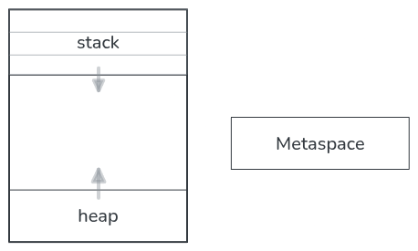

# Управление памятью и оператор `new`

## Способы управления памятью

В C вы сами управляли памятью: `malloc` для выделения, `free` для освобождения.
Это называется **ручным управлением памятью**.

В Java и Python памятью управляет среда исполнения: виртуальная машина или интерпретатор
автоматически отслеживает, какие объекты больше не нужны, и освобождает занятую ими память.
Это — **автоматическое управление памятью**, реализованное компонентом, который называется
**сборщик мусора** (Garbage Collector, GC).

У каждого подхода есть свои сильные и слабые стороны:

| | **Ручное управление (C)** | **Автоматическое (Java, Python, Go, C#)** |
|---|---|---|
| **Контроль** | Полный — разработчик решает, когда и сколько памяти выделять и освобождать | Минимальный — время жизни объекта определяет GC |
| **Производительность** | Нет накладных расходов на GC; можно оптимизировать под конкретную задачу | GC нагружает CPU (анализ достижимости, остановки «stop-the-world») и дополнительную память |
| **Предсказуемость** | Высокая — `free` срабатывает немедленно | Низкая — момент запуска GC и длительность паузы не гарантированы |
| **Ошибки** | Утечки (забытый `free`), висячие указатели (использование после `free`), двойное освобождение | Практически отсутствуют; утечки возможны только если случайно держать ссылку на ненужный объект |
| **Пригодность** | Системное ПО, встраиваемые системы, драйверы — где важны детерминизм и низкий уровень | Прикладные приложения, веб-серверы, микросервисы — где важнее скорость разработки и безопасность |

В C вы платите **временем разработки и риском ошибок** за полный контроль над памятью.
В Java вы платите **ресурсами CPU и памяти** за удобство и безопасность.


### Сборщик мусора в Java и Python

Важно понимать: автоматическое управление памятью реализовано по-разному даже в языках со сборщиком мусора.

- **Java** использует **граф объектов** (reachability analysis). GC периодически обходит все достижимые объекты, начиная с корневых точек (стек, статические поля), и помечает недостижимые как мусор. Это требует полной остановки программы (stop-the-world) на время обхода, но эффективно работает с большими объёмами данных.
- **Python** использует **счётчик ссылок** (reference counting). Каждый объект хранит число ссылок на себя; когда счётчик падает до нуля, объект удаляется немедленно. Циклические ссылки обрабатываются отдельным циклическим GC.


## 1. Три области памяти в JVM

- **Стек (stack)**. Хранит локальные переменные, параметры, адреса возврата. 
- **Куча (heap)**. Хранит динамическую память (выделенную через оператор new).
- **Статическая память** (Metaspace)

&nbsp;

Условная схема распределения памяти:



### Стек (Stack)

- Каждый вызов метода (функции) потребляет память под названием стек. Один вызов метода создаёт **фрейм** (кадр) в стеке.
- В фрейме хранятся:
  - локальные переменные **примитивных** типов (`int`, `double`, `boolean` …);
  - **ссылки** на объекты (но не сами объекты!);
  - параметры метода;
  - служебная информация (адрес возврата и т.д.).
- Размер стека ограничен (обычно ~1 МБ на поток).
- Фрейм автоматически разрушается при выходе из метода.
- Задать размер стека вызова можно задать при запуске JVM. Например, `-Xss2m` -- увеличивает размер стека до 2 МБ. В Intellij IDEA можно задать размер стека в настройках запуска программы в поле VM options.

```java
void example() {
    int x = 10;         // x — примитив, лежит в стеке
    String s = "Hi";    // s — ссылка в стеке,
                        // объект "Hi" — в куче (см. ниже)
}
```

### Куча (Heap) -- динамическая память.

- Единая область памяти, где живут **все объекты**.
- Объект попадает в кучу при вызове `new`.
- Живёт, пока на него есть хотя бы одна активная ссылка.
- Сборщик мусора автоматически удаляет объекты, на которые больше никто не ссылается.
- Размер может быть практически каким угодно.


### Статическая память (Metaspace)

- До Java 8 называлась PermGen.
- Хранит **метаданные классов**: структура класса, имена методов, статические поля.
- Данные попадают туда при загрузке класса — **один раз** на всё время работы программы.
- Именно здесь располагаются статические поля (`static`).

```java
class Config {
    static String appName = "MyApp";  // appName — в Metaspace
    int version;                      // version — в куче
}
```

&nbsp;

## 2. Оператор `new` — выделение памяти в куче

`new` — это аналог `malloc` в C, но управляемый JVM. Он возвращает *адрес* выделенной памяти. А если память выделить не получилось, то бросает исключение. (todo: тут перекрёстная ссылка)

Пример
```java
Scanner sc = new Scanner(System.in);
```

todo: объяснить где объявление переменной, а гле выделение памяти. 

Что происходит:

1. JVM выделяет память в **куче** под объект `Scanner`.
2. Вызывается специальная функция — конструктор `Scanner(System.in)`. Он инициализирует выделенную память (инициализирует объект).


### Для чего нужен `new`?

- Для создания **экземпляров классов**. `Scanner`, `Random`, `File`, своих классов…
- Для создания **массивов** (массивы в Java — это объекты, они живут в куче):

```java
int[] arr = new int[10];  // массив — объект в куче

todo: пример объявление массива без выделения памяти и без соответственно возможности его использовать
```

### Когда `new` **не нужен**?

- Для переменных примитивных типов, например  `int x = 5;`
- Для строковых литералов (но это частный случай: `"Hello"` может быть интернирован в пул строк).


## 3. Примитивы vs ссылки на объекты

Это ключевое различие, к которому нужно привыкнуть.

```java
int a = 5;              // a — примитив, значение 5 прямо в стеке
int b = a;              // b — копия значения 5

Scanner s1 = new Scanner(System.in);
Scanner s2 = s1;        // s2 — копия ссылки, указывает на ТОТ ЖЕ объект
```

Ссылка в Java — это **указатель** (адрес), но без специальных обозначений (в C используется `*`) и без специальных операций (без арифметики указателей).

### Сравнение `==` для объектов

```java
Scanner s1 = new Scanner(System.in);
Scanner s2 = s1;
Scanner s3 = new Scanner(System.in);

System.out.println(s1 == s2);  // true — одна и та же ссылка
System.out.println(s1 == s3);  // false — разные объекты
```

`==` сравнивает **ссылки** (адреса), не содержимое. Для сравнения содержимого объектов используют методы `.equals()`.


## 4. Сборщик мусора (Garbage Collector)

В C вы пишете `free(ptr)`. Забыли — **утечка памяти**.

В Java объект удаляется автоматически, когда на него перестают ссылаться:

```java
void example() {
    Scanner sc = new Scanner(System.in);
    // ... используем sc ...
}   // ← sc выходит из области видимости,
    //   ссылка теряется,
    //   GC может удалить Scanner из кучи
```

Сборщик мусора:
- Запускается автоматически, когда JVM решает, что пора.
- Не удаляет объекты, на которые есть активные ссылки.
- Не требует явного вызова `System.gc()` (это лишь *рекомендация* JVM).

### Когда объект становится «мусором»?

1. Переменная, хранившая ссылку, вышла из области видимости.
2. Переменной присвоили другую ссылку (`sc = null` или `sc = otherScanner`).
3. На объект ссылаются только другие объекты, которые сами стали мусором (цикл ссылок). В отличие от C, GC с циклами справляется.


## 5. Передача параметров в методы

В Java **все параметры передаются по значению**.

- Для примитивов: копируется значение.
- Для ссылок: копируется **ссылка** (адрес), объект остаётся в куче.

```java
void swap(int x, int y) {
    int t = x; x = y; y = t;   // меняются копии, исходные переменные НЕ изменятся
}

void rename(Scanner sc) {
    sc = new Scanner(System.in); // меняется локальная ссылка, исходная — нет
}
```

Но **объект через ссылку изменить можно**:

```java
void setValue(int[] arr) {
    arr[0] = 42;   // меняется содержимое объекта в куче
}
```


## 6. Сравнение: C — Java — Python

| Аспект | C | Java | Python |
|--------|---|------|--------|
| Выделение памяти | `malloc(size)` | `new Type()` | создание объекта (неявно) |
| Освобождение | `free(ptr)` | **сборщик мусора** | **сборщик мусора** |
| Ошибка памяти | утечки, dangling pointers | OutOfMemoryError | MemoryError |
| Переменная хранит | значение / указатель | значение / ссылку | ссылку на объект |
| Массивы | блок памяти (указатель) | объект в куче | список / tuple |
| Вручную вызвать GC | — | `System.gc()` (не гарантирует) | `gc.collect()` |
| Арифметика указателей | да | **нет** | нет |
| Примитивные типы | `int`, `double` … на стеке | `int`, `double` … на стеке | всё — объект |

---

## 7. Практические советы

- **Не бойтесь `new`** — это нормальный способ создавать объекты в Java.
- **Не пытайтесь вручную «удалить» объект.** Просто перестаньте на него ссылаться; GC сделает своё дело.
- **Сравнивайте объекты через `.equals()`**, а не `==` (если нужно сравнить содержимое).
- **Массивы — тоже объекты.** `new int[10]` выделяет память в куче, а переменная типа `int[]` — это ссылка.
- **Статические поля** живут в Metaspace (не в куче) и существуют в единственном экземпляре на весь класс.


## Вопросы для самопроверки

1. Где хранится примитивная переменная `int x = 5`? А где — объект, на который ссылается `Scanner sc`?
2. Что произойдёт с памятью, если в методе создать `Scanner`, а при выходе из метода не сохранить ссылку никуда?
3. Почему `==` может дать `true` для двух ссылок на один объект, но `false` — для двух разных объектов с одинаковым содержимым?
4. Чем ссылка в Java отличается от указателя в C?
5. Будет ли `String[] names = new String[5];` хранить сами строки, или ссылки на строки? Где будут сами строки?
