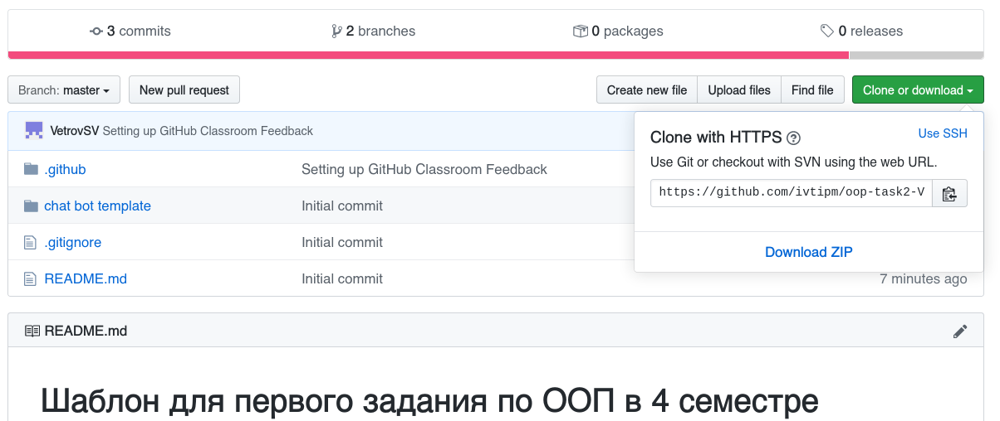
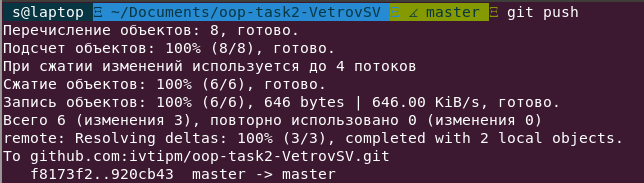

# Дистанционное обучение

Задания в летнюю сессию 2020 года будут приниматься дистанционно.

1. Зарегистрируйтесь на [GitHub](https://github.com)
1. Изучите слайды по git: [github.com/VetrovSV/Programming/blob/master/git_lec.pdf](https://github.com/VetrovSV/Programming/blob/master/git_lec.pdf)
1. Скачайте и установите git: [git-scm.com](https://git-scm.com)

Каждое задание из контрольной работы нужно загрузить на GitHub по ссылкам:
- Задание 1: Шаблон: https://github.com/ivtipm/OOP-Task1-z (ссылка для сдачи появится позже)
- Задание 2: https://classroom.github.com/a/EwFARkRA

1. Перейдите по ссылке задания. Автоматически создастся репозиторий на GitHub. Он содержит шаблонный проект для задания и само задание. Изучите Readme.
1. Скопируйте (клонируйте) этот удалённый репозиторий с GitHub на свой компьютер:
 - Перейдите в папку, куда хотите сохранить репозиторий. Репозиторий сохранится как отдельная папка.
 - Откройте Git Bash: контекстное меню в проводнике -> Git Bush. Откроется консоль Git
 - Скачайте репозиторий
 ```git clone <адрес репозитория>```

 Адрес репозитория должен начинаться с https (например https://github.com/ivtipm/HCI.git). Это несколько упростит авторизацию при отправке данных из локального репозитория в удалённый, нужно будет вводить только пароль.
 Если адрес начинается с git, то вместо ввода пароля потребуется использовать ключи шифрования. Это гарантирует б*о*льшую безопасность, но для начала рекомендуется использовать авторизацию по паролю.

 Пример. Созданный по ссылке репозиторий. Справа видно его адрес.
 

 Тогда клонирование репозитория будет таким:
 ```git clone https://github.com/ivtipm/oop-task2-VetrovSV.git ```

3. Попрактикуйтесь с Git. Попробуйте изменить файлы и отправить изменения на GitHub:
 1. Измените файл ``README.md``, сохраните изменения.
 Это текстовый файл с Markdown разметкой. Рекомендуется изменять в Atom или в другой программе, поддерживающей отображение Markdown.
  1. Добавьте новый файл: ```new_file.txt```
  1. Посмотрите как на изменение и добавление отреагирует git:\
 ```git status```
 
  1. Добавьте новый файл ```new_file.txt``` к списку отслеживаемых. Тогда git будет следить за состоянием этого файла и вы сможете отправить его в удалённый репозиторий на GitHub.\
 ```git add new_file.txt```
  1. Зафиксируйте сделанные в репозитории изменения, т.е. сделайте коммит\
 ```git commit -am "пробный коммит"```\
   Только зафиксированные изменения можно отправлять в удалённый репозиторий.
  1. Отправьте изменения в удалённый репозиторий
 ```git push```
 
  1. Обновите страницу удалённого репозитория на GitHub и убедитесь, что он изменился как и локальный репозиторий.


<to be continued>

<!--

### git
 - Изучить слайды 1-29, 38-44 по git: [github.com/VetrovSV/Programming/blob/master/git_lec.pdf](https://github.com/VetrovSV/Programming/blob/master/git_lec.pdf)
 - Ответить на вопросы
   - Что такое система управления версиями?
   - Что такое репозиторий?
   - Как создать пустой репозиторий?
   - Как добавить файлы в список отслеживания программы git?
   - Что такое коммит (фиксация)? Как сделать коммит в консоли?

- скачать и установить git [git-scm.com](https://git-scm.com)
- Зарегистрировать аккаунт на GitHub
 - Создать (открытый -- public) репозиторий на github
 - Выбрать папку на компьютере, в которой будет расположен локальный репозиторий.
 - Копировать туда исходные файлы программ. Каждая программа в отдельной папке.
 - Следовать инструкциям на GitHub, на странице созданного репозитория (для варианта, где локальный репозиторий не существует, create a new repository on the command line).
   - Предположим, что каталог с репозиторием выглядит так\
   .

   В нём две папки: simple_gui_example2 и TStringGrid example
   - Будем добавлять первую папку в репозиторий
   - Для этого в текущей папке нужно открыть консоль git: правая кнопка мыши -> git bash here

   - Поочерёдно ввести нижеприведенные команды. Они немного отличаются от того, что будет написано на github, на странице вновь созданного репозитория.
     1. Создать репозиторий (инициализировать git в текущей папке)\
     ```git init```
     1. Добавить файлы в список отслеживаемых\
     ```git add <тут указать список файлов (папок)>```\
     Для примера команды будут выглядеть так:
      - перейдём в первый каталог, чтобы было удобнее указывать имена файлов\
     ```cd simple_gui_example2```
      - добавим файлы используя маску\
     ```git add exp_growth* logic.pas param report.txt unit1*```
      - выйдем из каталога\
     ```cd ..```\
     Не добавляйте папки со скомпилированными и не важными для проекта файлами (в проекте lazarus это папки lib и bak)
     1. Сделайте коммит - зафиксируйте текущее состояние файлов\
     ```git commit -m "first commit"```
     1. Добавьте в удалённый репозиторий ссылку на внешний репозиторий на github\
     ```git remote add origin <адрес вашего репозитория>```\
     1. Отправьте изменения в удалённый репозиторий\
     ```git push -u origin master```
 - Адрес репозитория должен начинаться с https (например https://github.com/ivtipm/HCI.git). Это несколько упростит авторизацию при отправке данных из локального репозитория в удалённый, нужно будет вводить только пароль.
 Если адрес начинается с git, то вместо ввода пароля потребуется использовать ключи шифрования. Это гарантирует большую безопасность, но для начала рекомендуется использовать авторизацию по паролю.
 - В каждой папке помимо файлов с исходным кодом должен быть скриншот окна программы (файл scr1.jpg)
 - Отправить ссылку на созданный репозиторий преподавателю на проверку.

- Изучить git и работу с github важно потому, что в дальнейшем все работы будут приниматься именно на github.
- Если не хотите создавать открытый (public) репозиторий, который доступен всем, то можно создать закрытый (private) он будет виден только вам. Чтобы преподаватель мог проверить вашу работу, нужно пригласить пользователя VetroSV в репозиторий:
 - На странице репозитория: settings > Manage Access > Invate a collaborator: VetrovSV -->


#### Игнорирование файлов
 Добавлять к отслеживанию можно и папку целиком, например
 ```git add TStringGrid```
 Но нужно избегать добавления в репозиторий лишних файлов, которые появляются во время работы над проектом. Это скомпилированные файлы и файлы резервных копий.

 Для эти файлы и папки можно добавить в чёрный список. Создайте файл ```.gitignore``` в корневой папке репозитория и добавьте в него маски и имена файлов и папок. Эти файлы будут игнорироваться git.
 Пример файла ```.gitignore```:
 ```
 backup/
 lib/
 *.exe
 ```
Если уже добавили ненужные файлы в список отслеживания git, то удалить их из этого списка можно так:\
```git rm --cached <имена файлов>```\
```git rm -r --cached <имена папок>```\
При этом сами файлы и папки сохранятся, но git больше не будет следить за их изменением.
