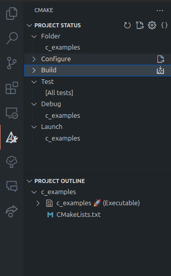

# Система сборки CMake

Для компиляции простых программ достаточно вызывать только команду компиляции, например:
```bash
g++ main.cpp unit.cpp -o my_program 
```
Более сложные программы обычно полагаются на внешние библиотеки, наборы дополнительных файлов (файлы с данными, файлы настроек, изображения и т.д.).
Иногда такие программы компилируют частями, разбивая их на отдельные модули. 
Таким образом, процесс компиляции может включать в себя несколько запусков компилятора с различными файлами и настройками, 
с учётом расположения ранее скомпилированных частей программы, очистку папок от временных файлов, 
копирование уже готовой программы и её файлов в отдельный, от файлов исходного кода, каталог.

**Система автоматизации сборки** -- набор программ, призванных упростить компиляцию кода, с учётом параметров компилятора, 
зависимостей кода (других библиотек), выполнения модульных тестов, очистки проекта от временных файлов и т.п. 
Система сборки полагается на специальные конфигурационные файлы, которые описывают состав проекта и процесс его компиляции. 
Большинство современных IDE при компиляции программы не вызывают компилятор напрямую, а обращаются к системе сборки. 
Например Qt Creator и CLion полагаются на CMake.

**CMake** -- генератор системы (конфигурации) сборки, позволяет автоматизировать компиляцию программ и их частей (сконфигурировать команды компиляции), 
выполнение тестов, развёртывание программы и т.п. Конфигурация сборки описывается в файле CMakeLists.txt

Далее эта конфигурация может быть использована любой системой сборки: make (устарела), ninja (кроссплатформенная), MSBuild (используется совместно с MSVC).

CMake используется средами разработки Qt Creator, CLion и др. Visual Studio также может открывать проекты на основе CMake или создавать .sln (файлы решения) и файлы проекта (.vcxproj)

Последняя версия СMake на май 2025 - 4.0.1.

### Основные понятия
В основе файлов конфигурации cmake лежат **цели (targets)**. Целями могут выступать например: 
- компиляция исполняемого файла (`add_executable`);
- компиляция библиотеки  (`add_library`);
- включить в текущий проект, другой cmake проект (`add_subdirectory`).

Для задания цели нужно указать ей тип, задать или указать название и указать основные файлы исходного кода.

Помимо задания цели можно определить название **проекта**, его описание и свойства (`project( ... )`). **Параметры** метакомпилятора (`set( var value)`  или `add_compile_options(-O2)`. CMake не привязан к конкретному компилятору, поэтому можно задавать параметры (например версию стандарта C++) в формате предусмотренным CMake.

Многие параметры задаются через специальные **переменные** командой set, например `set(CMAKE_CXX_STANDARD 20)`. Обращаться к переменным, например так: `${PROJECT_NAME}`

Если программа использует хранит файлы исходного кода или библиотеки в других папках, то указываются **дополнительные пути**, после того как задана цель компиляции:
- для исходных файлов (`target_include_directories ( ... ) `), которые передаются компилятору;
- для скомпилированных файлов библиотек (`target_link_directories ( ... )`, `target_link_libraries(...)`), которые передаются компоновщику (линковщику) [см. этапы компиляции С++ программы]

Наконец можно указать **папку для сохранения выходных файлов**: `set (CMAKE_RUNTIME_OUTPUT_DIRECTORY bin)`

Если необходимо, можно скопировать файлы из папки с исходниками в папку сборки. Например
```CMake
configure_file(data/my_data.txt ${CMAKE_CURRENT_BINARY_DIR}/bin/data/my_data.txt)
```
копирует файл `data/my_data.txt` в каталог сборки (`${CMAKE_CURRENT_BINARY_DIR}`). Если необходимо, в новом месте создаётся папка.

Рекомендуется разделять как минимум папку с файлами исходного кода и папку сборки, где будет создан, например, исполняемый файл проекта. 


***

**Библиотеки** можно разделить на три вида:
1. Состоит только из файлов исходного кода
   - header‑only: только .h\hpp файлы, иногда всего один заголовочный файл
   - .cpp и заголовочные файлы
   Такие библиотеки нужно компилировать при компиляции проекта, их используемого, либо на их основе создать библиотеку одно из нижеприведённых видов.
2. Статическая (static) библиотека. 
   Состоит из заголовочных файлов (.h/.hpp) и скомпилированного (.a на Linux/macOS, .lib на Windows) файла. Скомпилированный файл при компиляции проекта входит в состав исполняемого файла проекта.
3. Динамическая (shared) библиотека
   Состоит из заголовочных файлов (.h/.hpp) и скомпилированного (.so на Linux, .dylib на macOS, .dll на Windows) файла. Скомпилированный файл может *подключаться* к исполняемому файлу проекта *динамически*, т.е. в любой момент работы программы.   
   


## Hello, World

Рассмотрим простую программу **main.cpp**
```C++
#include <iostream>
using namespace std;

int main(){
	cout << "Hello, World\n"; }
```
Создадим простой файл конфигурации сборки `CMakeLists.txt`
```cmake
# add_executable -- цель -- создание исполняемого файла
add_executable(                         
  hello_world                       # имя выходного файла = имя проекта
  main.cpp                          # Список файлов исходного кода
)
```

**Сборка**

Структура проекта:
```
my_project
   |-- src
   |   |-- main.cpp
   |   |-- CMakeLists.txt
```

Подготовка сборки, `.` - имя текущего каталога.
```bash
cmake -B ../my_build .
# с явным указанием путь к папке с исходными файлами
cmake -S my_src -B ../my_build .
```
- `-B ../my_build` - путь из папки с файлом CMakeLists.txt к папке, где будет происходить сборка. Если не указать, то большое количество служебных файлов сборки будут созданы прямо в текущем каталоге.

Сборка:
```bash
cmake --build ../my_build 

# сборка в c использованием параллельных процессов (jobs)
cmake --build ../my_build -j
```

В результате получится структура проекта
```
my_project
   |-- src
   |   |-- main.cpp
   |   |--CMakeLists.txt
   |-- my_build
   |   |-- ...служебные файлы и папки ...
   |   |-- my_project.exe
```

Очистить каталог сборки
```bash
cmake --build build --target clean
```


## Расширенный пример

Более сложный файл конфигурации сборки `CMakeLists.txt`
```cmake
cmake_minimum_required(VERSION 3.24)			# требуемая версия CMake

# название проекта my_project и его версия
project(my_project VERSION 1.5)

# настройки компилятора
# set(CMAKE_CXX_COMPILER "g++-12")           # имя компилятора (можно указать полный путь)
set(CMAKE_CXX_STANDARD 20)               		# версия стандарта языка
# set(CMAKE_CXX_STANDARD_REQUIRED True)  		# включает проверку: задана ли явно версия стандарта языка
add_compile_options(-O2)                 		# другие опции компиляции: второй уровень оптимизации кода


# папка для сохранения исполняемого файла: bin
# стоит указать, чтобы отделить от служебных файлов генерируемых CMake
set (CMAKE_RUNTIME_OUTPUT_DIRECTORY bin)

# add_executable -- цель -- создание исполняемого файла
add_executable(                         
  ${PROJECT_NAME}                        # имя файла = имя проекта
  main.cpp                               # Список файлов исходного кода через пробел
)


# если нужно: дополнительная папка для поиска файлов исходного кода (cpp и h) 
# должна быть указана после того, как указана цель сборки add_executable или add_librarie
# target_include_directories(${PROJECT_NAME} PUBLIC include)
# Второй аргумент задаёт видимость включаемых файлов для проектов, использующих данный (если они есть)
```


В результате получится структура проекта

```
my_project
   |-- src
   |   |-- main.cpp
   |   |-- CMakeLists.txt
   |-- build (будет создан автоматически)
   |   |-- ...служебные файлы и папки ...
   |   |-- bin
   |   |   |-- my_project.exe
```


Более сложный файл конфигурации сборки `CMakeLists.txt`
```cmake
cmake_minimum_required(VERSION 3.16)      # минимальная версия CMake

# если необходимо, задать предпочитаемый компилятор
set(CMAKE_CXX_COMPILER clang++ )
# аналогично можно задать переменную окружения СXX или СС
# linux: export CXX=clang++

# проект: имя, версия, языки
project(my_project
    VERSION 1.0
    LANGUAGES C CXX           # C и С++
)

# Стандарт C++ и параметры
set(CMAKE_CXX_STANDARD 20)
set(CMAKE_CXX_STANDARD_REQUIRED ON)
set(CMAKE_CXX_EXTENSIONS OFF)

# добавить ключи компилятору (например оптимизация O3)
set(CMAKE_C_FLAGS   "${CMAKE_C_FLAGS}   -O3")       # С
set(CMAKE_CXX_FLAGS "${CMAKE_CXX_FLAGS} -O3")       # C++

# Сохранять бинарник в папку bin внутри папки сборки
set(CMAKE_RUNTIME_OUTPUT_DIRECTORY ${CMAKE_BINARY_DIR}/bin)

# ${PROJECT_NAME} = имя указанное в project
add_executable(${PROJECT_NAME} 
               main.cpp )

# Линкуем дополнительные библиотеки
# Например math для C (ключ -lm), OpenMP (если включено)
target_link_libraries(${PROJECT_NAME} PRIVATE
    m )


# если нужно, добавить дополнительную цель - запуск
# Цель для запуска
add_custom_target(run
    COMMAND           ${PROJECT_NAME}            # команда - имя исполняемого файла
    WORKING_DIRECTORY ${CMAKE_SOURCE_DIR}        # задать рабочую папку = папка проекта
    DEPENDS           ${PROJECT_NAME}            # сначала соберётся проект
    COMMENT "Запуск программы из корня проекта: "
)
# тогда сборки и запуск выглядят так: 
# cmake --build build --target run

```

**Конфигурация. Сборка. Запуск**
из папки `src/`
```bash

# 1. Конфигурация сборки:
cmake -B ../build 

# 2. Сборка:
cmake --build ../build -j

# 2. Сборка и запуск
cmake --build ../build -j  --target run

# 3. Запуск в папке проекта:
cd ..
build/bin/cpp_lab
```


# Отдельные команды Cmake

#### Основные понятия
- **target** (цель) - компонент, который следует собрать. Может быть исполняемым файлом, статической или динамической библиотекой.
- **project** (проект) - это набор компонентов (целей), по смыслу похожий на Solution (решение) в Visual Studio.
- **flags** (флаги) - это аргументы командной строки для компилятора, компоновщика и других утилит, вызываемых при сборке.

#### Задание папок для include
```cmake
# папки указываются через пробел, количество не ограничено
include_directories("headers/" "more_headers/")
```

#### Задание списка файлов исходного кода (cpp)
```cmake
add_executable(exec_file_name    main.cpp Unit1.cpp Unit2.cpp)
```

#### Указание статической библиотеки для линковки
```cmake
# линовка математической библиотеки (m)
target_link_libraries(project_name PRIVATE m)
# PRIVATE - использовать для для данной цели (target)
```

#### Задание версии стандарта языка С++
```cmake
# рекомендуемый, более общий способ
target_compile_features(myapp cxx_std_20)

# не рекомендуемый, более низкоуровневый способ
target_compile_options(hello PRIVATE -std=c++20)
```
См. [версии C++](https://ru.wikipedia.org/wiki/C%2B%2B#%D0%A0%D0%B0%D0%B7%D0%B2%D0%B8%D1%82%D0%B8%D0%B5_%D0%B8_%D1%81%D1%82%D0%B0%D0%BD%D0%B4%D0%B0%D1%80%D1%82%D0%B8%D0%B7%D0%B0%D1%86%D0%B8%D1%8F_%D1%8F%D0%B7%D1%8B%D0%BA%D0%B0).


#### Задать предпочитаемый компилятор
- Это нужно делать до задания имени проекта (`project(...)`)
- Компилятор будет задан только при настройке сборки (`cmake -B`).
```cmake
set(CMAKE_CXX_COMPILER clang++ )
```

#### Переменные
```cmake
# задать значение
set(MY_VAR "value")

# использовать
message("Variable: ${MY_VAR}")
```

- `CMAKE_SOURCE_DIR` – корневая директория исходного кода проекта
- `CMAKE_BINARY_DIR` – корневая директория сборки (build)
- `CMAKE_C_COMPILER` – путь к компилятору C
- `CMAKE_CXX_COMPILER` – путь к компилятору C+
- `CMAKE_<LANG>_FLAGS` – флаги компиляции для указанного языка (например, `CMAKE_C_FLAGS`, `CMAKE_CXX_FLAGS`)
- `PROJECT_NAME` – имя проекта, заданное в project()


## Более современный способ подключать зависимости
Если используемая библиотека (исходные код или статические бинарные файлы) не нужно скачивать, и у них нет своего CMakeLists.txt файла то:
```cmake
cmake_minimum_required(VERSION 3.10)
project(MyApp C)            # Или CXX, если у вас C++ проект

# 1) Создаём пустой таргет foo_lib типа STATIC и помечаем его как IMPORTED.
#    STATIC  — тип библиотеки (.a/.lib)
#    IMPORTED — говорит CMake: "этот таргет не собирается тут, а лежит где-то снаружи"
add_library(foo_lib STATIC IMPORTED)

# 2) Указываем путь к .a (IMPORTED_LOCATION):
#    В CMAKE_SOURCE_DIR — корневая папка с вашим проектом.
set_target_properties(foo_lib PROPERTIES
    IMPORTED_LOCATION "${CMAKE_SOURCE_DIR}/external/lib/libfoo.a"
)

# 3) Указываем, где лежат заголовки для foo_lib:
#    INTERFACE_INCLUDE_DIRECTORIES — include-пути, которые «foo_lib» передаёт тем,
#    кто будет на него ссылаться.
set_target_properties(foo_lib PROPERTIES
    INTERFACE_INCLUDE_DIRECTORIES "${CMAKE_SOURCE_DIR}/external/include"
)

```

# Загрузка зависимостей

Пример:
```cmake
# Подключает модуль FetchContent для CMake
# FetchContent используется для загрузки внешних зависимостей, входит в состав CMake 3.11+
include(FetchContent)

# Объявление зависимости
FetchContent_Declare(
        googletest
        URL https://github.com/google/googletest/archive/03597a01ee50ed33e9dfd640b249b4be3799d395.zip
)

# Загрузка зависимости
FetchContent_MakeAvailable(googletest)
```

# Тестирование
Пример проекта из двух файлов `main_test.cpp` (основная программа) и `main_test.cpp` (файл с тестом). Тест использует фреимворк GoogleTest.
```cmake
cmake_minimum_required(VERSION 3.24)    # требование к минимальной версии CMake

project(executable_with_test)           # название проекта

set(CMAKE_CXX_STANDARD 23)                          # Стандарт С++23

# Указание цели сборки: исполняемый файл
# executable_with_test -- имя цели = имя исполняемого файла
# main.cpp -- список файлов исходного кода, необходимых для компиляции
add_executable(executable_with_test main.cpp)


# ========================================================================================  Настройка тестирования
# Подключает модуль FetchContent для CMake
# FetchContent используется для загрузки внешних зависимостей, входит в состав CMake 3.11+
include(FetchContent)
# Объявление зависимости
FetchContent_Declare(
        googletest
        URL https://github.com/google/googletest/archive/03597a01ee50ed33e9dfd640b249b4be3799d395.zip
)
# Загрузка зависимости
FetchContent_MakeAvailable(googletest)


# добавление ещё одной цели -- исполняемый файл main_test для теста
add_executable(main_test main_test.cpp)
# для компиляции файла с тестами нужна дополнительная библиотека GoogleTest,
# добавим её как составную часть цели main_test
target_link_libraries( main_test  GTest::gtest_main)

# сделать тест частью проекта
enable_testing()
# Подключает модуль GoogleTest для CMake
include(GoogleTest)
# Запустить файл main_test чтобы получить имена тестов (но не выполнить тесты)
gtest_discover_tests(main_test)
```

main.cpp
```C++
int main() {
    return 0; }
```

main_test.cpp
```c++
#include <gtest/gtest.h>

// Пример тестовой функции
TEST(HelloTest, BasicAssertions) {

	EXPECT_STRNE("hello", "world");		// проверка неравенства строк
	EXPECT_EQ(7 * 6, 42);				// проверка равенства чисел
}
```

**Сборка**
```bash
# подготовка к сборке в каталог build
cmake -B build .
# сборка в каталог build
cmake --build build

# запуск тестов
cmake -B build .
```

Как правило для тестов создаётся отдельный файл конфигурации CMake, который потом включается в основной файл проекта. 

## Наиболее часто используемые функции и переменные CMake


| Название                          | Описание                                                        | Возможные значения и пояснения                                                                                                                                                                                                                                                                                                                                                          | Пример использования                                          |
| --------------------------------- | --------------------------------------------------------------- | ----------------------------------------------------------------------------------------------------------------------------------------------------------------------------------------------------------------------------------------------------------------------------------------------------------------------------------------------------------------------------------------- | ------------------------------------------------------------- |
| `cmake_minimum_required`          | Задаёт минимальную требуемую версию CMake                       | - `VERSION <версия>` — минимальная версия CMake (например `3.27`). При более старой версии конфигурация остановится с ошибкой.                                                                                                                                                                                                                                                            | `cmake_minimum_required(VERSION 3.16)`                        |
| `project`                         | Объявляет проект: задаёт имя, версию и поддерживаемые языки     | - `<name>` — имя проекта.<br>- `VERSION <версия>` — устанавливает `PROJECT_VERSION_MAJOR`/`_MINOR`/`_PATCH`.<br>- `LANGUAGES <C CXX Fortran…>` — список языков. Если не указано — по умолчанию `C` и `CXX`.                                                                                                                                                                                  | `project(MyApp VERSION 1.0 LANGUAGES CXX)`                    |
| `add_executable`                  | Создаёт цель — исполняемый файл                                 | - `<имя>` — имя цели.<br>- `<файлы...>` — исходные файлы (`.cpp`, `.c` и т. д.).                                                                                                                                                                                                                                                                                                       | `add_executable(my_app main.cpp util.cpp)`                    |
| `add_library`                     | Создаёт цель — библиотеку                                       | - `<имя>` — имя цели.<br>- `STATIC` — статическая библиотека (по умолчанию, если не указано явно).<br>- `SHARED` — динамическая библиотека.<br>- `MODULE` — загружаемая во время выполнения (для плагинов).<br>- `INTERFACE` — заголовочная библиотека без компиляции исходников.<br>- `[файлы...]` — исходники (не для `INTERFACE`).                                         | `add_library(mylib STATIC lib1.cpp lib2.cpp)`                 |
| `target_include_directories`      | Задаёт пути к заголовкам только для конкретной цели            | - `<target>` — имя цели.<br>- `PRIVATE` — используется только при сборке этой цели.<br>- `PUBLIC` — при сборке этой цели и её потребителей.<br>- `INTERFACE` — только для потребителей (сама цель не видит).<br>- `<директории...>` — пути (абсолютные или относительные).                                                                                                                 | `target_include_directories(my_app PRIVATE include/)`         |
| `target_link_libraries`           | Линкует цель с библиотеками                                    | - `<target>` — имя цели.<br>- `PRIVATE` — библиотека нужна только этой цели.<br>- `PUBLIC` — нужна и цели, и её потребителям.<br>- `INTERFACE` — только потребителям.<br>- `<библиотеки...>` — имена целей или внешних библиотек (`Boost::filesystem`, `Qt5::Widgets`).                                                                                                               | `target_link_libraries(my_app PRIVATE Boost::filesystem)`     |
| `set`                             | Устанавливает значение переменной                              | - `<var>` — имя переменной.<br>- `<value>` — строка или число.<br>- `CACHE <TYPE> <doc> [FORCE]` — создаёт cache‑переменную:<br>  • `TYPE` — `STRING`, `BOOL`, `PATH`, `FILEPATH`.<br>  • `doc` — описание в GUI.<br>  • `FORCE` — перезаписать существующую.                                                                                          | `set(CMAKE_CXX_STANDARD 20)`                                  |
| `option`                          | Создаёт булеву опцию (CACHE‑переменную типа BOOL)              | - `<var>` — имя (например, `ENABLE_TESTS`).<br>- `<описание>` — описание в GUI/ccmake.<br>- `[<значение по умолчанию>]` — `ON` или `OFF` (по умолчанию `OFF`).                                                                                                                                                                                                                        | `option(ENABLE_TESTS "Собирать тесты" ON)`                    |
| `find_package`                    | Находит установленные пакеты и подключает их. Ищет в и стандартных системных директория и в путях из переменных CMAKE_MODULE_PATH, CMAKE_PREFIX_PATH, CMAKE_INSTALL_PREFIX                   | - `<name>` — имя пакета (`Qt5`, `Boost`).<br>- `[version]` — минимальная версия (`5.15`, `1.75`).<br>- `REQUIRED` — остановить сборку, если не найден.<br>- `COMPONENTS <компоненты...>` — модули (`Widgets`, `Filesystem`).<br>Ищет в `CMAKE_MODULE_PATH`, `CMAKE_PREFIX_PATH`, системных директориях и т. д.                                    | `find_package(Qt5 REQUIRED COMPONENTS Widgets)`               |
| `target_compile_features`         | Требует поддержки у компилятора определённых возможностей      | - `<target>` — имя цели.<br>- `PRIVATE`/`PUBLIC`/`INTERFACE` — область применения (аналогично include/link).<br>- `<features...>` — список фич, напр. `cxx_std_17`, `cxx_std_20`.                                                                                                                                                                                                          | `target_compile_features(my_app PUBLIC cxx_std_20)`           |
| `configure_file`                  | Копирует файл с подстановкой переменных                        | - `<input>` — шаблон (обычно `.in`).<br>- `<output>` — файл назначения (в `${CMAKE_BINARY_DIR}`).<br>- `COPYONLY` — без подстановки.<br>- `ESCAPE_QUOTES` — экранировать кавычки.                                                                                                                                                                                                        | `configure_file(config.h.in ${CMAKE_BINARY_DIR}/config.h)`    |
| `message`                         | Выводит сообщение при конфигурации                             | - `STATUS` — обычное сообщение.<br>- `NOTICE` — информативное (CMake 3.0+).<br>- `WARNING` — предупреждение.<br>- `AUTHOR_WARNING` — для авторов.<br>- `SEND_ERROR` — ошибка, но не прерывает генерацию.<br>- `FATAL_ERROR` — критическая ошибка, прерывает конфигурацию.                                                                    | `message(STATUS "Project version: ${PROJECT_VERSION}")`       |
| `enable_testing`                  | Подключает поддержку CTest                                      | *(нет аргументов)* — включает модуль CTest и опцию `BUILD_TESTING`, но явная цель `test` появляется только после `add_test` или при `include(CTest)`.                                                                                                                                                                                                                                   | `enable_testing()`                                            |
| `include_directories` *(устаревшая)* | Глобально задаёт пути к заголовкам для всех целей проекта   | - `<директории...>` — пути (абсолютные или относительные).<br>**Устарело:** лучше `target_include_directories`.                                                                                                                                                                                                                                                                           | `include_directories(common/include/)`                        |
| `CMAKE_CXX_STANDARD`              | Стандарт C++ для всех целей проекта                            | - `<число>` — `11`, `14`, `17`, `20`, `23`.<br>**Совет:** предпочтительнее `target_compile_features`, и при этом задавать ещё `CMAKE_CXX_STANDARD_REQUIRED` и `CMAKE_CXX_EXTENSIONS`.                                                                                                                                                                                                        | `set(CMAKE_CXX_STANDARD 17)`                                  |
| `CMAKE_BUILD_TYPE`                | Тип сборки в одноконфигурационных генераторах                  | - `Debug`, `Release`, `RelWithDebInfo`, `MinSizeRel`.                                                                                                                                                                                                                                                                                                                                    | `cmake -DCMAKE_BUILD_TYPE=Release -B build .`                 |
| `CMAKE_RUNTIME_OUTPUT_DIRECTORY`  | Директория для собираемых исполняемых файлов                   | - `<путь>` — абсолютный или относительный (обычно `${CMAKE_BINARY_DIR}/bin`).<br>**Совет:** для библиотек используйте `CMAKE_LIBRARY_OUTPUT_DIRECTORY` и `CMAKE_ARCHIVE_OUTPUT_DIRECTORY`.                                                                                                                                                | `set(CMAKE_RUNTIME_OUTPUT_DIRECTORY ${CMAKE_BINARY_DIR}/bin)` |


## См. также

1. Папки с примерами в этом каталоге
2. Расширения для VS Code: CMake (автодополнение при редактировании CMakeLists.txt) и CMakeTools (предоставляет GUI для конфигурации, сборки, запуска, тестирования и т.п.)
   
3. [Meson](https://mesonbuild.com/index.html) - более простая и современная система сборки, однако менее популярная.

# Ссылки
- https://cliutils.gitlab.io/modern-cmake/
- Учебник: Система построения проектов CMake, Д. В. Дубровов
