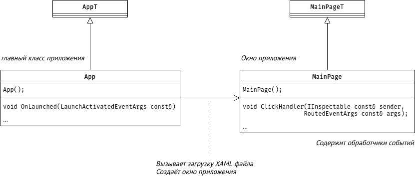
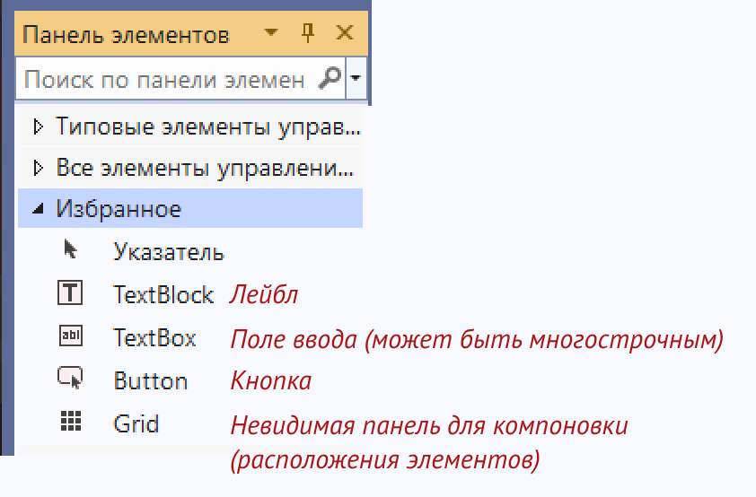

# Создание программ с GUI

Некоторые фреимворки для чистого C++ для создания приложений с GUI
-  Qt (кроссплатформенный: Linux, Windows, MacOS, Android) [https://raw.githubusercontent.com/VetrovSV/OOP/master/Qt_lec1.pdf]
-  wxWidgets (кроссплатформенный: Linux, Windows, MacOS)
-  WinUI (Windows)
-  UWP (Windows)
-  WindowsForms (устарел, Windows)


Для диалекта под названием C++\CLI есть возможностьь использовать UWP и WPF. Этот диалект языка, может компилироваться в байт-код виртуальной машины, которая исполняет программы в частности на C#. Есть возможность использовать библиотеки .NET.
Однако, диалект местами существенно отличается от стандартного C++ и не имеет широкого распространения.


# Приложение на основе WinRT и UWP (XAML)

Создано в VS 2022 по шаблону: Blank App (C++ / WinRT).


Шаблон проекта может называться BlankApp.

WinRT - Windows Runtime - это набор библиотек, реализующих базовое взаимодействие программы с Windows. Этот набор библиотек пришёл вместе с Windows 8 на смену старому, который назывался WinAPI.

UWP - Universal Windows Platform - более высокоуровневое расширение WinRT, включающее в том числе библиотеки для построения программ с графическим интерфейсом. Появилась вместе с Windows 11.


XAML - eXtensible Application Markup Language - расширяемый язык разметки для приложений. Этот декларативный язык используется прежде всего для описаний пользовательского интерфейса (за исключением логики его работы). XAML - специализированный вариант XML.


*IDE может указывать на большое число синтаксических ошибок в только что созданном проекте. Они пропадают после первой компиляции проекта.*

## Файлы проекта
- `CppWinRTUWP.sln` - файл решения (solution)
- `CppWinRTUWP.vcxproj` - файл проекта (project)
- `App.h`, `App.cpp` - файл с описанием главного класса приложения, содержит аналог функции main
- `MainPage.h`, `MainPage.h` - файлы с описанием класса (struct) главного окна
- `MainPage.xaml` - описания пользовательского интерфейса главного окна; можно редактирвоать в дизайнере интерфейса или как текстовый xml файл
- `MainPage.idl` - классы локальной среды выполнения, на которые нужно сослаться в XAML файлах
- `pch.h` - файл содержащий директивы include для файлов, которые редко изменяются и которые можно скомпилировать заранее (из `pch.cpp` файла)
- `bank.h` - файл с основной логикой приложения, добавлен вручную


## Устройство проекта
Основные классы приложения



Для доступа к элементам интерфейса из класса окна MainPage нужно вызывать методы, которые возвращают ссылки на объекты, представляющие элементы интерфейса. Например
```c++
// вызов метода, который вернёт ссылку на объект,
// представляющий поле ввода с именем textbox_sum
// textbox_sum().Text()

string sumt = to_string( textbox_sum().Text() );

// содержимое поля ввода представленно типом данных hstring
// для преобразования в std::string вызываем функцию to_string
```

### XAML
Каждый элемент интерфейса описан в XAML файле окна. Например
```xml
 <TextBox
          x:Name="textbox_sum"                                   имя элемента интерфейса
          HorizontalAlignment="Left" VerticalAlignment="Top"     привязка к левой и верхней границе окна
          Margin="010,30,0,0"                                    поля вокруг объекта
          Text="100000"                                          содержимое поля ввода
          TextWrapping="Wrap"                                    настройка переноса текста
          />
```

Простые элементы, не включающие в себя другие можно описываются так:
```xml
 <ТипЭлемента атрибуты />
```

Составные элементы так:

```xml
<ТипЭлемента атрибуты>
    Содержимое
</ТипЭлемента>
```

Например компоновщик Grid - невидимый элемент для расположений элементов интерфейса.
```xml
 <Grid HorizontalAlignment="Stretch" VerticalAlignment="Stretch">

        <TextBox x:Name="textbox_sum"  Text="100000"/>

        <Button x:Name="Button_calc" Click="ClickHandler" Margin="10,90,0,0" VerticalAlignment="Top" Content="Вычислить"/>

    </Grid>
```

Значения **атрибутов** записывается либо в одинарных `'` либо в двойных кавычках `"`.

Запись похожа на другой декларативный язык описания - HTML.
Более подробно XAML рассматривается в [2].

`ТипЭлемента` можно понимать как имя класса в C++, значение атрибута `x:Name` как имя экземпляра, остальные атрибуты - поля класса.
Хотя, отдельные (нередко сложные, составные, например шрифт) атрибуты заменятся на вложенные элементы [2, стр 27].

### Обращение к элементам интерфейса из кода на С++

Задание свойств элементов интерфейса в C++ коде происходит по имени, заданному в атрибуте `x:Name` (см. пример выше), причём это обращение - вызов метода, который возвращает ссылку на объект C++ описывающий аналогичный элемент: 
```c++
textbox_sum().Text( "new text" );       // вызов сеттера
hstring s = textbox_sum().Text( );       // вызов геттера
```

Для доступа к атрибутам используются геттеры и сеттеры (перегруженные методы) с таким же именем, как название атрибута.


#### Некоторые часто используемые элементы
Элементы компоновки:
- StackPanel - вертикальная или горизонтальная компоновка
- Grid - компоновка на основе сетки (позволяет располагать элементы произвольно)

Остальные элементы интерфейса
- Button
- 


**Часто используемые атрибуты и примеры задания их значений**
- Width, Height - ширина, высота;
- Background="Blue", Background="#eeffee" - цвет фона;
- Foreground="Red"  - цвет текста;
- Content="This is a button" - содержимое;
- Click="Button_Click" - обработчик события Клик, задаётся имя метода;
- Margin="10,20,10,30" - поля (отступы) слева, сверху, справа, снизу; задаёт положение.


## Дизайнер UI


Создание обработчика события по умолчанию -- двойной клик на элементе интерфейса.
Для кнопки создаётся обработчик клика. Для поля ввода -- обработчик на изменение содержимого.



## Для компиляции должны быть установлены (VS Installer)
- [x] Разработка приложений для универсальной платформы Windows.
- [x] Средства инструментов универсальной платформы Windows для C++ (версии 14x)  \
на панели Сведения об установке - Разработка приложений для универсальной платформы Windows:
- Кроме того, в разделе Windows Параметры - Обновления Безопасность >> выберите параметр Режим разработчика вместо параметра Неопубликованные приложения.


#### Справка
1. https://docs.microsoft.com/ru-ru/windows/uwp/cpp-and-winrt-apis/get-started
2. Язык декларативного программирования XAML, В. В. Подбельский, 2018, 336 с.
