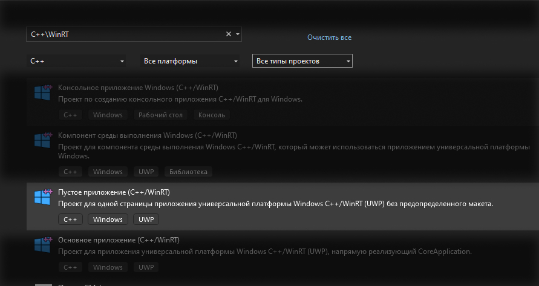

# Приложение на основе WinRT и UWP (XAML)

Создано в VS 2022 по шаблону: Blank App (C++ / WinRT)

#### Файлы проекта
- `CppWinRTUWP.sln` - файл решения (solution)
- `CppWinRTUWP.vcxproj` - файл проекта (project)
- `App.h`, `App.cpp` - файл с описанием главного класса приложения, содержит аналог функции main
- `MainPage.h`, `MainPage.h` - файлы с описанием класса (struct) главного окна
- `MainPage.xaml` - описания пользовательского интерфейса главного окна; можно редактирвоать в дизайнере интерфейса или как текстовый xml файл
- `MainPage.idl` - классы локальной среды выполнения, на которые нужно сослаться в XAML файлах
- `pch.h` - файл содержащий директивы include для файлов, которые редко изменяются и которые можно скомпилировать заранее (из `pch.cpp` файла)
- `bank.h` - файл с основной логикой приложения, добавлен вручную

###
Для компиляции должны быть установлены (VS Installer)
- [x] Разработка приложений для универсальной платформы Windows.
- [x] Средства инструментов универсальной платформы Windows для C++ (версии 14x)  \
на панели Сведения об установке - Разработка приложений для универсальной платформы Windows:
- Кроме того, в разделе Windows Параметры - Обновления Безопасность >> выберите параметр Режим разработчика вместо параметра Неопубликованные приложения.

#### Справка
- https://docs.microsoft.com/ru-ru/windows/uwp/cpp-and-winrt-apis/get-started
- Язык декларативного программирования XAML, В. В. Подбельский, 2018, 336 с.
