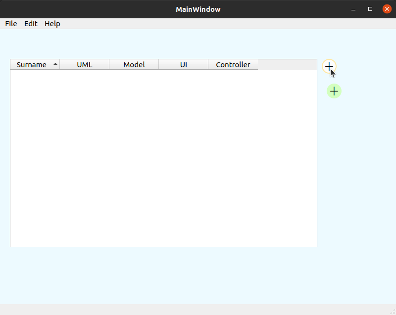

# Заготовка для простой файловой БД с одной таблицей
- `modelstuds.h` -- модель, хранит табличные данные, основана на QStandardItemModel.
- `floatnumberitem.h` -- переопределённый класс QStandardItem для ячейки, которая раскрашивает свой фон в зависимости от своего значения.
- `res.qrc` -- файл ресурсов, нужен для включения файла стилей в исполняемый файл (что не обязательно).
- `style.qss` -- описание стилей некоторых элементов интерфейса.

- Примеры работы с представлением и моделью: https://raw.githubusercontent.com/VetrovSV/OOP/master/Qt_lec2.pdf
- Qt: Model/View Programming: https://doc.qt.io/qt-6/model-view-programming.html
- Выбор цвета: https://www.google.com/search?channel=fs&q=%23edfaff
- Примеры стилей в Qt
https://doc.qt.io/qt-5/stylesheet-examples.html#customizing-qpushbutton
- Документация Qt StyleSheet
https://doc.qt.io/qt-5/stylesheet-reference.html
