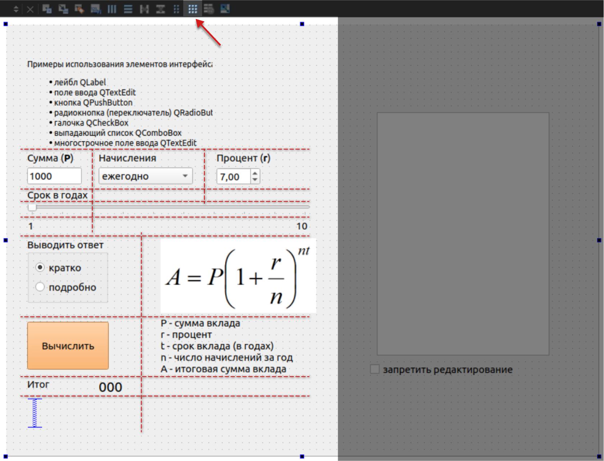

# Дизайн интерфейса в Qt Creator

1. Поместим все нужные элементы интерфейса в окне.

Окно будет строиться из двух колонок.
В левой колонке окна расположим все элементы для ввода данных и пояснения к ним. 
В правой колонке будет текстовое поле для легирования вычислений.

2. Компоновка левой половины окна по сетке.

Расположим элементы интерфейса левой части окна так, чтобы они примерно соответствовали сетке (см. рис. ниже). Каждый элемент интерфейса может занимать один или несколько ячеек сетки. При необходимости зададим отдельных элементам максимальные и минимальные размеры. Например ПКМ на элементе -> Size Constraints -> Set Maximum Size задаст текущий размер как максимальный.

Чтобы при увеличении высоты окна расстояние между элементами интерфейса не увеличилось, добавим в низ пружину (verticalSpacer) которая будет прижимать элементы окна снизу и заполнять всё свободное пространство внизу.

Скомпонуем элементы интерфейса по сетке (см. рисунок ниже), в дереве объектов окна появится объект gridLayout.

При необходимости изменим расположение элементов на сетке или их размеры

