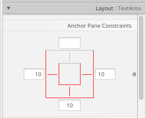

# Пример JavaFX приложения.

1. Создание проекта в intelij IDEA (2020): File > New > Project: Шаблон JavFX\
  Для компиляции и запуска нужен фреимворк JavaFX. Он не входит в стандартную библиотеку Java. Нужно скачать отдельно.
2. Скачать JavaFX SDK: https://gluonhq.com/products/javafx/. Разархивировать. Например, в папку проекта.
3. Указать путь к JavaFX SDK в настройках проекта: File > Project Structure > Libraries: "+", указать путь к папке lib JavaFX \
  Теперь проект компилируется. Но не запустится, т.к. код JavaFX не включится в исполняемый файл. \
  Нужно отдельно указать параметры запуска программы -- параметры виртуальной машины Java, при запуске этого Java приложения
4. Run > Edit configurations: в поле VM Options записать: `--module-path "путь к JavaFX SDK" --add-modules javafx.controls,javafx.fxml` \
  Если поля VM Options в окне Edit configurations нет, то его можно показать: Modify Options > Add VM options \
  Теперь программу можно запускать


# Ссылки
https://www.jetbrains.com/help/idea/javafx.html -- аналогичная инструкция на сайте JetBrains


# ***
#### Аннотация `@FXML` перед полями котроллера

[SO](https://stackoverflow.com/questions/30210170/is-fxml-needed-for-every-declaration)
 
```Java
 public class MainWindowController {
    
    @FXML
    public Label label_status;
    
    // соответствующий fxml файл:
      // Корневой элемент окна содержит название класса- контроллера
      // <VBox alignment="CENTER" ...  fx:controller="com.example.my_javafx_program.MainWindowController">
      // ...
      // <Label fx:id="label_status"/>
    
}
```
В классе MainWindowController объект label_status не создаётся (нет оператора new) и не инициализируется. 
Аннотация @FXML заставляет экземпляр загрузчика fxlm файлов (FXMLLoader) создать объект и инициализировать его в методе load().
```java
  FXMLLoader fxmlLoader = new FXMLLoader(HelloApplication.class.getResource("hello-view.fxml"));
  Scene scene = new Scene(fxmlLoader.load(), 320, 240);
```
#### Основные свойства\методы элементов интерфейса
`.getText();   // -> String`\
`.setText("Some text");`\
`.appendText( "этот текст будет добавлен к содержимому");`\
`.clear();`\
`.setEditable( false );`


#### Якоря (привязки)


#### Обработка событий

- `onAction` - основной обработчик события для многих элементов интерфейса, чаще всего привязан к нажатию на клавишу Enter или клику на элемент.
- `onKeyPressed`,`onKeyReleased` - обработчики нажатия и отпускания клавиши соответственно.
  ```java
    // Обработчик нажатия клавиши, вызывается когда элемент в фокусе и нажата любая клавиша,
    // в том числе для ввода данных
    @FXML
    public void area_key_released(KeyEvent keyEvent) {
        System.out.println( keyEvent.getCode() );       // -> KeyCode - код клавиши
        System.out.println( keyEvent.getText() );       //  -> String - строковое обозначение клавиши
        keyEvent.isControlDown();                       // -> True, если нажата клавиша Control
    }```

##### Обработчик нажатия на Enter для однострочного поля ввода TextField.
Описание поля ввода в fxml файле:
```fxml
<TextField fx:id="Text_input" onAction="#on_input_done"/>
```


Реализация обработчика события для поля ввода в файле контролера окна:
```java
    @FXML
    protected void on_input_done(){
        Text_input.clear();   // для примера, очистка содержимого поля ввода 
        }
```


#### Получить stage из контроллера окна
Stage -- это окно (построен на основе javafx.stage.Window)


```Java
обращение через любой экземпляр класса, представляющего элемент интерфейса

 
 
 public class Controller {
    @FXML
    public Label label_status;
    
    @FXML
    protected void onButtonClick(){
    
      Stage window = (Stage) label_status.getScene().getWindow();
      
      }
}
```


#### Диалог выбора имени файла для открытия или сохранения
```java
  // получить Stage (окно) через любой экземпляр класса, представляющего элемент интерфеса
  Stage window = (Stage)label_status.getScene().getWindow();
  
  FileChooser dialog = new FileChooser();
  
  // Диалог выбора файла для открытия
  File f = dialog.showOpenDialog(window);
  // вернёт null, если файл не выбран
  
  // Диалог выбора файла для сохранения
  File f = dialog.showSaveDialog(window);
```

### Меню приложения

Меню строится из 3 основных элементов:
* MenuBar - панель для меню программы
* Menu - основной элемент \ подраздел и т.д. меню программы
* MenuItem - пункт меню
  - Основные свойства: 
    - text - текст
    - onAction - обработчик нажатия на пункт меню
    - Accelerator - горячая клавиша


Пример меню программы:
* File
  - Open
  - Save
  - --- Разделитель
  - Exit
* Edit
  - Preferences
    - Settings
    - Themes
```xml
<!-- панель меню -->
<MenuBar>
  <!--Основные элементы меню -->
    <Menu text="File">
            <MenuItem text="Open" onAction="#handleOpen" accelerator="Ctrl+O"/>
            <!--onAction - обработчик нажатия на пункт меню -->
            <!-- accelerator="Ctrl+O" - горячая клавиша -->
            <MenuItem text="Save" onAction="#handleSave"/>
            <SeparatorMenuItem/>
            <MenuItem text="Exit" onAction="#handleExit"/>
    </Menu>
        <Menu text="Edit">
            <Menu text="Preferences">
                <MenuItem text="Settings" onAction="#handleSettings"/>
                <MenuItem text="Themes" onAction="#handleThemes"/>
            </Menu>
        </Menu>
        <Menu text="Help">
            <MenuItem text="About" onAction="#handleAbout"/>
        </Menu>
    </MenuBar>
```