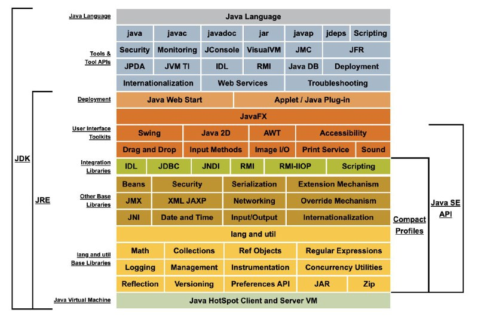
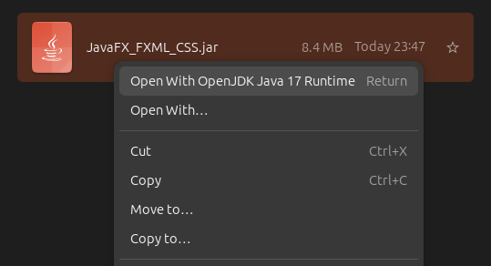
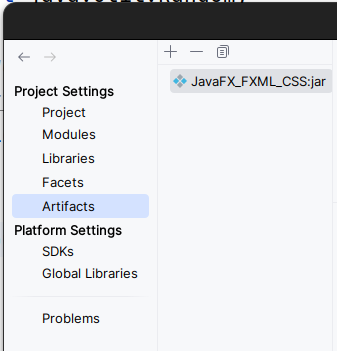
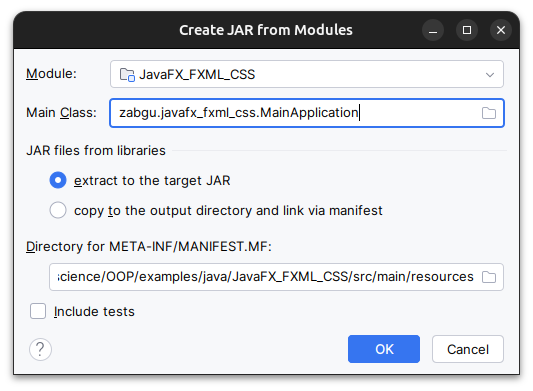
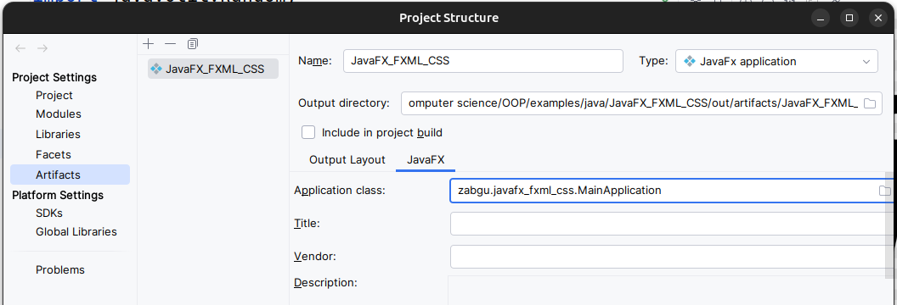

# Java
- Слайды [https://raw.githubusercontent.com/VetrovSV/OOP/master/OOP_2.pdf](https://docs.google.com/presentation/d/14Y8LWzVeChUyjaKhb6rgELdWJR58B2YGUIukeZ-e3PU/edit#slide=id.g20e70e069b8_0_780)
- Появился в 1995 г.
- Входят в пятёрку самых популярных языков программирования (по [оценке TIOBE](https://www.tiobe.com/tiobe-index/))
- Объектно-ориентированный язык программирования общего назначения
  - в основе любой программы лежит класс
  - вместо функций -- методы
- Строгая типизация (более строгая чем в C++)
- Программы компилируются в байт-код
  - Байт-код выполняется виртуальной машиной Java (JVM)
  - Байт-код независим от ОС
  - JVM реализована для всех популярных платформ
  - Есть сборщик мусора
- JIT компиляция
- В байт-код виртуальной машины Java компилируются программы на других языках: Scala, Clojure, Kotlin и др.
- Последняя версия – Java SE 17 (февраль 2022)
  - SE = Standard Edition
  - выход новой версии два раза в год
  - существуют LTS версии


<details>
Дорожная карта изучения Java


Шпаргалка по основам Java: https://introcs.cs.princeton.edu/java/11cheatsheet/

Отдельные понятия:
- Обобщения (generic) — внешне похожий аналог шаблонов С++
- Пакет (package) — набор классов (файлов), способ организации пространств имён;
- Интерфейс (interface) — класс, который не содержит реализаций методов, либо содержит реализации по-умолчанию (начиная с Java 9, 2017 г.)
  - абстрактные классы в Java тоже существуют и похожи на аналогичные в C++
  - Функциональный интерфейс — это интерфейс, который содержит один и
только один абстрактный метод.
- Модуль — совокупность пакетов и ресур­сов, доступных по имени модуля


JDK и JRE


</details>


# Hello, World!
[[слайды](https://docs.google.com/presentation/d/14Y8LWzVeChUyjaKhb6rgELdWJR58B2YGUIukeZ-e3PU/edit#slide=id.g205b655ab26_0_421)]
```Java
// неявное подключение всего содержимого пакета java.lang, в том числе класса System
// java.lang содержит классы общего назначения

public class Main {
  public static void main(String[] args) {
  System.out.println("Hello World!");
}
```

См. примеры простых программ


**Компиляция** \
Для компиляции должен быть установлен Java Development Kit (JDK).
```bash
javac Main.java
```
После компиляции появится файл c байт-кодом .class, он может быть выполнен виртуальной машиной Java – Java Runtime Enviroment (JRE). JRE входит в состав JDK.

**Выполнение**
```bash
java Main
```
java – название исполняемого файла JRE.

Так можно запускать или одиночный .class файл с именем Main или jar файл с именем Main.jar. В обоих случаях имя главного класса (содержащего функцию main) должно совпадать с именем файла. Иначе придётся указать его отдельно.


### jar файлы
Создание jar файла из скомпилированных .class файлов
```bash
jar cfe MyProgram.jar MyProgram *.class
```

- `cfe`: с –создать новый jar файл, f – далее указано имя это файла, e – далее указана точка входа
	в программу (главный класс)
- `MyProgram.jar` – имя выходного файла
- `MyProgram` – имя главного класса
- `*.class` – входные файлы (все файлы с расширение class в текущей папке)

См. также про Manifest File.

#### Запуск

**Запуск в консоли**
```bash
java -jar MyProgram.jar
```

Виртуальная машина Java (JRE), файл `java` из команды выше, должен быть доступен для вызова.

**Запуск в Ubuntu**\
Заупстить jar файл можно непостредственно, как и любой другой исполняемый файл - по двойному клику.

Если запуск недоступен, то можно выбрать вариант запуска из контекстного меню:


#### Создание Jar файлов в intelij IDEA
1. Открыть окно: Project Structure из меню File
2. В разделе настроек проекта (Project Settings) выбрать подраздел Artifacts
3. Нажать на кнопку добавления `+`, выбрать тип артефакта: *JAR* > *From modules with dependencies*
4. В окне настроек JAR файла указать имя главного класса приложения (Main Class). Будет автоматичеки создан файл MANIFEST.MF - файл описания Jar фрхива. 
5. [ОК]





Инструкция IDEA: https://www.jetbrains.com/help/idea/compiling-applications.html#package_into_jar

6. Создание JAR файла: Build > Build Artifacts.\
Файл должен появится в указанной папке (обычно это `out\artifacts\имя_проекта`)


#### Создание Jar файлов в intelij IDEA для проектов на основе JavaFX

В intelij IDEA создание JAR файлов на основе специального шаблона JavaFX приложений не работает по уммолчанию.

Решение: Создать новый главный класс, в котором явно вызывать метод статический метода `launch` из стандартного JavaFX класса Application.
```java
package zabgu.javafx_fxml_css;
import javafx.application.Application;
// новый главный класс
public class Launcher {
    public static void main(String[] args){
        Application.launch(MainApplication.class, args);
    }
}
```

Далее создать JAR файл обычным способом.

Инструкция: https://www.youtube.com/watch?v=kQaE2HlFeWY

<details>
*Ниже приведён фрагмент инструкции IDEA, но без указания дополнительных действия для настройки JAR файла*
1. Открыть окно: Project Structure из меню File
2. В разделе настроек проекта (Project Settings) выбрать подраздел Artifacts
3. Нажать на кнопку добавления `+`, выбрать тип артефакта: *JavaFX Application* > *From module...*
4. Справа на панели настроек артефакта, во вкладке JavaFX указать имя главого класса приложения в поле Application class.\
 Будет автоматичеки создан файл MANIFEST.MF - файл описания Jar фрхива. 
5. [ОК]



Ошибка при сборке: 
`Java FX Packager: Can't build artifact - fx:deploy is not available in this JDK`

Решение:
https://www.jetbrains.com/help/idea/packaging-javafx-applications.html#troubleshoot

<br>
Инструкция IDEA: https://www.jetbrains.com/help/idea/packaging-javafx-applications.html#java_fx_build_artifact

</details>

### Системы сборки
- Ant
- Maven [[короткая шпаргалка](https://github.com/ivtipm/BigDataLanguages/tree/main/Java/Maven)]
- Gradle


# Тестирование
```java
assert 4 == 2 + 2;
```

Нужно включить проверку утверждений (assertions) с помощью ключа `-ea` виртуально машины Java.
В IDEA: конфигурация проекта > Add VM options. Появится поле ввода аргументов для виртуальной машины.

см. также junit


# Типы данных
#### Массивы
```java
// создание массива с инициализацией элементов
String array[] = new String[]{"qwerty", "asdfgh"};
array.length // размер массива
```
#### Преобразования типов
Java язык со строгой типизацией. Например
```Java
int x = 3.5;    // ошибка!
// правильно:
int x = (int)3.5;
```

Число в строку, используя метод toString класса Double. Такой метод есть у многих классов.
```Java
double d = 123.45d;
String str = Double.toString(d);
```

В строку с форматированием
```Java
double d = 36.98d;
String s = String.format("%f", d);
System.out.println(s); //36.980000
```

Строка в число
```Java
double d=Double.parseDouble("23.6");  
```


# Лямбда-выражения и ссылки на методы

```Java
// минимальное лямбда-выражение
() -> 42;

// с параметром
(п) -> 1.0 / n;
```
**Функциональный интерфейс** — это интерфейс, который содержит один и
только один абстрактный метод.
Функциональные интерфейсы стандартной библиотеки
- `Function<T, R>` - содержит метод `R apply(T t)`
- `Supplier<T>`  - `T get()`
- `Consumer` - `void accept(T t)`
- ...

```Java
// ссылка на статический метод
имя_класса::имя_метода

// ссылка на метод объекта
имя_объекта::имя_метода
```


# Проект inteliJ Idea
Проект и настройки хранятся в
- папка .idea (может быть скрытой) -- настройки проекта
  - **modules.xml**, compiler.xml, misc.xml, encodings.xml, uiDesigner,  
  - vcs.xml
  - workspace.xml, usage.statistcics.xml, shelf (folder) -- настроки пользователя
- файл .iml
- папка src -- исходные коды

#### Загрузка зависимостей в InteliJ Idea
Как правило Java библиотеки распространяются в виде jar архивов. Архивы содержат скомпилированный для JRE код.

Добавление зависимостей в проект:

Project Structure... > Project Settings | Libraries | + > From Maven | Искать по названию библиотеки


# Ссылки
- Слайды: 
  - https://docs.google.com/presentation/d/14Y8LWzVeChUyjaKhb6rgELdWJR58B2YGUIukeZ-e3PU/edit#slide=id.g205b655ab26_0_52
  - https://docs.google.com/presentation/d/1pmOlWlulw2prFhPjn73f3SE6KCyYtW2jYux-aKugVcA/edit#slide=id.g20e6f19f99c_0_1285

- JavaFX пример: https://github.com/VetrovSV/OOP/tree/master/examples/java/JavaFX
- Java: руководство для начинающих, 7-е и зд .: Пер. с англ. — С П б .: ООО “Диалектика”, 2019. — 816 с.
- JavaFX, Прохоренок Н.А., 2020
- Урма Рауль-Габриэль, Фуско Марио, Майкрофт Алан
Современный язык Java. Лямбда-выражения, потоки и функциональное программирование. — СПб.: Питер, 2020. — 592 с.: и
- Онлайн-курс (2015): https://stepik.org/course/187/syllabus

**Дополнительно**

- https://soundcloud.com/podlodka/podlodka-172-java
