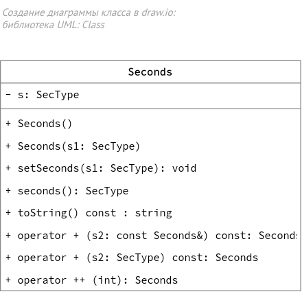
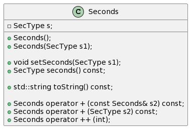

# Пример класса

Проект консольного приложения создан в Qt Creator




Вариант описания диаграммы класса в [PlantUML](https://www.plantuml.com/plantuml/):
```text
@startuml
class Seconds 
{

  - SecType s;


   + Seconds();                            
   + Seconds(SecType s1);                  

   + void setSeconds(SecType s1);
   + SecType seconds() const;

   + std::string toString() const; 

   + Seconds operator + (const Seconds& s2) const;
   + Seconds operator + (SecType s2) const;
                                      
   + Seconds operator ++ (int);            
}
@enduml
```


