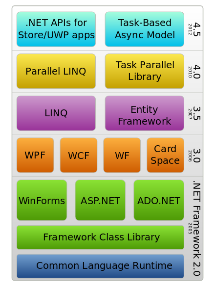

#  Создание приложений с GUI
- ATL, MFC
- WindowsForms
- UWP
- Qt
- ...

# Managed С++

Программы на некоторых языках программирования не компилируются в машинный код. Их исходный код транслируется в промежуточное представление — платформонезависимый **байт-код**. Который исполняется специальной программой — **вирутальной машиной**. Самые популярные из таких языков — Java и C#.

**Managed C++** — набор дополнений к языку C++ (полностью называемых Managed Extensions for C++), позволяющих программам, написанным изначально на C++, управляться CLR (Common Language Runtime) и работать на платформе Microsoft .NET. Виртуальная машина содержит сборщик мусора.

**Управляемый код** (managed code) — термин, введённый фирмой Microsoft, для обозначения кода программы, исполняемой под «управлением» виртуальной машины .NET — Common Language Runtime или Mono.
См. список языков программирования, транслируемых в байт-код: https://en.wikipedia.org/wiki/List_of_CLI_languages

С формальной точки зрения управляемым кодом является любой программный код, исполняемый в среде отладчика.

Машинный код называется **неуправляемым кодом.**

# C++/CX и  C++/CLI

**C++/CLI** — дальнейшее развитие Managed C++

**C++/WinRT** — расширения языка C++, gпостроеное на основе C++/CX (Component Extensions), реализованные в компиляторах от Microsoft. Позволяют писать программы на языке C++ для новой платформы Windows Runtime (WinRT).
****

Программы работают на Windows Runtime и компилируются в машинный код.
