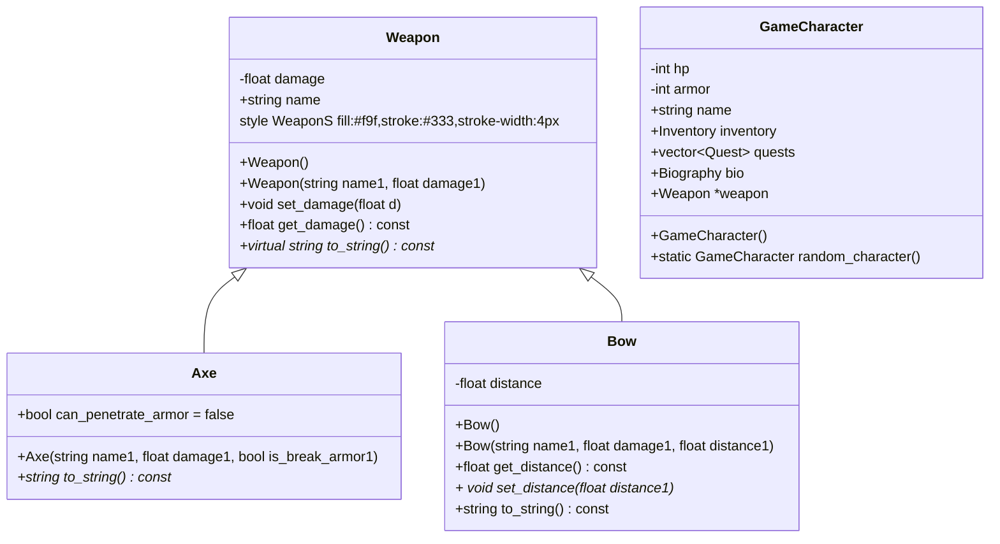

# Отношения между классами

```mermaid
classDiagram
    

    
    class Weapon {
      -float damage
      +string name
      +Weapon()
      +Weapon(string name1, float damage1)
      +void set_damage(float d)
      +float get_damage() const
      +virtual string to_string() const*
      style WeaponS fill:#f9f,stroke:#333,stroke-width:4px
      
    }
    
    


    class Axe {
      +bool can_penetrate_armor = false
      +Axe(string name1, float damage1, bool is_break_armor1)
      +string to_string() const*
    }
    
    

    class Bow {
      -float distance
      +Bow()
      +Bow(string name1, float damage1, float distance1)
      +float get_distance() const
      + void set_distance(float distance1)*
      +string to_string() const
    }

    class GameCharacter {
      -int hp
      -int armor
      +string name
      +Inventory inventory
      +vector~Quest~ quests
      +Biography bio
      +Weapon *weapon
      +GameCharacter()
      +static GameCharacter random_character()
    }

    %% Наследование
    Weapon <|-- Axe
    Weapon <|-- Bow

    


```