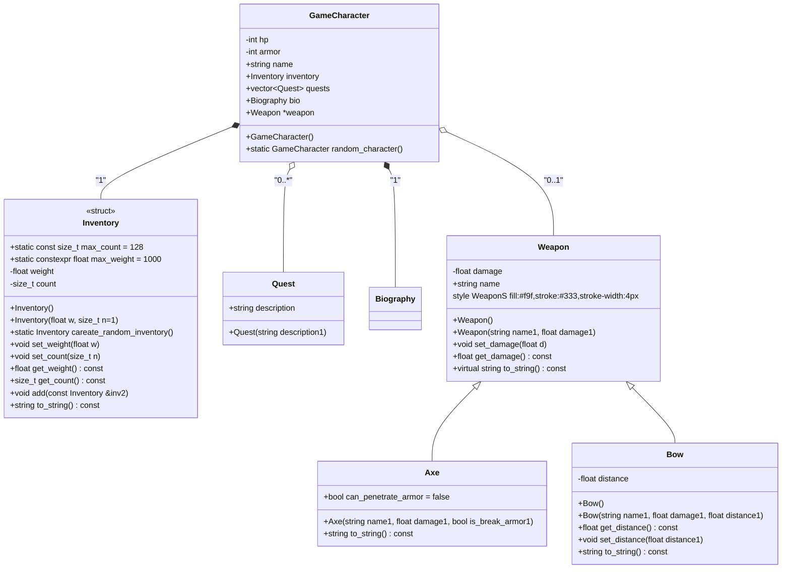

# Отношения между классами

```mermaid
classDiagram
    
    
class Inventory {
<<struct>>
+static const size_t max_count = 128
+static constexpr float max_weight = 1000
-float weight
-size_t count
+Inventory()
+Inventory(float w, size_t n=1)
+static Inventory careate_random_inventory()
+void set_weight(float w)
+void set_count(size_t n)
+float get_weight() const
+size_t get_count() const
+void add(const Inventory &inv2)
+string to_string() const
}

    class Quest {
      +string description
      +Quest(string description1)
    }

    class Biography {
      %% пустой класс в исходнике
    }
    
    
    class Weapon {
      -float damage
      +string name
      +Weapon()
      +Weapon(string name1, float damage1)
      +void set_damage(float d)
      +float get_damage() const
      +virtual string to_string() const
      style WeaponS fill:#f9f,stroke:#333,stroke-width:4px
      
    }
    
    


    class Axe {
      +bool can_penetrate_armor = false
      +Axe(string name1, float damage1, bool is_break_armor1)
      +string to_string() const
    }
    
    

    class Bow {
      -float distance
      +Bow()
      +Bow(string name1, float damage1, float distance1)
      +float get_distance() const
      +void set_distance(float distance1)
      +string to_string() const
    }

    class GameCharacter {
      -int hp
      -int armor
      +string name
      +Inventory inventory
      +vector~Quest~ quests
      +Biography bio
      +Weapon *weapon
      +GameCharacter()
      +static GameCharacter random_character()
    }

    %% Наследование
    Weapon <|-- Axe
    Weapon <|-- Bow

    %% Композиция (целое владеет частью)
    GameCharacter *-- Inventory : "1"
    GameCharacter *-- Biography : "1"

    %% Агрегация (слабая связь / коллекция)
    GameCharacter o-- Quest : "0..*"
    GameCharacter o-- Weapon : "0..1"

    


```