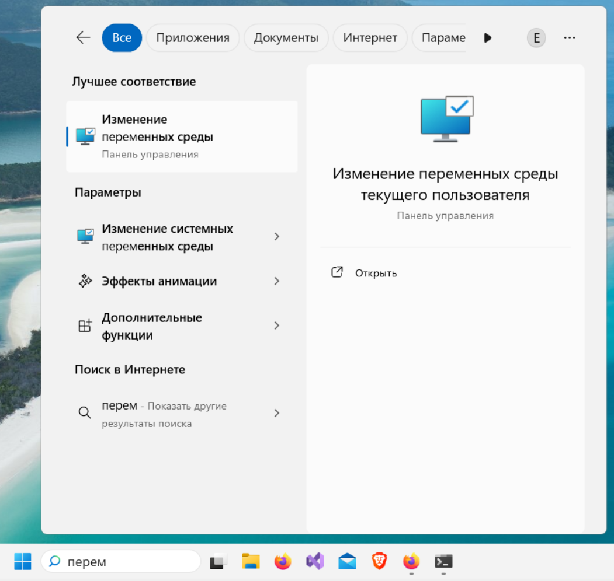
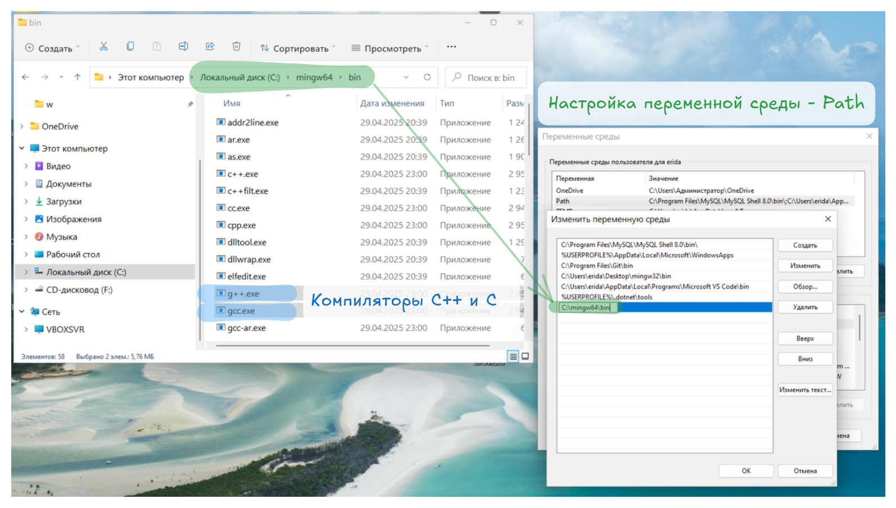

# 0. Подготовка к изучению Java 
1. Раздобудьте рекомендованную литературу и\или найдите аналогичные источники информации по Java.
2. Установите среду разработки IntelliJ IDEA. Обратитесь к преподавателю или одногруппникам, если есть проблемы со скачиванием установочного файла.
3. Скачайте одну из реализаций JDK. Можно здесь: https://adoptium.net/temurin или через IntelliJ IDEA (например, при создании проекта).
Рекомендуется выбирать LTS (long-term support) версию, например JDK 21 или 25. Помните, что на компьютерах у многих пользователей может быть установлена не самая новая версия JRE. Поэтому и в самой последней версии JDK не всегда есть смысл. Тем более, что основные возможности языка (которые рассматриваются в этом курсе) присутствуют даже в первых версиях.


# 1. Java. Простая программа, компиляция в консоли, отчёт

1. Установите JDK. Добавьте путь к JDK (к папке с java.exe) в переменную окружения PATH.
1. Решите любую задачу из первого раздела [задачника](https://ivtipm.github.io/Programming/Files/spisocall.htm) согласно своему варианту или предложите свою задачу сопоставимой сложности или немного сложнее (нужно согласовать с преподавателем).
1. Создайте *отчёт* о компилировании программ в консоли (PowerShell, bash) и запуске. 
   - Начните с этапа добавления пути к компилятору в переменную среды окружения Path.
   - Коротко опишите самое важное для работы в консоли: программы cd, ls, как работает автодополнение, обращение к предыдущим командам.
   - Нужна ли виртуальная машина Java для запуска скомпилированных программ?
1. Создайте отдельную функцию для вычислений. Вынесите её в отдельный модуль (java файл).
1. Сделайте автоматическое тестирование программы с помощью оператора `assert`. Для функций (методов), вычисляющих значения, сделайте минимум три проверки. Рассмотрите крайние случаи. Напишите поясняющие комментарии.
1. *Бонус: Добавьте в программу интерфейс командной строки (используйте параметр `args` метода `main`).*
    - *Выдавайте подсказку, если пользователь передал аргумент `help` или `--help`. Если аргументы не переданы, то запрашивайте данные как обычно, через `Scanner` (`System.in`). Если программа запущена с необходимыми аргументами, используйте их вместо отдельного запроса данных через `Scanner`.*
1. *Бонус: сделайте отчёт\конспект о работе с аргументами командной строки в программах на языке Java*


**Критерии оценки**
- корректные идентификаторы, 
- понятный пользовательский интерфейс, 
- указан автор программы, есть комментарии и документация
См. полный список критериев оценки работ в файле [criteria.md](https://github.com/VetrovSV/OOP/blob/master/criteria.md)

### *Настройка компилятора и компиляция*
1. Запустите PowerShell. Изучите переменную окружения Path: выполните команду для отображения переменной среды окружения:
```$env:path```\
Есть ли там путь к JVM\JRE\JDK? Если нет, то добавьте через программу настройки "Изменение переменных среды окружения текущего пользователя".

<details>
<summary>Как добавить путь в переменную окружения PATH</summary>

Картинки показывают настройку для компилятора C/C++, но для JDK всё делается точно так же: нужно добавить путь к папке `bin` (там где находится компилятор javac.exe) вашего JDK (например `C:\Program Files\Eclipse Adoptium\jdk-21\bin`).





</details>

2. Проверить доступность виртуальной машины Java и компилятора Java соответственно:
```bash
	java  --version
	javac --version
```

3. Создайте в текстовом редакторе (например Sublime Text) файл с расширением .java и исходным кодом простой программы на Java (например Main.java). Файл должен находиться в папке, совпадающей с именем пакета (package). В этом примере это папка `MyCompany`.

Main.java
```java
package MyCompany;

// Главный класс. Может иметь произвольное имя*
// Должен быть public
// *Любой класс должен находится в одноименном файле!
public class Main {
   // главный метод. Должен быть статическим,
   // должен называться main
   public static void main(String[] args) {
       System.out.println("Hello World!");
       }
   }
```
4. Скомпилируйте и запустите программу:\
```bash
javac MyCompany/Main.java

# запуск из текущей папки (запустится файл Main.class)
java MyCompany.Main
```

Если класс объявлен в пакете `MyCompany`, то исходный файл должен лежать в папке `MyCompany/`, а запускать программу нужно по полному имени класса `MyCompany.Main`.

Если хотите скомпилировать программу, с поддержкой более ранней версии Java, например 21
```bash
javac --release 21 MyCompany/Main.java 
```


### Автоматическое тестирование функций
Разбейте программу с предыдущего занятия на функции (методы). Создайте тестовую функцию (метод) с помощью оператора assert.

Для проверки вещественных значений проверяйте модуль ошибки вычислений вашей функции (метода), а не точное значение. 

Пример (на Java)
``` Java
        // проверка работы функции (метода)
        // если внутри оператора assert будет ЛОЖЬ, то программа аварийно завершит работу
        // такие проверки позволяют легко заметить ошибки в коде, особенно когда
        // проверяемая функция (метод) во время разработки часто модифицируется, оптимизируется
        assert Math.abs(calcC(3, 4) - 5.0) < 1e-6;
        // в Java невозможно корректное сравнение вещественных чисел на равенство без округления
        // например Math.sin(Math.PI) = 1.2246467991473532e-16, хотя в идеале должен быть 0
        // Поэтому в assert проверяется не точное значение, а модуль ошибки вычислений вашей
        // функции (метода). Он должен быть меньше некоторого допустимого порога, например 1e-6.
        // В Java нет встроенной константы наподобие FLT_EPSILON, поэтому порог задаётся явно.

        assert Math.abs(calcC(1.5, 1) - 1.8027756) < 1e-6;

        assert Math.abs(calcC(500.0, 501.0) - 707.8142412) < 1e-3; // возьмём точность порядка 10^-3

        // далее основная работа программы
        // ...
    }
}
```

Важно: в Java проверки `assert` по умолчанию отключены. Запускайте программу с флагом `-ea` (enable assertions):
```bash
java -ea MyCompany.Main
```

Подробнее: [Компиляция и запуск программ на Java](../Java/studbook/11_compile_and_run.md)


# 2. Системы сборки: Maven или Gradle
1. Установите систему сборки Maven (или Gradle) либо используйте встроенную в IntelliJ IDEA.
   - Проверьте установку: `mvn --version` (или `gradle --version`).
   - Для Maven задайте переменную окружения `JAVA_HOME` — путь к папке, в которой лежит папка `bin` JDK.
2. Создайте проект:
   - Maven: `mvn archetype:generate -DgroupId=com.mycompany -DartifactId=myapp -DarchetypeArtifactId=maven-archetype-quickstart`
3. Изучите файловую структуру проекта: `pom.xml` (или `build.gradle`), `src/main/java`, `src/test/java`. Опишите её в отчёте.
4. Скомпилируйте и запустите программу:
   - Maven: `mvn compile`, затем `java -cp target/classes com.mycompany.App`
   - Gradle: `gradle build`, `gradle run`
5. ~~Запустите тесты: `mvn test` (или `gradle test`). В шаблоне Maven уже есть пример теста (AppTest) с JUnit — добавьте свои тесты для программы из задания 1.~~
6. Перенесите свою программу из задания 1 в проект Maven/Gradle. Убедитесь, что она собирается и запускается.
7. *Бонус: соберите исполняемый JAR-файл: `mvn package`, затем запустите: `java -jar target/myapp-1.0-SNAPSHOT.jar`.*

**Критерии оценки**
- Отчёт: что такое система сборки, зачем она нужна, чем отличается от ручной компиляции `javac`, структура проекта, основные команды.
- Проект собирается и запускается из командной строки.

Подробнее: [Компиляция и запуск программ на Java](../Java/studbook/11_compile_and_run.md) — разделы «Системы сборки» и «Maven».


# 3. Конспекты по основам языка
1. Этапы компиляции и запуска программы на Java: исходный код → байт-код (.class) → JVM. Чем это отличается от компиляции в C?
1. Выберите рекомендации по стилю кодирования (style guidelines) на Java, которые нравятся вам. Приведите в конспекте наиболее важные и часто используемые рекомендации.
1. *Тип enum. Что это? Когда использовать? Примеры.*
1. Форматированный вывод: методы format и printf (String.format, System.out.printf). Использование строк, вещественных и целых чисел.
1. *Конспект: тернарный оператор. Общий синтаксис. Использование в составе выражений и без них.*
1. *Ключевое слово static: статические поля и методы класса. Сравнение со static в C.*
1. Области памяти в JVM: стек, куча, Metaspace (статическая область). [Подробнее](../Java/studbook/20_memory.md)


# 4. Работа с массивами, файлами, исключительными ситуациями
1. Сделайте задачу из 15 строки задачника:
    - https://ivtipm.github.io/Programming/Files/spisocall.htm
    - можно предложить свою задачу с массивами (согласуйте с преподавателем)
    - используйте динамические массивы
    - функция для вывода массива
    - функция для заполнения массива случайными числами из зданного диапазаона
    - напишите тесты
    - Создавайте вспомогательные функции: заполнение массива случайными числами в заданном диапазоне, вывод массива на экран по 10 элементов в строке.
1. Создайте пространство имён для модуля.
1. Создайте функции для записи массива в файл, для заполнения массива из файла с произвольным количеством данных. Можно использовать тип vector или обычный динамический массив.
    - Используйте текстовые файлы
    - Бонус: *используйте бинарные файлы*
1. Добавьте обработку исключительных ситуаций.
1. Дополните программу функциями, которые делают то же самое, но используют vector вместо классических массивов [https://github.com/VetrovSV/OOP/blob/master/2022/vector.cpp].
1. *Бонус: используйте умные указатели для работы с массивами*.
1. *Бонус: скомпилируйте cpp файл модуля [https://github.com/VetrovSV/OOP/tree/master/examples/example_libs/simple_lib].*
1. *Бонус: добавьте в программу возможность получать данные через аргументы командной строки (см. предыдущее задание)*
1. *Бонусный отчёт: Сделайте отчёт о компиляции с использованием системы сборки CMake*
1. *Бонус: Сделайте отчёт о компиляции с использованием компилятора MSVC* [https://github.com/VetrovSV/OOP/blob/master/examples/CMake/readme.md]
1. *Бонус: сделайте отдельный модуль\пространство имён с шаблонными функциями из п. 1 и 3.*

**Критерии оценки**
- Корректные идентификаторы, оформление кода, перегрузка функций (если необходимо)
- Следование процедурное-модульному подходу, принципу единственной ответственности.
- Документация (документирующие комментарии) и поясняющие комментарии, указан автора кода в каждом файле.
[criteria.md](https://github.com/VetrovSV/OOP/blob/master/criteria.md)


# 5. Конспекты. Продвинутые возможности языка
1. Конспект: Обработка исключительных ситуаций. Несколько catch, catch(...), указание типов бросаемых исключений в функции.

2. Конспект: Класс vector. Эффективность операций.

3. Конспект: Класс string. Операции.

4. *Конспект: Умные указатели.*

5. Конспект: static_cast, C-style cast;


# 6. Конспект и отчёт по вашей любимой среде разработки для С++
   - Режимы запуска и компиляции: Сборка, запуск без отладки, запуск с отладкой.
   - Отладка в VS. Точки останова. Режимы выполнения. Просмотр значений переменных. Стек вызовов.\
   Объясните на примере одной из ваших программ.
   - Файлы и папки проекта VisualStudio.\
   Какие файлы и папки стоит добавлять к отслеживанию гитом?
   - Часто используемые горячие клавиши
   - upd: рефакторинг в VS
   - Задание параметров для компилятора (оптимизация, версия стандарта С++ и т.п.) через общую таблицу параметров и через ручную запись аргументов компилятора.
    - upd: Как указать версию стандарта языка C++?
   - todo комментарии. Зачем нужны? Как создать? Как посмотреть список?


### Ссылки
1. https://en.cppreference.com/w/cpp/container/vector
2. https://en.cppreference.com/w/cpp/language/range-for -- пример перебора элементов динамического массива vector с помощью совместного цикла и auto
1. Модульное тестирование (Google Test + VS) [ [StudBook](https://raw.githubusercontent.com/VetrovSV/OOP/master/OOP_StudBook_upd.pdf#section.4.5] ]


# 7. Бонус: минимизация булевой функции
Создайте программу для минимизации булевой функции произвольного числа переменных.

Задавайте функцию через таблицу истинности. На ввод подавайте столбец значений функции или список строк таблицы, для которых значения функции равно единице.

На выходе должна быть запись функции в минимальной дизъюнктивной нормальной форме (МДНФ).
Если вариантов МДНФ несколько, то приведите их все. 

Создавайте графический интерфейс по желанию.

Минимизируйте функцию [методом Куайна — Мак-Класки](https://ru.wikipedia.org/wiki/%D0%9C%D0%B5%D1%82%D0%BE%D0%B4_%D0%9A%D1%83%D0%B0%D0%B9%D0%BD%D0%B0_%E2%80%94_%D0%9C%D0%B0%D0%BA-%D0%9A%D0%BB%D0%B0%D1%81%D0%BA%D0%B8)
На практике этот метод применяется для минимизации числа элементов в логических схемах и логических условий маршрутизации или переключения в сетях.

Выводите таблицу истинности и результат минимизации результат на экран и записывайте в текстовый файл. 

Дополнительно: сделайте функцию, которая создаёт импликантную матрицу.

Не забудьте про поясняющие комментарии, тесты.

Узнавайте про преимущества выполнения этого задания у преподавателя математической логики и теории алгоритмов.
