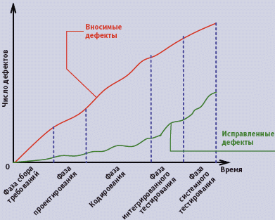
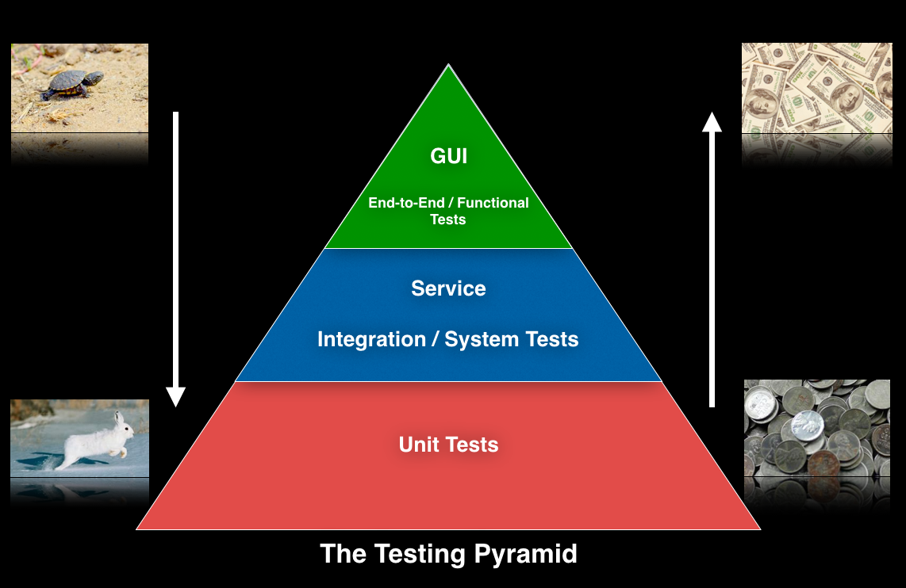
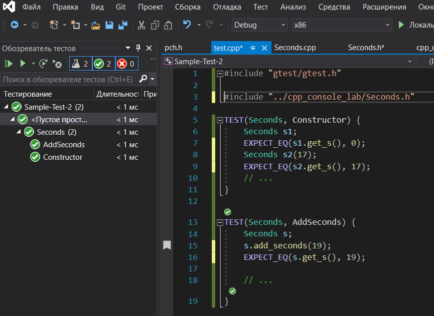

# Тестирование


Программирование -- это процесс добавления ошибок в программы :)

### Виды
По уровню автоматизации:
- ручное
- автоматизированное (код, который тестирует код)


По подходу к поиску ошибок:
- чистое (подтверждает, что программа правильно работает [по основному алгоритму])
- грязное (нацелено на поиск всевозможных ошибок)

По охвату кода\



# TDD
**Разработка через тестирование (test-driven development,TDD)** -- техника разработки программного обеспечения,которая основывается на повторении очень коротких циклов разработки:
  1. Пишется тест
  2. Пишется код программы (который должен пройти тест)
  3. Проводится рефакторинг нового кода к соответствующим стандартам


# Автоматическое модульное тестирование

- тестирует только небольшую часть программы за раз (такой тест написать просто)
- как правило тестовый алгоритм проще тестируемого алгоритма: подставить входные данные, проверить совпадение с заранее заготовленными выходным, повторить для другого набора данных
- тестовый алгоритм состоит из набора функций, каждая из которых тестирует небольшую часть модуля (класса), например один или несколько функций (методов)
- тестовые функции запускаются автоматически при компилировании (запуске) программы


- позволяет обнаружить ошибки как можно раньше
- избавляет от ручного тестирования после каждого изменения кода
- заставляют ещё раз подумать об удобстве вашего API
- не избавляет от интеграционного, функционального и юзабилити-тестирования


### Пример
```C++
// тестируемая функция
int sum(int x, int y){
  return x + y; }

// тестирующая функция (расположить в отдельном модуле)
float test_sum(){       // по названию тестирующей функции модно понять, что она тестирует

  // проверка работы функции на разных входных данных
  assert( sum( 3,  2) ==  5 );    // asssert аварийно завершит программу, если логические выражение будет ложным
  assert( sum( 2,  3) ==  5 );
  assert( sum(-3,  2) == -1 );
  assert( sum(-3, -2) == -5 );
  assert( sum( 0,  2) ==  2 );
  assert( sum( 0, -2) == -2 );
  assert( sum( 0,  0) ==  0 );

  cout << "test sum OK" << endl;  // программа завершится с ошибкой// если хотя-бы одно из условий в assert будет ложным}
```

В некоторых случаях нужно проверять возникновение исключения, повторно использовать одни и те же сходные данные для тестов разных функций. Чтобы избежать рутинной работы используйте тестовые библиотеки:
- Google Test (входит в поставку Visual Studio)
  - https://github.com/google/googletest
  - если используется отдельно от VS, то нужно скачать файлы исходных кодов
  - установка в Ubuntu: `sudo apt install libgtest-dev`
- Boost Test
- Cpputest
- QtTest
- ...


### Пример тестирования класса
https://github.com/VetrovSV/OOP/tree/master/examples/simple_class

## Интеграция модульных тестов Google Test в Visual Studio
1. Открыть решение, для которого нужно сделать модульное тестирование
1. Добавить проект теста в решение:
  1. Файл > Добавить > Создать проект > Выбрать шаблон Google Test (фильтр проектов -- Тестирование)
  1. Задать название проекта тестов, выбрать проект, для которого будут написаны тесты
1. В созданном проекте будет один файл исходных текстов с единственной тестовым макросом
```C++
TEST(TestCaseName, TestName) {
  EXPECT_EQ(1, 1);
  EXPECT_TRUE(true);
}
```
1. Подключите зависимые файлы из основного проекта в тестовый проект (добавить > существующие ...), подключите заголовочные файлы в файл с тестами
1. Создайте тестовые макросы для вашего класса.
  - в каждом тестовом макросе сделайте несколько проверок одного, или нескольких, логически связанных методов класса
  - Вместо `TestCaseName` можно написать идентификатор -- имя тестируемого класса или модуля
  - Вместо `TestName` указывайте идентификатор, объясняющий назначение теста \
  Пример
  ```C++
  TEST(Seconds, Constructor) {
	   Seconds s1;
	   EXPECT_EQ(s1.get_s(), 0);
     Seconds s2(17);
	   EXPECT_EQ(s2.get_s(), 17);
     // ...
    }

    TEST(Seconds, AddSeconds) {
      Seconds s;
      s.add_seconds(19)
      EXPECT_EQ(s.get_s(), 19);

    // ...
  }

    // ...
  ```

1. Откройте список тестов и запустите их: меню Тест > Обозреватель тестов



# Ссылки
- https://doc.qt.io/qtcreator/creator-autotest.html -- тестирование в Qt Creator
- [youtube: Настройка и использование Google Test в Qt Creator](https://www.youtube.com/watch?v=6pp8S56sS2Y)

# См. также
- Статические анализаторы кода: cppcheck, PVS-studio, встроенные в Qt Creator, Visual Studio, CLion
- Контрактное программирование (появилось в С++20)
- [Метаморфное тестирование](https://habr.com/ru/post/454458/)
