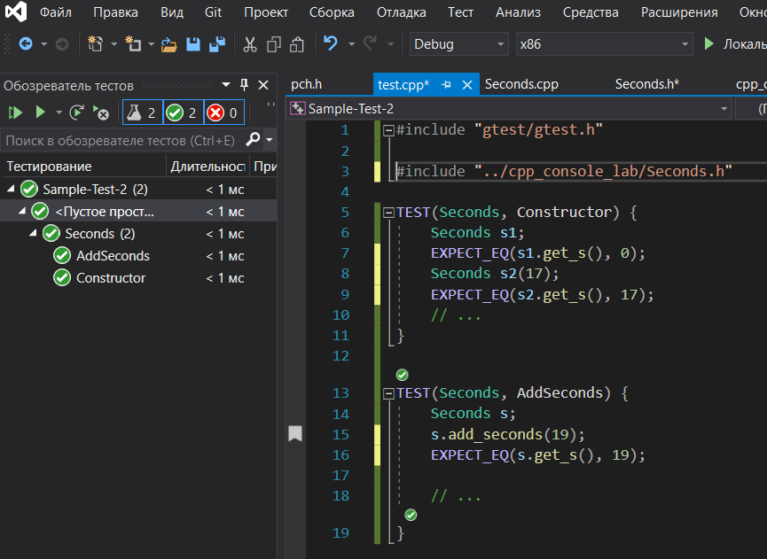

# Модульное тестирование

## Интеграция модульных тестов Google Test в Visual Studio
1. Открыть решение, для которого нужно сделать модульное тестирование
1. Добавить проект теста в решение:
  1. Файл > Добавить > Создать проект > Выбрать шаблон Google Test (фильтр проектов -- Тестирование)
  1. Задать название проекта тестов, выбрать проект, для которого будут написаны тесты
1. В созданном проекте будет один файл исходных текстов с единственной тестовым макросом
```C++
TEST(TestCaseName, TestName) {
  EXPECT_EQ(1, 1);
  EXPECT_TRUE(true);
}
```
1. Подключите зависимые файлы из основного проекта в тестовый проект (добавить > существующие ...), подключите заголовочные файлы в файл с тестами
1. Создайте тестовые макросы для вашего класса.
  - в каждом тестовом макросе сделайте несколько проверок одного, или нескольких, логически связанных методов класса
  - Вместо `TestCaseName` можно написать идентификатор -- имя тестируемого класса или модуля
  - Вместо `TestName` указывайте идентификатор, объясняющий назначение теста \
  Пример
  ```C++
  TEST(Seconds, Constructor) {
	   Seconds s1;
	   EXPECT_EQ(s1.get_s(), 0);
     Seconds s2(17);
	   EXPECT_EQ(s2.get_s(), 17);
     // ...
    }

    TEST(Seconds, AddSeconds) {
      Seconds s;
      s.add_seconds(19)
      EXPECT_EQ(s.get_s(), 19);

    // ...
  }

    // ...
  ```

1. Откройте список тестов и запустите их: меню Тест > Обозреватель тестов

